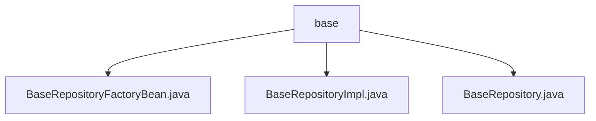

# 基础信息

|      |      |
|------|------|
| 名称 | base |
| 编码语言 | .java |
| 代码路径 | WeFe/fusion/fusion-service/src/main/java/com/welab/wefe/data/fusion/service/database/repository/base |
| 包名 | docs.fusion.fusion-service.src.main.java.com.welab.wefe.data.fusion.service.database.repository.base |
| 概述说明 | BaseRepositoryFactoryBean扩展JpaRepositoryFactoryBean，创建自定义JPA仓库实例。BaseRepositoryImpl继承SimpleJpaRepository，提供多种数据操作方法。BaseRepository接口扩展JpaRepository，定义通用数据操作功能。 |

# 说明

## 概述  
该模块是围绕Spring Data JPA扩展的通用仓库框架，核心职责是通过工厂模式定制化创建JPA仓库实例，并提供丰富的CRUD操作能力。接口规范统一为支持条件查询、分页、字段级更新及原生SQL执行，同时确保事务一致性。关键数据结构包括泛型实体类、DTO转换对象及分页参数对象。外部依赖项主要为Spring Data JPA、EntityManager和Hibernate。例如BaseRepositoryFactoryBean通过MyRepositoryFactory动态生成BaseRepositoryImpl实例。

## 主要业务场景  
模块适用于需要灵活操作实体数据的场景，类似增强版JPA模板。完整流程包含：工厂创建定制仓库→实现类处理基础CRUD→接口暴露多样化查询。典型交互如按ID更新字段时自动填充时间戳，或分页查询中转换DTO。集成案例涵盖条件统计、事务更新及原生SQL映射，例如通过@Query注解执行自定义SQL并返回实体列表。

### 包内部结构视图

该流程图展示了base目录下的三个Java文件之间的层级关系。BaseRepositoryFactoryBean.java、BaseRepositoryImpl.java和BaseRepository.java都直接隶属于base目录，没有更深层的嵌套结构。这三个文件属于同一层级，共同构成了基础仓库实现的核心组件。

# 文件列表

| 名称   | 类型  | 说明 |
|-------|------|-------------|
| [BaseRepositoryFactoryBean.java](BaseRepositoryFactoryBean.md) | file | BaseRepositoryFactoryBean扩展JpaRepositoryFactoryBean，自定义工厂创建BaseRepositoryImpl实例，用于特定JPA仓库实现。 |
| [BaseRepositoryImpl.java](BaseRepositoryImpl.md) | file | BaseRepositoryImpl是JPA基础仓库实现类，提供通用CRUD操作，包括按条件查询、分页、更新及原生SQL执行功能。 |
| [BaseRepository.java](BaseRepository.md) | file | BaseRepository接口扩展了JpaRepository和JpaSpecificationExecutor，提供自定义查询、更新、分页和原生SQL操作功能，支持按字段查询、统计、事务更新及分页转换。 |

