# 基础信息

|      |      |
|------|------|
| 名称 | dto |
| 编码语言 | .java |
| 代码路径 | WeFe/fusion/fusion-service/src/main/java/com/welab/wefe/data/fusion/service/dto |
| 包名 | docs.fusion.fusion-service.src.main.java.com.welab.wefe.data.fusion.service.dto |
| 概述说明 | 账户模块处理数据校验与脱敏，联邦学习模块管理数据与任务，分页模块封装分页查询功能。 |

# 说明

## 概述  
该模块是联邦学习系统中负责数据管理、账户处理和分页查询的核心组件，采用类似配置中心模式统一管理各类业务实体。接口规范遵循Getter/Setter模式，包含AccountInput/Output的数据校验脱敏、PagingInput/Output的分页封装及Bloomfilter/Task等业务模型。关键数据结构涵盖账户字段（phoneNumber/nickname）、分页元数据（total/pageSize）和联邦学习实体（DataSet/Bloomfilter）。外部依赖仅需Java基础类库和ModelMapper，例如使用Masker处理敏感信息，通过链式操作加载TaskDetail数据。

## 主要业务场景  
模块支持联邦学习全生命周期管理，典型流程包括：1）账户注册校验（InputModel格式验证→OutputModel脱敏返回）；2）分页查询（PagingInput参数→PagingOutput包装）；3）数据融合（Bloomfilter创建→PSI角色分配）。交互模式采用DTO对象传递，类似微服务治理方案，例如通过TaskOutput跟踪异步任务进度，MemberInfoModel校验RSA公钥。功能完整性体现在覆盖配置管理（GlobalConfigInput）、状态跟踪（DataSetStateOutput）和审计分析（OperationLogOutput）三大场景，形成类似事件总线的处理体系。

### 包内部结构视图

```mermaid
graph TD
    dto --> vo
    dto --> entity
    dto --> base
    vo --> AccountInputModel.java
    vo --> AccountOutputModel.java
    entity --> bloomfilter
    entity --> globalconfig
    entity --> dataset
    entity --> DataSourceOverviewOutput.java
    entity --> TaskOverviewOutput.java
    entity --> OperationLogOutputModel.java
    entity --> PartnerOutputModel.java
    entity --> AbstractOutputModel.java
    entity --> TaskOutput.java
    bloomfilter --> BloomfilterOutputModel.java
    bloomfilter --> BloomfilterDetailOutputModel.java
    globalconfig --> GlobalConfigInput.java
    globalconfig --> MemberInfoModel.java
    globalconfig --> FusionConfigModel.java
    dataset --> DataSetOutputModel.java
    dataset --> DataSetPreviewOutputModel.java
    dataset --> DataSetDetailOutputModel.java
    dataset --> DataSetStateOutputModel.java
    base --> PagingOutput.java
    base --> PagingInput.java
```

该流程图展示了WeFe项目中fusion-service模块下dto目录的完整层级结构。根节点dto下包含vo、entity和base三个主要子目录，其中entity目录进一步细分为bloomfilter、globalconfig和dataset等子目录。每个子目录都包含相应的Java类文件，如vo目录下的账户模型、entity下的各种输出模型以及base目录下的分页相关类。整个结构清晰地反映了数据传输对象(DTO)层的组织方式。

# 文件列表

| 名称   | 类型  | 说明 |
|-------|------|-------------|
| [base](base/_module.md) | package | PagingOutput是分页结果类，含total和list属性，提供静态工厂方法创建实例或自动映射DTO。PagingInput是分页参数类，含pageIndex和pageSize属性，校验页码不小于0。 |
| [entity](entity/_module.md) | package | 管理布隆过滤器、全局配置、数据集和任务等模块，提供数据模型、状态跟踪和操作日志功能，支持联邦学习系统的全生命周期管理。 |
| [vo](vo/_module.md) | package | AccountInputModel类继承AbstractApiInput，包含必填的电话、昵称、密码和邮箱字段，有格式和长度限制。AccountOutputModel类继承AbstractOutputModel，包含账户属性如手机号、邮箱（脱敏）、权限标识、状态信息及活动时间，提供getter/setter方法。 |

