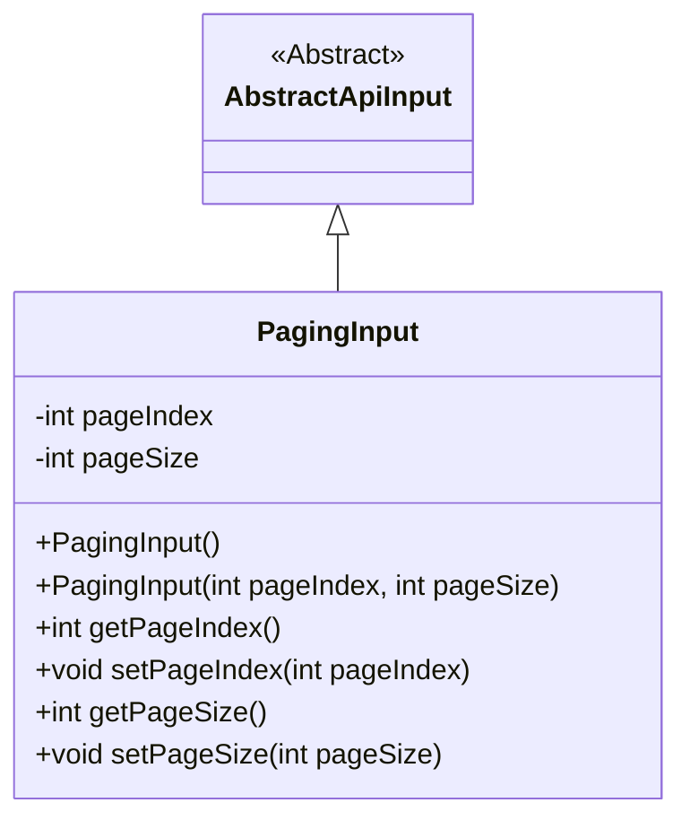
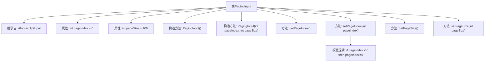

# 基础信息

|      |      |
|------|------|
| 名称 | PagingInput |
| 编码语言 | .java |
| 代码路径 | WeFe/fusion/fusion-service/src/main/java/com/welab/wefe/data/fusion/service/dto/base/PagingInput.java |
| 包名 | com.welab.wefe.data.fusion.service.dto.base |
| 依赖项 | ['com.welab.wefe.common.fieldvalidate.annotation.Check', 'com.welab.wefe.common.web.dto.AbstractApiInput'] |
| 概述说明 | 分页输入类，包含页码和页大小属性，页码默认为0，页大小默认为100，提供构造方法和getter/setter。 |

# 说明

PagingInput 是一个继承自 AbstractApiInput 的分页输入类，用于处理分页查询参数。它包含两个主要属性：pageIndex 表示页码，0 为第一页，默认值为 0；pageSize 表示每页记录数，默认值为 100。类提供了无参构造器和带参构造器，以及对应的 getter 和 setter 方法。在 setPageIndex 方法中，会对传入的 pageIndex 进行校验，确保其不小于 0。

# 类列表 Class Summary

| 名称   | 类型  | 说明 |
|-------|------|-------------|
| PagingInput | class | 分页输入类，包含页码和每页大小，页码默认为0，每页大小默认为100，提供构造方法和getter/setter。 |

## 类 PagingInput

|      |      |
|------|------|
| 访问范围 | public |
| 类型 | class |
| 名称 | PagingInput |
| 说明 | 分页输入类，包含页码和每页大小，页码默认为0，每页大小默认为100，提供构造方法和getter/setter。 |

### UML类图

这段代码定义了一个分页输入类`PagingInput`，它继承自抽象基类`AbstractApiInput`。该类包含两个私有字段：`pageIndex`表示页码（0为第一页），`pageSize`表示每页大小，默认值为100。提供了无参构造器和带参构造器，以及对应的getter和setter方法。其中`setPageIndex`方法包含输入验证，确保页码不小于0。这个类主要用于封装分页查询参数，为API请求提供标准化的分页输入结构。

### 内部方法调用关系图

这段代码定义了一个分页输入类PagingInput，继承自AbstractApiInput，包含页码和页大小两个属性，提供默认构造方法和带参构造方法，以及属性的getter和setter方法。在设置页码时，会校验输入值是否小于0，若小于0则自动修正为0。流程图展示了类的继承关系、属性、构造方法、普通方法以及校验逻辑的调用路径。

### 字段列表 Field List

| 名称  | 类型  | 说明 |
|-------|-------|------|
| pageIndex = 0 | int | 页码索引，0表示第一页。 |
| pageSize = 100 | int | 定义私有整型变量pageSize，初始值为100。 |

### 方法列表

| 名称  | 类型  | 说明 |
|-------|-------|------|
| getPageIndex | int | 获取当前页码的方法，返回整型变量pageIndex的值。 |
| getPageSize | int | 获取当前页面大小的方法，返回整型值pageSize。 |
| setPageIndex | void | 设置页码，若小于0则自动调整为0。 |
| setPageSize | void | 设置每页显示数量的方法，参数为pageSize。 |

