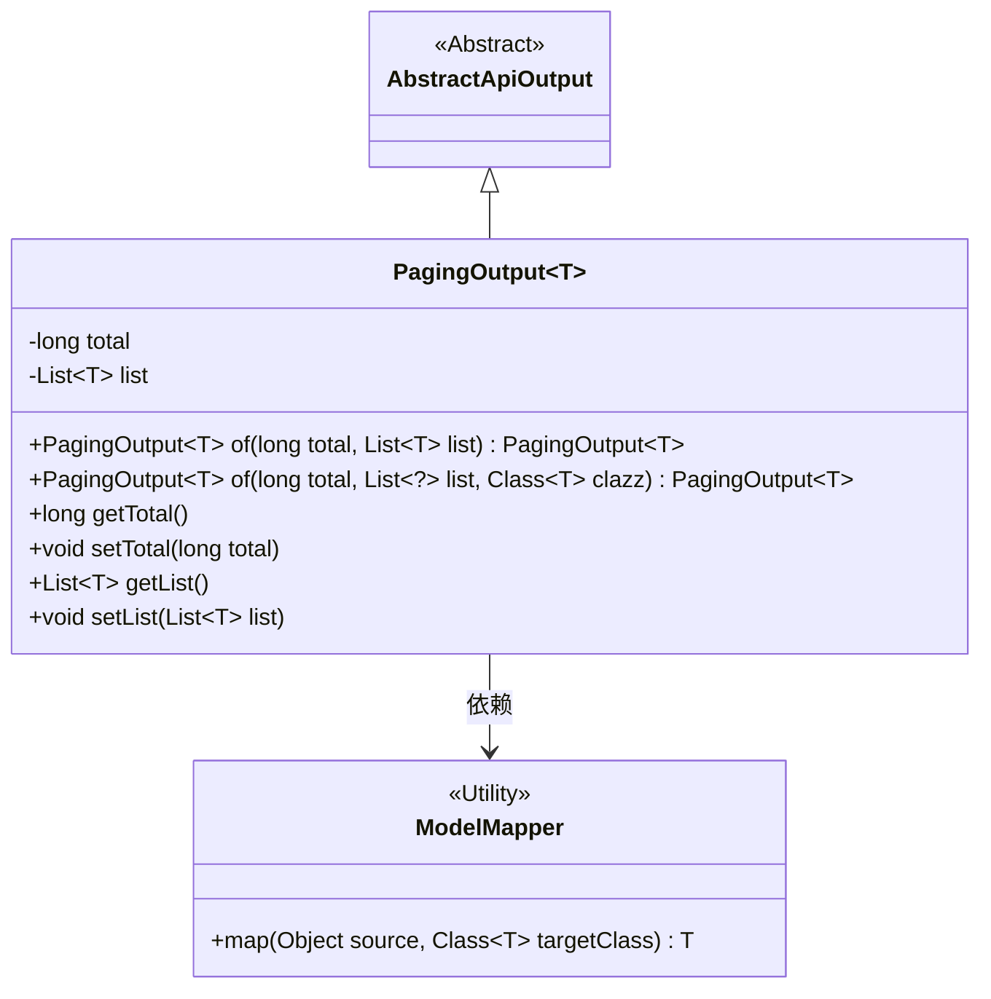
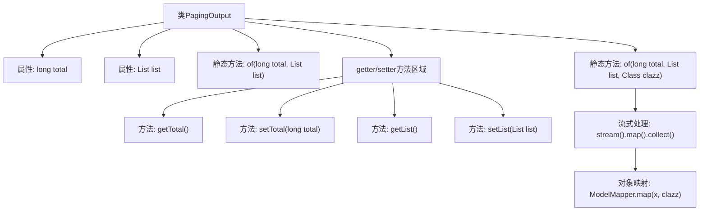

# 基础信息

|      |      |
|------|------|
| 名称 | PagingOutput |
| 编码语言 | .java |
| 代码路径 | WeFe/fusion/fusion-service/src/main/java/com/welab/wefe/data/fusion/service/dto/base/PagingOutput.java |
| 包名 | com.welab.wefe.data.fusion.service.dto.base |
| 依赖项 | ['com.welab.wefe.common.web.dto.AbstractApiOutput', 'com.welab.wefe.common.web.util.ModelMapper', 'java.util.List', 'java.util.stream.Collectors'] |
| 概述说明 | 分页输出类，包含总数和列表数据，支持直接创建或通过映射转换创建。 |

# 说明

PagingOutput是一个泛型类，继承自AbstractApiOutput，用于封装分页查询结果。它包含两个主要属性：total表示总记录数，list存储当前页的数据列表。提供了两个静态工厂方法：of(long total, List<T> list)直接创建实例；of(long total, List<?> list, Class<T> clazz)通过ModelMapper将数据库实体自动映射为DTO对象。类中还包含total和list的标准getter和setter方法。

# 类列表 Class Summary

| 名称   | 类型  | 说明 |
|-------|------|-------------|
| PagingOutput | class | 分页输出类，包含总数和列表数据，提供两种创建方法，支持直接赋值或实体到DTO的自动映射。 |

## 类 PagingOutput

|      |      |
|------|------|
| 访问范围 | public |
| 类型 | class |
| 名称 | PagingOutput |
| 说明 | 分页输出类，包含总数和列表数据，提供两种创建方法，支持直接赋值或实体到DTO的自动映射。 |

### UML类图

该代码定义了一个泛型类`PagingOutput<T>`，用于封装分页查询结果，包含总记录数`total`和当前页数据列表`list`。类提供了两个静态工厂方法`of()`，其中一个支持自动将数据库实体映射为DTO。类继承自抽象类`AbstractApiOutput`，并依赖`ModelMapper`工具类进行对象映射。这种设计简化了分页数据的封装和类型转换，提高了代码复用性。

### 内部方法调用关系图

该流程图展示了PagingOutput泛型类的结构和主要方法。类包含两个核心属性(total和list)，两个静态工厂方法(of)，以及标准的getter/setter方法。特别值得注意的是第二个of方法，它通过流式处理和ModelMapper实现了数据库实体到DTO的自动映射转换，体现了该类的核心功能。流程图清晰地呈现了类成员之间的关系和方法调用链。

### 字段列表 Field List

| 名称  | 类型  | 说明 |
|-------|-------|------|
| list | List<T> | 私有泛型列表变量list |
| total | long | 私有长整型变量total，用于存储总数。 |

### 方法列表

| 名称  | 类型  | 说明 |
|-------|-------|------|
| getTotal | long | 获取total值的公共方法，返回long类型。 |
| of | PagingOutput<T> | 这是一个静态泛型方法，用于创建分页输出对象。方法接收总记录数、数据列表和目标类型参数，将列表元素映射为目标类型后返回封装结果。处理空列表情况，确保健壮性。 |
| setTotal | void | 这是一个Java方法，用于设置类成员变量total的值。方法接受一个long类型参数total，并将其赋值给当前对象的total属性。 |
| setList | void | 这是一个Java方法，用于设置类的List类型成员变量list。方法接受一个泛型List参数，并将其赋值给当前对象的list属性。 |
| of | PagingOutput<T> | 静态方法`of`创建分页输出对象，设置总记录数和数据列表并返回。 |
| getList | List<T> | 返回列表对象的get方法。 |

