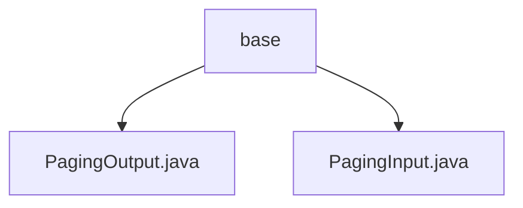

# 基础信息

|      |      |
|------|------|
| 名称 | base |
| 编码语言 | .java |
| 代码路径 | WeFe/fusion/fusion-service/src/main/java/com/welab/wefe/data/fusion/service/dto/base |
| 包名 | docs.fusion.fusion-service.src.main.java.com.welab.wefe.data.fusion.service.dto.base |
| 概述说明 | PagingOutput是分页结果类，含total和list属性，提供静态工厂方法创建实例或自动映射DTO。PagingInput是分页参数类，含pageIndex和pageSize属性，校验页码不小于0。 |

# 说明

## 概述  
该模块提供标准化的分页查询处理能力，核心职责包括封装分页请求参数(PagingInput)和响应结果(PagingOutput)。接口规范遵循统一输入输出模式，PagingInput定义页码和页大小参数，PagingOutput包装数据列表和总数。关键数据结构包含分页元数据(total/pageIndex/pageSize)和泛型数据列表(list)。依赖项包括ModelMapper用于对象映射。例如通过of()工厂方法支持DTO自动转换。

## 主要业务场景  
模块适用于需要分页查询的RESTful接口场景，类似后端CRUD操作的分页处理范式。典型流程为：前端传递PagingInput参数，后端返回PagingOutput包装的分页数据。例如列表查询接口通过pageIndex/pageSize控制数据分段，返回带total统计的当前页数据。集成案例包括静态工厂方法构建响应，支持直接传参或实体-DTO映射两种模式。

### 包内部结构视图

该流程图展示了base目录下的两个Java文件：PagingOutput.java和PagingInput.java。这两个文件都位于同一层级，直接隶属于base目录，没有更深层次的嵌套关系。图中清晰地呈现了这种简单的父子结构关系，符合给定的路径信息要求。

# 文件列表

| 名称   | 类型  | 说明 |
|-------|------|-------------|
| [PagingOutput.java](PagingOutput.md) | file | 分页输出类，包含总数和列表数据，支持直接创建或通过映射转换创建。 |
| [PagingInput.java](PagingInput.md) | file | 分页输入类，包含页码和页大小属性，页码默认为0，页大小默认为100，提供构造方法和getter/setter。 |

