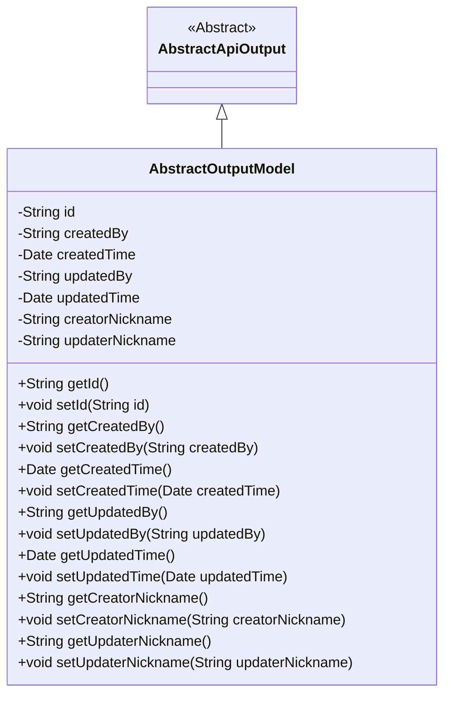

# 基础信息

|      |      |
|------|------|
| 名称 | AbstractOutputModel |
| 编码语言 | .java |
| 代码路径 | WeFe/fusion/fusion-service/src/main/java/com/welab/wefe/data/fusion/service/dto/entity/AbstractOutputModel.java |
| 包名 | com.welab.wefe.data.fusion.service.dto.entity |
| 依赖项 | ['com.welab.wefe.common.fieldvalidate.annotation.Check', 'com.welab.wefe.common.web.dto.AbstractApiOutput', 'com.welab.wefe.data.fusion.service.service.CacheObjects', 'org.apache.commons.lang3.StringUtils', 'java.util.Date'] |
| 概述说明 | AbstractOutputModel类继承AbstractApiOutput，包含ID、创建者、创建时间、更新者、更新时间等字段，并自动设置创建者和更新者的昵称。 |

# 说明

AbstractOutputModel类继承自AbstractApiOutput，包含id、创建者、创建时间、更新者、更新时间等字段，以及创建者和更新者的昵称。通过getter和setter方法管理这些属性，其中设置创建者和更新者时会自动从缓存获取昵称，若为空则使用默认成员名。

# 类列表 Class Summary

| 名称   | 类型  | 说明 |
|-------|------|-------------|
| AbstractOutputModel | class | AbstractOutputModel类继承AbstractApiOutput，包含ID、创建者、创建时间、更新者、更新时间等字段，并自动设置创建者和更新者昵称。 |

## 类 AbstractOutputModel

|      |      |
|------|------|
| 访问范围 | public |
| 类型 | class |
| 名称 | AbstractOutputModel |
| 说明 | AbstractOutputModel类继承AbstractApiOutput，包含ID、创建者、创建时间、更新者、更新时间等字段，并自动设置创建者和更新者昵称。 |

### UML类图

这段代码展示了一个继承自`AbstractApiOutput`的`AbstractOutputModel`类，主要用于处理模型数据的基本输出。类中包含多个私有字段如唯一标识符、创建/更新信息及相关昵称，并提供了相应的getter和setter方法。特别值得注意的是，`setCreatedBy`和`setUpdatedBy`方法在设置值时还会自动更新对应的昵称字段，若昵称为空则使用默认成员名称。这个设计体现了对数据一致性和用户体验的考虑。

### 内部方法调用关系图

```mermaid
graph TD
    A["类AbstractOutputModel"]
    B["继承自: AbstractApiOutput"]
    C["属性: String id"]
    D["属性: String createdBy"]
    E["属性: Date createdTime"]
    F["属性: String updatedBy"]
    G["属性: Date updatedTime"]
    H["属性: @Check String creatorNickname"]
    I["属性: @Check String updaterNickname"]
    J["方法: get/set id"]
    K["方法: get/set createdBy"]
    L["方法: get/set createdTime"]
    M["方法: get/set updatedBy"]
    N["方法: get/set updatedTime"]
    O["方法: get/set creatorNickname"]
    P["方法: get/set updaterNickname"]
    Q["逻辑: setCreatedBy调用CacheObjects"]
    R["逻辑: setUpdatedBy调用CacheObjects"]

    A --> B
    A --> C
    A --> D
    A --> E
    A --> F
    A --> G
    A --> H
    A --> I
    A --> J
    A --> K
    A --> L
    A --> M
    A --> N
    A --> O
    A --> P
    K --> Q
    M --> R
```

这段代码定义了一个AbstractOutputModel类，继承自AbstractApiOutput，包含多个属性和对应的getter/setter方法。其中setCreatedBy和setUpdatedBy方法在设置值时，会调用CacheObjects获取昵称信息，若获取失败则使用默认成员名。类主要用于封装输出模型的基础字段，包括创建/更新信息及校验注解的昵称字段。

### 字段列表 Field List

| 名称  | 类型  | 说明 |
|-------|-------|------|
| createdTime | Date | 创建时间字段，类型为Date。 |
| updaterNickname | String | 字段updaterNickname用于存储修改者昵称，通过@Check注解进行校验。 |
| updatedBy | String | 字段updatedBy记录最后修改者信息。 |
| createdBy | String | 私有字符串变量，记录创建者信息。 |
| updatedTime | Date | 字段updatedTime用于记录更新时间，类型为Date。 |
| creatorNickname | String | 字段creatorNickname用于校验创建者昵称。 |
| id | String | 私有字符串类型变量id。 |

### 方法列表

| 名称  | 类型  | 说明 |
|-------|-------|------|
| getUpdaterNickname | String | 获取更新者昵称的方法，返回字符串类型的昵称值。 |
| setCreatedBy | void | 设置创建者信息，包括ID和昵称。若昵称为空，则使用默认成员名。 |
| setId | void | 设置对象ID的方法，将参数id赋值给当前对象的id属性。 |
| setUpdatedTime | void | 设置对象更新时间的方法，参数为Date类型。 |
| setCreatedTime | void | 设置对象创建时间的方法，参数为Date类型。 |
| getCreatorNickname | String | 获取创建者昵称的方法，返回字符串类型的creatorNickname值。 |
| getCreatedBy | String | 获取创建者信息的方法，返回字符串类型变量createdBy。 |
| getUpdatedTime | Date | 获取更新时间的方法，返回updatedTime对象。 |
| getCreatedTime | Date | 获取创建时间的方法，返回Date类型。 |
| setCreatorNickname | void | 设置创建者昵称的方法，将参数值赋给类的成员变量creatorNickname。 |
| getUpdatedBy | String | 获取更新者信息的方法，返回updatedBy字段值。 |
| getId | String | 方法getId返回字符串类型的id值。 |
| setUpdatedBy | void | 该方法设置更新者信息，包括更新者ID和昵称。若昵称为空，则使用默认成员名称。 |
| setUpdaterNickname | void | 设置更新者昵称的方法，将参数赋值给类成员变量updaterNickname。 |

