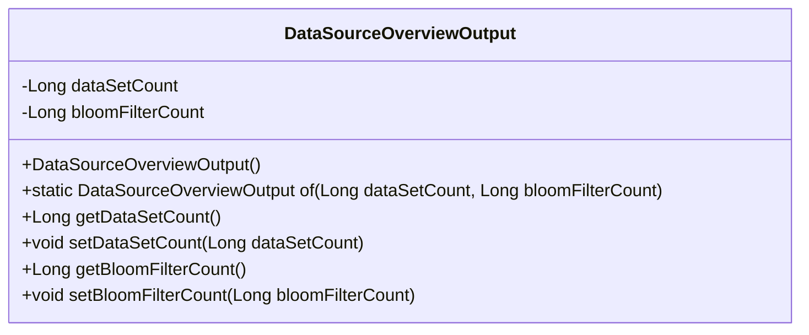
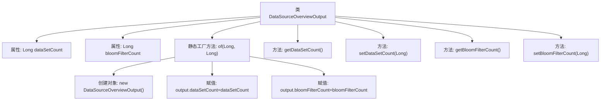

# 基础信息

|      |      |
|------|------|
| 名称 | DataSourceOverviewOutput |
| 编码语言 | .java |
| 代码路径 | WeFe/fusion/fusion-service/src/main/java/com/welab/wefe/data/fusion/service/dto/entity/DataSourceOverviewOutput.java |
| 包名 | com.welab.wefe.data.fusion.service.dto.entity |
| 依赖项 | [] |
| 概述说明 | DataSourceOverviewOutput类包含数据集计数和布隆过滤器计数属性，提供构造方法和getter/setter。 |

# 说明

DataSourceOverviewOutput类是一个用于封装数据源概览信息的Java类，包含两个私有Long类型属性：dataSetCount和bloomFilterCount，分别表示数据集数量和布隆过滤器数量。该类提供了静态工厂方法of用于创建实例，并包含标准的getter和setter方法用于属性访问和修改。

# 类列表 Class Summary

| 名称   | 类型  | 说明 |
|-------|------|-------------|
| DataSourceOverviewOutput | class | Java类DataSourceOverviewOutput，包含数据集计数和布隆过滤器计数属性，提供构造方法和getter/setter。 |

## 类 DataSourceOverviewOutput

|      |      |
|------|------|
| 访问范围 | public |
| 类型 | class |
| 名称 | DataSourceOverviewOutput |
| 说明 | Java类DataSourceOverviewOutput，包含数据集计数和布隆过滤器计数属性，提供构造方法和getter/setter。 |

### UML类图

这段代码定义了一个名为DataSourceOverviewOutput的类，用于封装数据源概览的输出信息。该类包含两个私有Long类型属性：dataSetCount（数据集数量）和bloomFilterCount（布隆过滤器数量），通过静态工厂方法of()创建实例，并提供了标准的getter/setter方法。类图清晰地展示了该POJO类的结构，包含私有字段、构造方法、工厂方法和访问器方法。

### 内部方法调用关系图

这段代码定义了一个名为DataSourceOverviewOutput的类，包含两个Long类型属性dataSetCount和bloomFilterCount。类提供了静态工厂方法of用于创建对象并初始化属性，同时包含标准的getter和setter方法。流程图展示了类的结构、属性、方法以及工厂方法内部的对象创建和属性赋值流程。该设计模式常用于不可变对象的构建，适合作为数据传输对象使用。

### 字段列表 Field List

| 名称  | 类型  | 说明 |
|-------|-------|------|
| dataSetCount | Long | 数据集数量，长整型私有变量。 |
| bloomFilterCount | Long | 私有长整型变量，用于布隆过滤器计数。 |

### 方法列表

| 名称  | 类型  | 说明 |
|-------|-------|------|
| setDataSetCount | void | 设置数据集数量的方法，参数为长整型dataSetCount，赋值给类成员变量。 |
| getDataSetCount | Long | 获取数据集数量的方法，返回长整型值dataSetCount。 |
| of | DataSourceOverviewOutput | 创建DataSourceOverviewOutput实例，设置数据集计数和布隆过滤器计数属性后返回该对象。 |
| getBloomFilterCount | Long | 获取布隆过滤器计数值的方法，返回类型为长整型。 |
| setBloomFilterCount | void | 设置布隆过滤器计数值的方法，参数为长整型bloomFilterCount。 |

