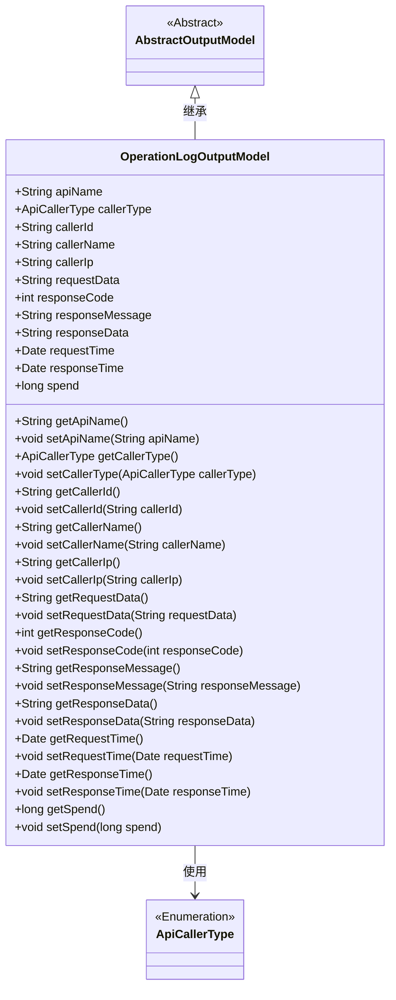

# 基础信息

|      |      |
|------|------|
| 名称 | OperationLogOutputModel |
| 编码语言 | .java |
| 代码路径 | WeFe/fusion/fusion-service/src/main/java/com/welab/wefe/data/fusion/service/dto/entity/OperationLogOutputModel.java |
| 包名 | com.welab.wefe.data.fusion.service.dto.entity |
| 依赖项 | ['com.welab.wefe.common.fieldvalidate.annotation.Check', 'com.welab.wefe.common.web.delegate.api_log.ApiCallerType', 'org.apache.commons.lang3.StringUtils', 'java.util.Date'] |
| 概述说明 | OperationLogOutputModel类记录API操作日志，包含接口名、调用者信息、请求响应数据及时间耗时等字段。 |

# 说明

OperationLogOutputModel类继承自AbstractOutputModel，用于记录API操作日志。包含请求接口名称、调用者类型、ID、名称、IP地址、请求参数、响应码、消息、内容、请求时间、响应时间及耗时等字段。每个字段均有对应的getter和setter方法，便于数据存取。默认调用者类型为User。该类全面记录了API调用的关键信息，便于追踪和分析操作日志。

# 类列表 Class Summary

| 名称   | 类型  | 说明 |
|-------|------|-------------|
| OperationLogOutputModel | class | OperationLogOutputModel类记录API操作日志，包含接口名、调用者信息、请求响应数据及时间耗时等字段。 |

## 类 OperationLogOutputModel

|      |      |
|------|------|
| 访问范围 | public |
| 类型 | class |
| 名称 | OperationLogOutputModel |
| 说明 | OperationLogOutputModel类记录API操作日志，包含接口名、调用者信息、请求响应数据及时间耗时等字段。 |

### UML类图

这段代码定义了一个操作日志输出模型`OperationLogOutputModel`，继承自抽象类`AbstractOutputModel`。该类包含API调用相关的各种属性，如接口名称、调用者信息、请求/响应数据、时间戳等，并提供了完整的getter/setter方法。其中`callerType`使用了枚举类型`ApiCallerType`。该模型主要用于记录API调用的完整操作日志信息，便于后续审计和分析。

### 内部方法调用关系图

```mermaid
graph TD
    A["类OperationLogOutputModel"]
    B["继承: AbstractOutputModel"]
    C["属性: String apiName"]
    D["属性: ApiCallerType callerType"]
    E["属性: String callerId"]
    F["属性: String callerName"]
    G["属性: String callerIp"]
    H["属性: String requestData"]
    I["属性: int responseCode"]
    J["属性: String responseMessage"]
    K["属性: String responseData"]
    L["属性: Date requestTime"]
    M["属性: Date responseTime"]
    N["属性: long spend"]
    O["方法: getter/setter 组"]

    A --> B
    A --> C
    A --> D
    A --> E
    A --> F
    A --> G
    A --> H
    A --> I
    A --> J
    A --> K
    A --> L
    A --> M
    A --> N
    A --> O
```

该流程图展示了OperationLogOutputModel类的结构，它继承自AbstractOutputModel，包含12个属性字段（如apiName、callerType等）和对应的getter/setter方法组。所有属性均为公开字段，用于记录API调用的完整操作日志信息，包括请求参数、响应数据和耗时等关键指标。类设计采用标准JavaBean模式，通过方法组统一管理属性访问。

### 字段列表 Field List

| 名称  | 类型  | 说明 |
|-------|-------|------|
| responseTime | Date | 声明一个Date类型的公共变量responseTime。 |
| requestData | String | 声明一个公共字符串变量requestData。 |
| callerIp | String | 声明一个公共字符串变量callerIp，用于存储调用者的IP地址。 |
| callerName | String | 公共字符串变量，存储调用者名称。 |
| requestTime | Date | 声明一个名为requestTime的公共Date类型变量。 |
| responseCode | int | 定义整型变量responseCode，用于存储响应代码。 |
| spend | long | 变量spend为长整型，用于存储支出金额。 |
| callerType = ApiCallerType.User | ApiCallerType | API调用者类型设置为用户。 |
| apiName | String | 定义了一个公开的字符串类型变量apiName。 |
| responseMessage | String | 公共字符串变量responseMessage，用于存储响应消息。 |
| callerId | String | 定义了一个公共字符串变量callerId，用于存储调用者标识信息。 |
| responseData | String | 公共字符串变量responseData，用于存储响应数据。 |

### 方法列表

| 名称  | 类型  | 说明 |
|-------|-------|------|
| setResponseMessage | void | 设置响应消息的方法，将输入参数赋值给类的成员变量responseMessage。 |
| getCallerName | String | 方法getCallerName返回callerName字符串值。 |
| setRequestTime | void | 这是一个Java方法，用于设置请求时间。方法名为setRequestTime，接收Date类型参数requestTime，并将其赋值给类的同名成员变量。 |
| setResponseData | void | 设置响应数据的方法，将输入字符串赋值给类的responseData成员变量。 |
| getResponseData | String | 获取响应数据的方法，返回字符串类型变量responseData。 |
| getCallerIp | String | 获取调用者IP地址的方法，返回字符串类型值callerIp。 |
| getRequestData | String | 获取请求数据的方法，返回字符串类型的requestData。 |
| getResponseMessage | String | 获取响应消息的方法，返回字符串类型变量responseMessage。 |
| getCallerId | String | 获取调用者ID的方法，返回字符串类型的callerId。 |
| setResponseTime | void | 设置响应时间的方法，将传入的日期参数赋值给类的responseTime属性。 |
| setResponseCode | void | 设置HTTP响应状态码的方法，将传入的整数值赋给类的responseCode成员变量。 |
| setCallerIp | void | 设置调用者IP地址的方法。 |
| setCallerId | void | 设置调用者ID的方法，将参数callerId赋值给当前对象的callerId字段。 |
| getResponseCode | int | 获取HTTP响应状态码的方法，返回整型变量responseCode的值。 |
| getApiName | String | 这是一个Java方法，返回字符串类型的apiName属性值。 |
| setApiName | void | 设置API名称的方法，将输入参数赋值给类成员变量apiName。 |
| getSpend | long | 方法返回spend变量的值。 |
| setCallerType | void | 该方法用于设置调用者类型，将传入的ApiCallerType参数赋值给类的callerType成员变量。 |
| getCallerType | ApiCallerType | 获取调用者类型的方法，返回ApiCallerType对象。 |
| getRequestTime | Date | 获取请求时间的方法，返回Date类型值。 |
| getResponseTime | Date | 获取响应时间的方法，返回Date类型值。 |
| setRequestData | void | Java方法：设置请求数据，将输入字符串赋值给类成员变量requestData。 |
| setCallerName | void | 设置调用者名称的方法，将参数callerName赋值给当前对象的callerName属性。 |
| setSpend | void | 设置花费金额的方法，将参数值赋给类变量spend。 |

