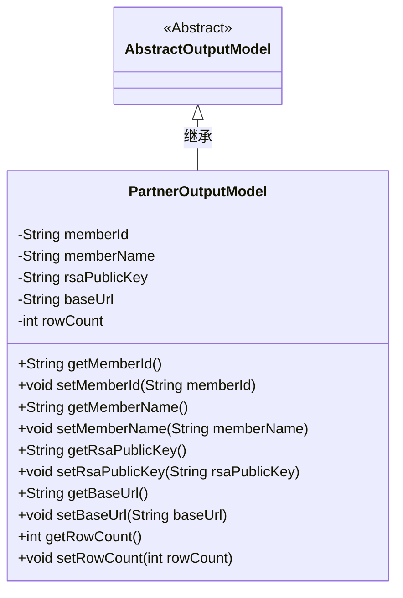
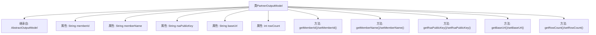

# 基础信息

|      |      |
|------|------|
| 名称 | PartnerOutputModel |
| 编码语言 | .java |
| 代码路径 | WeFe/fusion/fusion-service/src/main/java/com/welab/wefe/data/fusion/service/dto/entity/PartnerOutputModel.java |
| 包名 | com.welab.wefe.data.fusion.service.dto.entity |
| 依赖项 | [] |
| 概述说明 | PartnerOutputModel类继承AbstractOutputModel，包含成员ID、名称、RSA公钥、基础URL和行数字段，提供各属性的getter和setter方法。 |

# 说明

PartnerOutputModel类继承自AbstractOutputModel，包含五个属性：memberId表示成员ID，memberName表示成员名称，rsaPublicKey存储RSA公钥，baseUrl记录基础URL，rowCount保存行数。每个属性都有对应的getter和setter方法用于读写操作。

# 类列表 Class Summary

| 名称   | 类型  | 说明 |
|-------|------|-------------|
| PartnerOutputModel | class | PartnerOutputModel类继承AbstractOutputModel，包含成员ID、名称、RSA公钥、基础URL和行数字段及其getter/setter方法。 |

## 类 PartnerOutputModel

|      |      |
|------|------|
| 访问范围 | public |
| 类型 | class |
| 名称 | PartnerOutputModel |
| 说明 | PartnerOutputModel类继承AbstractOutputModel，包含成员ID、名称、RSA公钥、基础URL和行数字段及其getter/setter方法。 |

### UML类图

这段代码定义了一个`PartnerOutputModel`类，继承自抽象类`AbstractOutputModel`。该类包含五个私有字段：`memberId`、`memberName`、`rsaPublicKey`、`baseUrl`和`rowCount`，并为每个字段提供了公有的getter和setter方法。这个类主要用于封装合作伙伴相关的输出数据模型，包括成员ID、名称、RSA公钥、基础URL和数据行数等信息。通过继承关系，它扩展了基础输出模型的功能。

### 内部方法调用关系图

该流程图展示了PartnerOutputModel类的结构，包括其继承关系和成员属性。该类继承自AbstractOutputModel，包含5个私有属性（memberId、memberName等）以及对应的getter/setter方法。每个属性与方法均通过箭头连接至主类，清晰地呈现了数据封装和访问控制的层级关系。

### 字段列表 Field List

| 名称  | 类型  | 说明 |
|-------|-------|------|
| memberName | String | 声明一个字符串类型的成员变量memberName。 |
| rowCount | int | 声明一个整型变量rowCount，用于记录行数。 |
| memberId | String | 成员ID字符串变量 |
| baseUrl | String | 定义字符串变量baseUrl，用于存储基础URL地址。 |
| rsaPublicKey | String | RSA公钥字符串变量。 |

### 方法列表

| 名称  | 类型  | 说明 |
|-------|-------|------|
| setMemberName | void | 设置成员变量memberName的方法，参数为String类型。 |
| setMemberId | void | 设置成员ID的方法，将参数memberId赋值给当前对象的memberId属性。 |
| getRsaPublicKey | String | 获取RSA公钥的方法，返回字符串类型的rsaPublicKey。 |
| getRowCount | int | 获取当前行数的方法，返回rowCount值。 |
| getMemberName | String | 获取成员名称的方法，返回memberName字符串。 |
| getBaseUrl | String | 方法返回baseUrl字符串。 |
| setBaseUrl | void | 设置基础URL的方法，将输入参数baseUrl赋值给类的成员变量baseUrl。 |
| setRsaPublicKey | void | 设置RSA公钥的方法，将输入字符串赋值给类的rsaPublicKey成员变量。 |
| getMemberId | String | 获取成员ID的方法，返回字符串类型的memberId。 |
| setRowCount | void | 方法setRowCount用于设置行数，参数为rowCount，直接赋值给成员变量this.rowCount。 |

