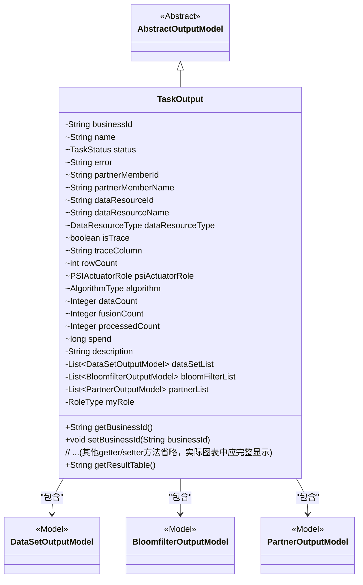

# 基础信息

|      |      |
|------|------|
| 名称 | TaskOutput |
| 编码语言 | .java |
| 代码路径 | WeFe/fusion/fusion-service/src/main/java/com/welab/wefe/data/fusion/service/dto/entity/TaskOutput.java |
| 包名 | com.welab.wefe.data.fusion.service.dto.entity |
| 依赖项 | ['com.welab.wefe.data.fusion.service.dto.entity.bloomfilter.BloomfilterOutputModel', 'com.welab.wefe.data.fusion.service.dto.entity.dataset.DataSetOutputModel', 'com.welab.wefe.data.fusion.service.enums', 'java.util.List'] |
| 概述说明 | TaskOutput类继承AbstractOutputModel，包含任务ID、名称、状态、错误信息、数据资源、跟踪标记、行数、算法类型、处理计数、耗时及数据集列表等属性，用于管理任务输出数据。 |

# 说明

TaskOutput类是一个继承自AbstractOutputModel的模型类，用于表示任务输出信息。该类包含多个字段，包括业务ID、任务名称、状态、错误信息、合作伙伴成员ID和名称、数据资源ID和名称及类型、跟踪相关字段、行数、PSI执行角色、算法类型、数据计数、融合计数、处理计数、耗时、描述、数据集列表、布隆过滤器列表、合作伙伴列表和角色类型。此外，还提供了所有字段的getter和setter方法，以及一个根据任务状态和融合计数返回结果表名称的方法。

# 类列表 Class Summary

| 名称   | 类型  | 说明 |
|-------|------|-------------|
| TaskOutput | class | TaskOutput类包含任务ID、名称、状态、错误信息、成员及资源信息、数据统计、算法类型、数据集列表及结果表生成方法。 |

## 类 TaskOutput

|      |      |
|------|------|
| 访问范围 | public |
| 类型 | class |
| 名称 | TaskOutput |
| 说明 | TaskOutput类包含任务ID、名称、状态、错误信息、成员及资源信息、数据统计、算法类型、数据集列表及结果表生成方法。 |

### UML类图

这段代码定义了一个`TaskOutput`类，继承自`AbstractOutputModel`，用于表示任务输出结果的复杂数据结构。该类包含任务基础信息（如业务ID、名称、状态）、资源信息（数据资源ID/名称/类型）、执行指标（数据量/融合数/耗时）以及三个关联模型列表（数据集/Bloom过滤器/合作伙伴）。特别提供了`getResultTable()`方法用于在任务成功时生成结果表名，体现了业务逻辑与数据模型的紧密结合。

### 内部方法调用关系图

```mermaid
graph TD
    A["类TaskOutput"]
    B["继承: AbstractOutputModel"]
    C["属性: String businessId"]
    D["属性: String name"]
    E["属性: TaskStatus status"]
    F["属性: String error"]
    G["属性: String partnerMemberId"]
    H["属性: String partnerMemberName"]
    I["属性: String dataResourceId"]
    J["属性: String dataResourceName"]
    K["属性: DataResourceType dataResourceType"]
    L["属性: boolean isTrace"]
    M["属性: String traceColumn"]
    N["属性: int rowCount"]
    O["属性: PSIActuatorRole psiActuatorRole"]
    P["属性: AlgorithmType algorithm"]
    Q["属性: Integer dataCount"]
    R["属性: Integer fusionCount"]
    S["属性: Integer processedCount"]
    T["属性: long spend"]
    U["属性: String description"]
    V["属性: List<DataSetOutputModel> dataSetList"]
    W["属性: List<BloomfilterOutputModel> bloomFilterList"]
    X["属性: List<PartnerOutputModel> partnerList"]
    Y["属性: RoleType myRole"]
    Z["方法: getResultTable()"]

    A --> B
    A --> C
    A --> D
    A --> E
    A --> F
    A --> G
    A --> H
    A --> I
    A --> J
    A --> K
    A --> L
    A --> M
    A --> N
    A --> O
    A --> P
    A --> Q
    A --> R
    A --> S
    A --> T
    A --> U
    A --> V
    A --> W
    A --> X
    A --> Y
    A --> Z
```

这段代码定义了一个名为TaskOutput的类，继承自AbstractOutputModel，主要用于封装任务输出的相关属性和方法。类中包含多个属性，如业务ID、任务状态、错误信息、数据资源信息等，以及对应的getter和setter方法。特别地，getResultTable方法根据任务状态和融合数量返回结果表名。该类结构清晰，属性涵盖了任务输出的各个方面，便于管理和操作任务数据。

### 字段列表 Field List

| 名称  | 类型  | 说明 |
|-------|-------|------|
| spend | long | 变量spend为长整型，用于存储支出金额。 |
| myRole | RoleType | 私有角色类型变量myRole。 |
| dataResourceName | String | 字符串类型的数据资源名称变量。 |
| psiActuatorRole | PSIActuatorRole | 定义PSIActuatorRole类型的变量psiActuatorRole。 |
| partnerMemberId | String | partnerMemberId是字符串类型变量，用于标识合作伙伴成员ID。 |
| partnerMemberName | String | 声明一个字符串变量partnerMemberName，用于存储合作伙伴成员名称。 |
| processedCount | Integer | 已处理的计数，整数类型。 |
| rowCount | int | 变量rowCount用于记录行数。 |
| error | String | 变量error用于存储字符串类型的错误信息。 |
| bloomFilterList | List<BloomfilterOutputModel> | 私有变量bloomFilterList，类型为BloomfilterOutputModel的列表。 |
| dataResourceType | DataResourceType | 数据类型为DataResourceType的变量dataResourceType。 |
| dataSetList | List<DataSetOutputModel> | 私有数据集列表，存储DataSetOutputModel对象。 |
| partnerList | List<PartnerOutputModel> | 私有成员变量，存储合作伙伴输出模型的列表。 |
| isTrace | boolean | 布尔变量isTrace用于标识是否启用跟踪功能。 |
| businessId | String | 定义私有字符串类型变量businessId。 |
| traceColumn | String | 变量traceColumn，类型为String，用于存储追踪列信息。 |
| description | String | 私有字符串类型变量description |
| dataCount | Integer | 声明一个名为dataCount的公共整型变量。 |
| name | String | 声明字符串变量name |
| status | TaskStatus | 变量status的类型为TaskStatus。 |
| algorithm | AlgorithmType | 声明一个名为algorithm的AlgorithmType类型变量。 |
| dataResourceId | String | 字符串类型的数据资源标识符。 |
| fusionCount | Integer | 变量fusionCount为整型，用于存储计数数据。 |

### 方法列表

| 名称  | 类型  | 说明 |
|-------|-------|------|
| setDataSetList | void | 这是一个Java方法，用于设置数据集列表属性。方法接收一个DataSetOutputModel类型的列表参数，并将其赋值给类的成员变量dataSetList。 |
| setTraceColumn | void | 设置追踪列字段的值。 |
| getDataCount | Integer | 获取数据计数的方法，返回整数值dataCount。 |
| getSpend | long | 这是一个Java方法，返回名为spend的long类型变量值。 |
| getRowCount | int | 获取当前行数的方法，返回值为整型的rowCount。 |
| getName | String | 这是一个Java方法，返回私有变量name的值。 |
| setRowCount | void | 设置行数方法，将输入参数rowCount赋值给类的rowCount成员变量。 |
| setDataResourceType | void | 设置数据资源类型的方法，将输入参数赋值给类的成员变量dataResourceType。 |
| setError | void | 这是一个Java方法，用于设置错误信息。方法名为setError，接收一个String类型参数error，并将其赋值给当前对象的error属性。 |
| getDataSetList | List<DataSetOutputModel> | 获取数据集列表的方法，返回DataSetOutputModel类型的列表。 |
| getDataResourceId | String | 获取数据资源ID的方法，返回字符串类型值dataResourceId。 |
| setPartnerMemberName | void | 这是一个Java方法，用于设置成员变量partnerMemberName的值。方法接收一个字符串参数，并将其赋值给当前对象的partnerMemberName属性。 |
| setAlgorithm | void | 设置算法类型的方法，将传入的算法类型赋值给当前对象的algorithm属性。 |
| setStatus | void | 方法setStatus用于设置任务状态，将传入的status参数赋值给当前对象的status属性。 |
| setBusinessId | void | 设置业务ID的方法，将输入参数赋值给类的成员变量businessId。 |
| getError | String | 获取错误信息的字符串方法。 |
| setDescription | void | 设置描述信息的方法，将输入参数赋值给对象的description属性。 |
| getDataResourceType | DataResourceType | 这是一个Java方法，返回DataResourceType类型的对象dataResourceType。 |
| getPartnerMemberName | String | 获取合作伙伴成员名称的方法，返回字符串类型变量partnerMemberName。 |
| getAlgorithm | AlgorithmType | 获取当前算法类型的方法。 |
| getTraceColumn | String | 获取traceColumn值的公共方法。 |
| setDataResourceId | void | 设置数据资源ID的方法，将输入参数赋值给类的成员变量dataResourceId。 |
| getFusionCount | Integer | 该方法返回一个整数值fusionCount。 |
| setBloomFilterList | void | 该方法用于设置布隆过滤器列表，接收一个BloomfilterOutputModel类型的列表参数，并将其赋值给类的成员变量bloomFilterList。 |
| getBusinessId | String | 获取businessId的公共方法。 |
| setFusionCount | void | 这是一个Java方法，用于设置fusionCount属性的值。方法接收一个Integer参数，并将其赋值给类的成员变量fusionCount。 |
| setDataResourceName | void | 设置数据资源名称的方法，将输入参数赋值给类的成员变量。 |
| getDescription | String | 获取描述信息的方法，返回字符串类型的描述内容。 |
| getBloomFilterList | List<BloomfilterOutputModel> | 获取布隆过滤器列表的方法，返回类型为BloomfilterOutputModel的列表。 |
| getPartnerList | List<PartnerOutputModel> | 获取合作伙伴列表的方法，返回PartnerOutputModel类型的列表。 |
| setPartnerList | void | 这是一个Java方法，用于设置合作伙伴列表属性，接收一个PartnerOutputModel类型的列表参数。 |
| getResultTable | String | 方法getResultTable在任务状态为Success且fusionCount大于0时返回"task_result_"加businessId，否则返回空字符串。 |
| getMyRole | RoleType | 获取当前角色类型的方法，返回myRole变量值。 |
| setMyRole | void | 设置当前角色类型的方法，将输入参数myRole赋值给类成员变量this.myRole。 |
| setPartnerMemberId | void | 设置合作伙伴成员ID的方法，将参数值赋给类成员变量partnerMemberId。 |
| setPsiActuatorRole | void | 设置PSI执行器角色。 |
| setProcessedCount | void | 设置已处理数量的方法，参数为整型processedCount。 |
| setDataCount | void | 定义了一个公共方法setDataCount，用于设置整数类型的dataCount属性值。 |
| getStatus | TaskStatus | 获取当前任务状态的方法，返回TaskStatus类型的状态值。 |
| getProcessedCount | Integer | 获取已处理数量的整数值。 |
| getDataResourceName | String | 获取数据资源名称的方法，返回字符串类型值。 |
| setSpend | void | 这是一个Java方法，用于设置类成员变量spend的值。方法接受一个long类型参数，并将其赋值给当前对象的spend属性。 |
| setName | void | 这是一个Java方法，用于设置对象的名称属性。方法接收一个字符串参数name，并将其赋值给当前对象的name字段。 |
| setTrace | void | 设置跟踪状态的方法，将布尔参数trace赋值给isTrace变量。 |
| getPsiActuatorRole | PSIActuatorRole | 获取PSI执行器角色对象。 |
| isTrace | boolean | 这是一个Java方法，返回布尔值isTrace的状态。 |
| getPartnerMemberId | String | 获取合作伙伴成员ID的方法，返回成员ID字符串。 |

