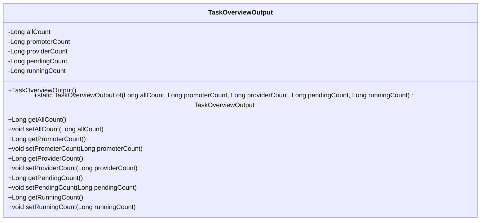

# 基础信息

|      |      |
|------|------|
| 名称 | TaskOverviewOutput |
| 编码语言 | .java |
| 代码路径 | WeFe/fusion/fusion-service/src/main/java/com/welab/wefe/data/fusion/service/dto/entity/TaskOverviewOutput.java |
| 包名 | com.welab.wefe.data.fusion.service.dto.entity |
| 依赖项 | [] |
| 概述说明 | TaskOverviewOutput类用于统计任务概览数据，包含总任务数、发起者数、提供者数、待处理数和运行中数，提供构造方法和getter/setter。 |

# 说明

TaskOverviewOutput 是一个 Java 类，用于封装任务概览的统计信息。它包含五个 Long 类型的私有字段：allCount（总任务数）、promoterCount（发起者任务数）、providerCount（提供者任务数）、pendingCount（待处理任务数）和 runningCount（运行中任务数）。类中提供了静态工厂方法 of 用于创建实例，并为每个字段提供了对应的 getter 和 setter 方法，以便访问和修改这些统计值。

# 类列表 Class Summary

| 名称   | 类型  | 说明 |
|-------|------|-------------|
| TaskOverviewOutput | class | TaskOverviewOutput类包含任务总数、发起者数、提供者数、待处理数和运行中数，提供get/set方法和静态构造方法。 |

## 类 TaskOverviewOutput

|      |      |
|------|------|
| 访问范围 | public |
| 类型 | class |
| 名称 | TaskOverviewOutput |
| 说明 | TaskOverviewOutput类包含任务总数、发起者数、提供者数、待处理数和运行中数，提供get/set方法和静态构造方法。 |

### UML类图

这段代码定义了一个名为`TaskOverviewOutput`的类，用于封装任务概览的统计信息。该类包含五个私有`Long`类型字段：`allCount`（总任务数）、`promoterCount`（发起者任务数）、`providerCount`（提供者任务数）、`pendingCount`（待处理任务数）和`runningCount`（运行中任务数）。通过静态工厂方法`of()`快速创建实例，并提供标准的getter/setter方法访问字段。类图清晰地展示了其数据结构与公有接口，适用于需要统计多维度任务状态的业务场景。

### 内部方法调用关系图

```mermaid
graph TD
    A["类TaskOverviewOutput"]
    B["属性: Long allCount"]
    C["属性: Long promoterCount"]
    D["属性: Long providerCount"]
    E["属性: Long pendingCount"]
    F["属性: Long runningCount"]
    G["静态工厂方法: of(Long allCount, Long promoterCount, Long providerCount, Long pendingCount, Long runningCount)"]
    H["getter方法: getAllCount()"]
    I["setter方法: setAllCount(Long)"]
    J["getter方法: getPromoterCount()"]
    K["setter方法: setPromoterCount(Long)"]
    L["getter方法: getProviderCount()"]
    M["setter方法: setProviderCount(Long)"]
    N["getter方法: getPendingCount()"]
    O["setter方法: setPendingCount(Long)"]
    P["getter方法: getRunningCount()"]
    Q["setter方法: setRunningCount(Long)"]

    A --> B
    A --> C
    A --> D
    A --> E
    A --> F
    A --> G
    A --> H
    A --> I
    A --> J
    A --> K
    A --> L
    A --> M
    A --> N
    A --> O
    A --> P
    A --> Q
```

这段代码定义了一个名为TaskOverviewOutput的类，主要用于封装任务概览的统计信息。该类包含五个Long类型的属性：allCount、promoterCount、providerCount、pendingCount和runningCount，分别表示总任务数、推广者任务数、提供者任务数、待处理任务数和运行中任务数。通过静态工厂方法of()可以创建并初始化对象实例，同时提供了标准的getter和setter方法用于属性的访问和修改。这个类适合作为DTO(数据传输对象)在系统间传递任务统计信息。

### 字段列表 Field List

| 名称  | 类型  | 说明 |
|-------|-------|------|
| runningCount | Long | 私有长整型变量，记录运行次数。 |
| pendingCount | Long | 私有长整型变量pendingCount，用于记录待处理数量。 |
| providerCount | Long | 私有长整型变量，记录提供者数量。 |
| promoterCount | Long | 私有长整型变量promoterCount，用于记录推广者数量。 |
| allCount | Long | 私有长整型变量，记录总数。 |

### 方法列表

| 名称  | 类型  | 说明 |
|-------|-------|------|
| of | TaskOverviewOutput | 创建TaskOverviewOutput对象，设置总任务数、发起者数、提供者数、待处理数和运行中数，并返回该对象。 |
| getAllCount | Long | 该方法返回一个名为allCount的Long类型变量值。 |
| getPendingCount | Long | 获取待处理任务数量的方法，返回长整型数值pendingCount。 |
| setPromoterCount | void | 设置推广者数量的方法，参数为长整型promoterCount。 |
| getRunningCount | Long | 获取运行计数值的方法，返回长整型变量runningCount。 |
| setRunningCount | void | Java方法：设置runningCount属性值，参数为Long类型。 |
| getProviderCount | Long | 获取提供者数量的方法，返回长整型数值providerCount。 |
| setAllCount | void | Java方法：设置allCount属性的值。 |
| getPromoterCount | Long | 获取推广者数量的方法，返回长整型数值promoterCount。 |
| setProviderCount | void | 设置服务商数量的方法，将输入参数赋值给类变量providerCount。 |
| setPendingCount | void | 设置待处理计数值的方法，将输入值赋给类成员变量pendingCount。 |

