# 基础信息

|      |      |
|------|------|
| 名称 | entity |
| 编码语言 | .java |
| 代码路径 | WeFe/fusion/fusion-service/src/main/java/com/welab/wefe/data/fusion/service/dto/entity |
| 包名 | docs.fusion.fusion-service.src.main.java.com.welab.wefe.data.fusion.service.dto.entity |
| 概述说明 | 管理布隆过滤器、全局配置、数据集和任务等模块，提供数据模型、状态跟踪和操作日志功能，支持联邦学习系统的全生命周期管理。 |

# 说明

## 概述  
该模块是联邦学习系统的核心数据管理组件，采用类似配置中心模式统一管理布隆过滤器、数据集、任务和成员信息。接口规范遵循Getter/Setter模式，通过继承AbstractOutputModel实现标准化输出，关键数据结构包括Bloomfilter系列模型、DataSet系列模型及TaskOutput等业务实体。外部依赖仅需Java基础类库，例如DataSetPreviewOutputModel采用Map结构存储原始数据，类似NoSQL文档模型。

模块提供两类核心功能：1）基础属性管理（如GlobalConfigInput的配置三元组）；2）扩展功能支持（如OperationLogOutputModel的完整调用链追踪）。所有模型均支持链式操作，例如先获取TaskOutput概要再按需加载Detail数据。

## 主要业务场景  
模块支持联邦学习的全生命周期管理，主要业务流程包括：1）成员注册审核（依赖MemberInfoModel的RSA公钥校验）；2）异步任务监控（通过TaskOutput的processCount跟踪进度）；3）数据融合（如Bloomfilter创建与PSI角色分配）。典型交互模式为DTO对象传递，例如使用DataSourceOverviewOutput快速获取数据源统计。

核心场景可归纳为：1）配置管理（如通过openSocketPort控制服务端口）；2）状态跟踪（如DataSetStateOutputModel记录处理状态）；3）审计分析（如OperationLogOutputModel记录完整API调用日志）。API类型覆盖CRUD操作和统计查询，形成类似微服务治理的解决方案。

### 包内部结构视图

```mermaid
graph TD
    entity --> bloomfilter
    entity --> globalconfig
    entity --> dataset
    entity --> DataSourceOverviewOutput.java
    entity --> TaskOverviewOutput.java
    entity --> OperationLogOutputModel.java
    entity --> PartnerOutputModel.java
    entity --> AbstractOutputModel.java
    entity --> TaskOutput.java
    bloomfilter --> BloomfilterOutputModel.java
    bloomfilter --> BloomfilterDetailOutputModel.java
    globalconfig --> GlobalConfigInput.java
    globalconfig --> MemberInfoModel.java
    globalconfig --> FusionConfigModel.java
    dataset --> DataSetOutputModel.java
    dataset --> DataSetPreviewOutputModel.java
    dataset --> DataSetDetailOutputModel.java
    dataset --> DataSetStateOutputModel.java
```

该流程图展示了WeFe数据融合服务中DTO实体类的层级结构。根节点"entity"下包含四个主要子节点：bloomfilter、globalconfig、dataset以及多个独立输出模型文件。每个子节点进一步展开为具体的模型类文件，如bloomfilter包含两个输出模型，globalconfig包含三个配置类文件，dataset包含四种数据集相关模型。此外还有六个直接隶属于entity的独立输出模型文件。

# 文件列表

| 名称   | 类型  | 说明 |
|-------|------|-------------|
| [DataSourceOverviewOutput.java](DataSourceOverviewOutput.md) | file | DataSourceOverviewOutput类包含数据集计数和布隆过滤器计数属性，提供构造方法和getter/setter。 |
| [TaskOverviewOutput.java](TaskOverviewOutput.md) | file | TaskOverviewOutput类用于统计任务概览数据，包含总任务数、发起者数、提供者数、待处理数和运行中数，提供构造方法和getter/setter。 |
| [OperationLogOutputModel.java](OperationLogOutputModel.md) | file | OperationLogOutputModel类记录API操作日志，包含接口名、调用者信息、请求响应数据及时间耗时等字段。 |
| [PartnerOutputModel.java](PartnerOutputModel.md) | file | PartnerOutputModel类继承AbstractOutputModel，包含成员ID、名称、RSA公钥、基础URL和行数字段，提供各属性的getter和setter方法。 |
| [AbstractOutputModel.java](AbstractOutputModel.md) | file | AbstractOutputModel类继承AbstractApiOutput，包含ID、创建者、创建时间、更新者、更新时间等字段，并自动设置创建者和更新者的昵称。 |
| [TaskOutput.java](TaskOutput.md) | file | TaskOutput类继承AbstractOutputModel，包含任务ID、名称、状态、错误信息、数据资源、跟踪标记、行数、算法类型、处理计数、耗时及数据集列表等属性，用于管理任务输出数据。 |
| [dataset](dataset/_module.md) | package | DataSetOutputModel类继承AbstractOutputModel，包含数据集名称、行数等属性，提供getter/setter方法。DataSetPreviewOutputModel类用于数据集预览，包含字段列表、元数据和原始数据。DataSetDetailOutputModel继承AbstractOutputModel，包含数据集详细信息及预览数据。DataSetStateOutputModel类表示数据集状态，包含数据源ID、行数和处理计数。 |
| [globalconfig](globalconfig/_module.md) | package | GlobalConfigInput类含group、name、value三个字符串属性，用于全局配置输入。MemberInfoModel类定义联邦成员信息，含ID、名称、邮箱等字段及RSA密钥。FusionConfigModel类包含内网URL、注册审核开关、socket端口号三个配置参数。 |
| [bloomfilter](bloomfilter/_module.md) | package | BloomfilterOutputModel类继承AbstractOutputModel，含名称、数据源ID等属性，默认数据资源类型为BloomFilter。BloomfilterDetailOutputModel类继承AbstractOutputModel，扩展了预览数据模型，支持布隆过滤器数据全面管理。 |

