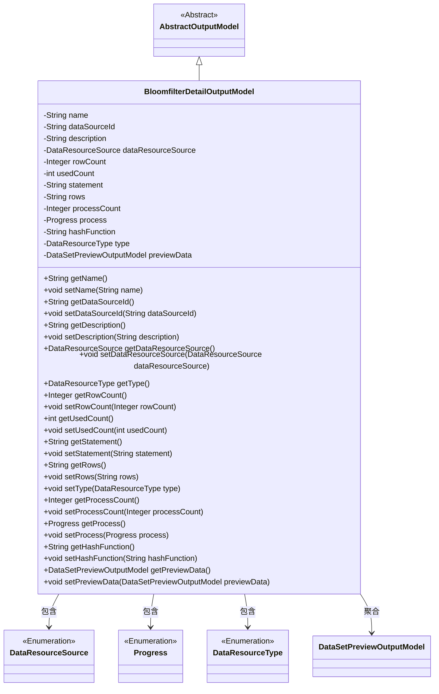
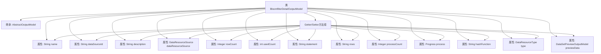

# 基础信息

|      |      |
|------|------|
| 名称 | BloomfilterDetailOutputModel |
| 编码语言 | .java |
| 代码路径 | WeFe/fusion/fusion-service/src/main/java/com/welab/wefe/data/fusion/service/dto/entity/bloomfilter/BloomfilterDetailOutputModel.java |
| 包名 | com.welab.wefe.data.fusion.service.dto.entity.bloomfilter |
| 依赖项 | ['com.welab.wefe.data.fusion.service.dto.entity.AbstractOutputModel', 'com.welab.wefe.data.fusion.service.dto.entity.dataset.DataSetPreviewOutputModel', 'com.welab.wefe.data.fusion.service.enums.DataResourceSource', 'com.welab.wefe.data.fusion.service.enums.DataResourceType', 'com.welab.wefe.data.fusion.service.enums.Progress', 'javax.persistence.EnumType', 'javax.persistence.Enumerated'] |
| 概述说明 | BloomfilterDetailOutputModel类包含名称、数据源ID、描述、数据来源、行数、使用次数、SQL语句、列选择、进度条、主键哈希方式等属性，用于表示布隆过滤器的详细信息。 |

# 说明

BloomfilterDetailOutputModel类继承自AbstractOutputModel，用于表示布隆过滤器的详细信息。包含名称、数据源ID、描述、数据资源来源枚举、行数、使用次数、SQL语句、选择列、进度条数值、进度状态枚举、主键哈希方式、数据资源类型（默认BloomFilter）及预览数据模型。提供各属性的getter和setter方法，支持对布隆过滤器相关数据的全面管理。

# 类列表 Class Summary

| 名称   | 类型  | 说明 |
|-------|------|-------------|
| BloomfilterDetailOutputModel | class | BloomfilterDetailOutputModel类继承AbstractOutputModel，包含名称、数据源ID、描述、数据来源、行数、使用次数、SQL语句、选择列、进度条数、进度状态、哈希函数、预览数据等属性。 |

## 类 BloomfilterDetailOutputModel

|      |      |
|------|------|
| 访问范围 | public |
| 类型 | class |
| 名称 | BloomfilterDetailOutputModel |
| 说明 | BloomfilterDetailOutputModel类继承AbstractOutputModel，包含名称、数据源ID、描述、数据来源、行数、使用次数、SQL语句、选择列、进度条数、进度状态、哈希函数、预览数据等属性。 |

### UML类图

该类图展示了BloomfilterDetailOutputModel继承自AbstractOutputModel，并包含多个属性和方法用于管理布隆过滤器的详细信息。其中包含枚举类型DataResourceSource、Progress和DataResourceType，以及聚合关系的数据集预览模型DataSetPreviewOutputModel。该类主要用于存储和操作布隆过滤器的元数据、使用统计、进度状态和预览数据等信息，通过getter和setter方法提供对这些属性的访问和修改。

### 内部方法调用关系图

该流程图展示了BloomfilterDetailOutputModel类的完整结构，包含从AbstractOutputModel的继承关系、12个属性字段（包括枚举类型和自定义对象类型）以及对应的getter/setter方法组。所有属性都通过统一的Getter/Setter方法组进行管理，其中dataResourceSource使用@Enumerated注解处理枚举序列化，type属性默认初始化为BloomFilter类型。类结构清晰体现了布隆过滤器详细输出模型的数据组成，包含基础信息、数据源配置、使用统计和预览数据等核心要素。

### 字段列表 Field List

| 名称  | 类型  | 说明 |
|-------|-------|------|
| type = DataResourceType.BloomFilter | DataResourceType | 数据类型为布隆过滤器。 |
| rows | String | 定义字符串类型变量rows。 |
| hashFunction | String | 私有字符串变量hashFunction，用于存储哈希函数名称。 |
| previewData | DataSetPreviewOutputModel | 私有数据集预览输出模型变量previewData。 |
| dataSourceId | String | 私有字符串变量dataSourceId，用于标识数据源。 |
| dataResourceSource | DataResourceSource | 定义枚举类型字段dataResourceSource，使用字符串值存储而非默认数字。 |
| usedCount = 0 | int | 私有整型变量usedCount，初始值为0。 |
| name | String | 私有字符串变量name。 |
| process | Progress | 私有进度对象process |
| processCount | Integer | 定义私有整型变量processCount，用于记录或控制进程数量。 |
| description | String | 私有字符串类型变量description。 |
| statement | String | 声明一个私有字符串变量statement。 |
| rowCount = 0 | Integer | 声明一个私有整型变量rowCount，初始值为0。 |

### 方法列表

| 名称  | 类型  | 说明 |
|-------|-------|------|
| getName | String | 该方法返回字符串类型的name变量值。 |
| getDataResourceSource | DataResourceSource | 方法返回数据资源源对象dataResourceSource。 |
| setDescription | void | 设置描述信息的方法，将输入参数赋值给对象的description属性。 |
| setStatement | void | 设置语句内容的方法。 |
| setRows | void | 这是一个Java方法，用于设置类的rows属性值，接受字符串参数rows并将其赋值给类的成员变量rows。 |
| setDataSourceId | void | 设置数据源ID的方法，将输入参数赋值给类的成员变量dataSourceId。 |
| setRowCount | void | 设置行数方法，用于更新对象的行数值。 |
| getProcessCount | Integer | 获取当前进程数量的方法，返回整数类型的进程计数值。 |
| setUsedCount | void | 设置已使用次数的方法，将参数usedCount赋值给成员变量usedCount。 |
| setProcess | void | 这是一个Java方法，用于设置类的process属性。方法接受一个Progress类型的参数，并将其赋值给当前对象的process成员变量。 |
| getDescription | String | 这是一个Java方法，返回字符串类型的description属性值。 |
| getRows | String | 获取rows字符串的方法。 |
| getType | DataResourceType | 方法返回DataResourceType类型的变量type。 |
| setType | void | 这是一个Java方法，用于设置数据资源类型。方法名为setType，接收DataResourceType类型参数，并将其赋值给当前对象的type属性。 |
| setName | void | 设置对象名称的方法，将参数name赋值给对象的name属性。 |
| getStatement | String | 获取statement字符串的方法。 |
| getRowCount | Integer | 获取行数的方法，返回整型的行数值。 |
| setProcessCount | void | 这是一个Java方法，用于设置processCount变量的值。方法接收一个Integer参数，并将其赋值给类的成员变量processCount。 |
| setDataResourceSource | void | 设置数据资源源的方法，将输入参数赋值给类的成员变量。 |
| getHashFunction | String | 该方法返回字符串类型的hashFunction值。 |
| setHashFunction | void | 这是一个Java方法，用于设置哈希函数的名称。方法接受一个字符串参数hashFunction，并将其赋值给类的同名成员变量。 |
| getPreviewData | DataSetPreviewOutputModel | 这是一个Java方法，返回名为previewData的DataSetPreviewOutputModel对象。 |
| setPreviewData | void | 该方法用于设置预览数据，接收一个DataSetPreviewOutputModel类型的参数previewData，并将其赋值给当前对象的previewData属性。 |
| getDataSourceId | String | 获取数据源ID的方法，返回成员变量dataSourceId的值。 |
| getProcess | Progress | 获取当前进度对象的方法。 |
| getUsedCount | int | 方法返回已使用次数变量值。 |

