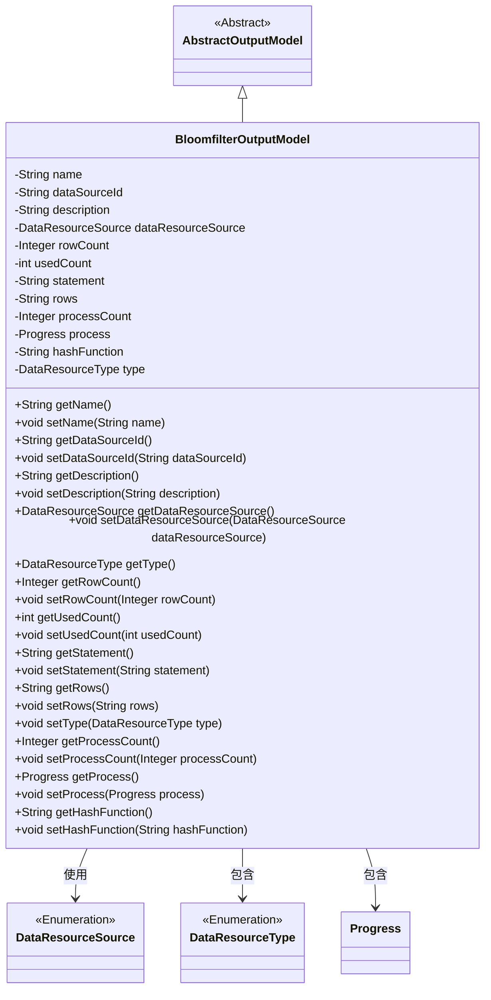

# 基础信息

|      |      |
|------|------|
| 名称 | BloomfilterOutputModel |
| 编码语言 | .java |
| 代码路径 | WeFe/fusion/fusion-service/src/main/java/com/welab/wefe/data/fusion/service/dto/entity/bloomfilter/BloomfilterOutputModel.java |
| 包名 | com.welab.wefe.data.fusion.service.dto.entity.bloomfilter |
| 依赖项 | ['com.welab.wefe.data.fusion.service.dto.entity.AbstractOutputModel', 'com.welab.wefe.data.fusion.service.enums.DataResourceSource', 'com.welab.wefe.data.fusion.service.enums.DataResourceType', 'com.welab.wefe.data.fusion.service.enums.Progress', 'javax.persistence.EnumType', 'javax.persistence.Enumerated'] |
| 概述说明 | BloomfilterOutputModel类继承AbstractOutputModel，包含名称、数据源ID、描述、数据资源来源、行数、使用次数、SQL语句、选择列、进度条数、进度状态、主键哈希方式和资源类型等属性及其getter/setter方法。 |

# 说明

BloomfilterOutputModel类继承自AbstractOutputModel，包含名称、数据源ID、描述、数据资源来源枚举、行数统计、使用次数、SQL语句、选择列、进度条数值、进度状态枚举、主键哈希方式和数据资源类型等属性。提供了所有属性的getter和setter方法，默认数据资源类型为BloomFilter。

# 类列表 Class Summary

| 名称   | 类型  | 说明 |
|-------|------|-------------|
| BloomfilterOutputModel | class | BloomfilterOutputModel类包含名称、数据源ID、描述、数据源类型、行数、使用次数、SQL语句、选择列、进度条数、进度状态和主键哈希方式等属性。 |

## 类 BloomfilterOutputModel

|      |      |
|------|------|
| 访问范围 | public |
| 类型 | class |
| 名称 | BloomfilterOutputModel |
| 说明 | BloomfilterOutputModel类包含名称、数据源ID、描述、数据源类型、行数、使用次数、SQL语句、选择列、进度条数、进度状态和主键哈希方式等属性。 |

### UML类图

该类图展示了BloomfilterOutputModel继承自AbstractOutputModel，并包含多个私有字段和对应的getter/setter方法。该类主要管理布隆过滤器输出模型的相关属性，包括名称、数据源ID、描述、资源来源类型、行数统计、使用计数、SQL语句、列选择、进度计数、进度状态和哈希函数等。通过枚举类型DataResourceSource和DataResourceType来限定某些字段的取值范围，同时使用Progress类来管理进度状态。

### 内部方法调用关系图

该流程图展示了BloomfilterOutputModel类的完整结构，包含其继承关系、12个属性字段以及对应的getter/setter方法。类继承自AbstractOutputModel，主要属性包括数据源标识、描述信息、资源类型枚举、行计数器等，所有属性均通过标准JavaBean规范提供访问方法。流程图清晰呈现了类成员与方法的从属关系，体现了该模型类用于管理布隆过滤器相关输出数据的结构设计。

### 字段列表 Field List

| 名称  | 类型  | 说明 |
|-------|-------|------|
| type = DataResourceType.BloomFilter | DataResourceType | 数据类型为布隆过滤器。 |
| statement | String | 私有字符串变量statement。 |
| dataSourceId | String | 数据源ID的私有字符串变量。 |
| description | String | 私有字符串类型变量description。 |
| hashFunction | String | 声明一个私有字符串变量hashFunction。 |
| rows | String | 声明一个私有字符串变量rows。 |
| process | Progress | 私有进度对象process。 |
| name | String | 私有字符串变量name |
| usedCount = 0 | int | 私有整型变量usedCount，初始值为0。 |
| processCount | Integer | 私有整型变量，用于记录进程数量。 |
| rowCount = 0 | Integer | 私有整型变量rowCount初始化为0。 |
| dataResourceSource | DataResourceSource | 枚举字段dataResourceSource使用字符串类型存储。 |

### 方法列表

| 名称  | 类型  | 说明 |
|-------|-------|------|
| setRows | void | 这是一个Java方法，用于设置对象的rows属性值为传入的字符串参数。 |
| getProcessCount | Integer | 获取进程数量的方法，返回整型值processCount。 |
| setName | void | 设置对象名称的方法，将参数name赋值给当前对象的name属性。 |
| setDescription | void | 这是一个Java方法，用于设置对象的描述信息。方法接收一个字符串参数description，并将其赋值给当前对象的description属性。 |
| setProcess | void | 设置进度对象。 |
| getProcess | Progress | 获取当前进度对象。 |
| setUsedCount | void | 设置已使用次数的方法，将参数usedCount赋值给类的成员变量usedCount。 |
| getType | DataResourceType | 方法返回DataResourceType类型的变量type。 |
| getUsedCount | int | 方法返回已使用次数。 |
| setProcessCount | void | 设置进程数量的方法，参数为整数类型。 |
| getRows | String | 获取rows字符串的方法。 |
| getDataResourceSource | DataResourceSource | 获取数据资源源的方法，返回dataResourceSource对象。 |
| setRowCount | void | 设置行数方法，参数为整型rowCount，赋值给类成员变量rowCount。 |
| getName | String | 这是一个Java方法，返回字符串类型的name变量值。 |
| setHashFunction | void | 这是一个Java方法，用于设置对象的hashFunction属性值。方法接受一个字符串参数hashFunction，并将其赋值给当前对象的同名属性。 |
| setStatement | void | 设置字符串类型的statement属性值。 |
| getRowCount | Integer | 获取行数的方法，返回整型的行数值。 |
| getDescription | String | 获取描述信息的方法，返回字符串类型的描述内容。 |
| getDataSourceId | String | 获取数据源ID的方法，返回字符串类型变量dataSourceId。 |
| setType | void | 设置数据资源类型的方法，将输入参数type赋值给当前对象的type属性。 |
| setDataSourceId | void | 设置数据源ID的方法，将输入参数赋值给类的成员变量dataSourceId。 |
| getStatement | String | 获取statement字符串的方法。 |
| setDataResourceSource | void | 设置数据资源源的方法，将传入参数赋值给类的成员变量。 |
| getHashFunction | String | 获取哈希函数名称的方法。 |

