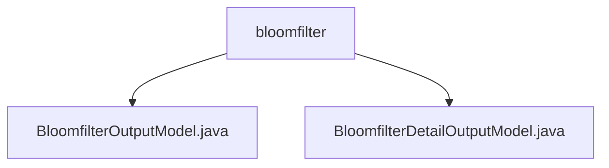

# 基础信息

|      |      |
|------|------|
| 名称 | bloomfilter |
| 编码语言 | .java |
| 代码路径 | WeFe/fusion/fusion-service/src/main/java/com/welab/wefe/data/fusion/service/dto/entity/bloomfilter |
| 包名 | docs.fusion.fusion-service.src.main.java.com.welab.wefe.data.fusion.service.dto.entity.bloomfilter |
| 概述说明 | BloomfilterOutputModel类继承AbstractOutputModel，含名称、数据源ID等属性，默认数据资源类型为BloomFilter。BloomfilterDetailOutputModel类继承AbstractOutputModel，扩展了预览数据模型，支持布隆过滤器数据全面管理。 |

# 说明

## 概述  
该模块核心职责是管理布隆过滤器数据模型，提供基础属性和详细信息两种输出模型。接口规范包含统一的属性访问方法，支持数据资源来源、进度状态等枚举类型操作。关键数据结构包括BloomfilterOutputModel和BloomfilterDetailOutputModel，后者扩展了预览数据功能。外部依赖仅为Java基础类库。例如，BloomfilterDetailOutputModel通过预览数据模型增强基础功能。

## 主要业务场景  
模块主要用于布隆过滤器数据的全生命周期管理，类似配置中心模式。业务流程涵盖从基础信息维护到详细数据预览的完整操作链，支持SQL语句配置、进度跟踪等核心功能。典型应用包括数据融合场景下的布隆过滤器创建与监控。例如，通过进度状态枚举实现异步任务状态更新。

### 包内部结构视图

该流程图展示了bloomfilter目录下的两个Java文件实体类结构。BloomfilterOutputModel.java和BloomfilterDetailOutputModel.java作为同级文件节点，都从属于bloomfilter父级目录，形成简单的两层树形关系。这种结构常见于DTO实体类的存放目录，用于描述布隆过滤器相关的数据输出模型。

# 文件列表

| 名称   | 类型  | 说明 |
|-------|------|-------------|
| [BloomfilterOutputModel.java](BloomfilterOutputModel.md) | file | BloomfilterOutputModel类继承AbstractOutputModel，包含名称、数据源ID、描述、数据资源来源、行数、使用次数、SQL语句、选择列、进度条数、进度状态、主键哈希方式和资源类型等属性及其getter/setter方法。 |
| [BloomfilterDetailOutputModel.java](BloomfilterDetailOutputModel.md) | file | BloomfilterDetailOutputModel类包含名称、数据源ID、描述、数据来源、行数、使用次数、SQL语句、列选择、进度条、主键哈希方式等属性，用于表示布隆过滤器的详细信息。 |

