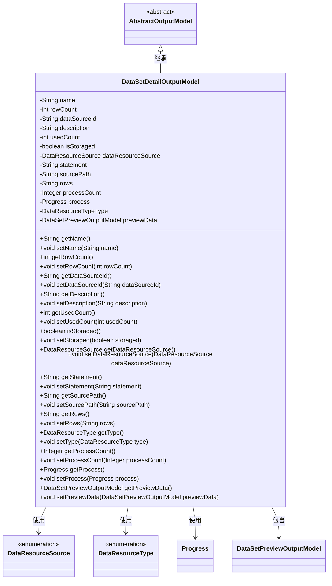

# 基础信息

|      |      |
|------|------|
| 名称 | DataSetDetailOutputModel |
| 编码语言 | .java |
| 代码路径 | WeFe/fusion/fusion-service/src/main/java/com/welab/wefe/data/fusion/service/dto/entity/dataset/DataSetDetailOutputModel.java |
| 包名 | com.welab.wefe.data.fusion.service.dto.entity.dataset |
| 依赖项 | ['com.welab.wefe.data.fusion.service.database.entity.DataSetColumnOutputModel', 'com.welab.wefe.data.fusion.service.dto.entity.AbstractOutputModel', 'com.welab.wefe.data.fusion.service.enums.DataResourceSource', 'com.welab.wefe.data.fusion.service.enums.DataResourceType', 'com.welab.wefe.data.fusion.service.enums.Progress', 'javax.persistence.EnumType', 'javax.persistence.Enumerated', 'java.util.ArrayList', 'java.util.List', 'java.util.Map'] |
| 概述说明 | 数据集详情输出模型，包含名称、行数、数据源ID、描述、使用次数、存储状态、数据来源、SQL语句、源文件路径、列选择、进度计数、进度状态、类型及预览数据。 |

# 说明

DataSetDetailOutputModel类继承自AbstractOutputModel，用于表示数据集详细信息。包含名称、行数、数据源ID、描述、使用次数、存储状态、数据资源来源、SQL语句、源文件路径、选定列、进度计数、进度状态等属性。默认类型为DataSet，并包含预览数据模型。提供所有属性的getter和setter方法。

# 类列表 Class Summary

| 名称   | 类型  | 说明 |
|-------|------|-------------|
| DataSetDetailOutputModel | class | 数据集详情输出模型，包含名称、行数、数据源ID、描述、使用次数、存储状态、数据来源、SQL语句、源文件路径、选择列、进度计数、进度状态、类型及预览数据。 |

## 类 DataSetDetailOutputModel

|      |      |
|------|------|
| 访问范围 | public |
| 类型 | class |
| 名称 | DataSetDetailOutputModel |
| 说明 | 数据集详情输出模型，包含名称、行数、数据源ID、描述、使用次数、存储状态、数据来源、SQL语句、源文件路径、选择列、进度计数、进度状态、类型及预览数据。 |

### UML类图

类图描述：该图展示了DataSetDetailOutputModel类继承自抽象类AbstractOutputModel，并包含多个私有字段及其对应的getter/setter方法。该类使用了枚举类型DataResourceSource和DataResourceType，以及Progress类和DataSetPreviewOutputModel类。DataSetDetailOutputModel主要用于表示数据集详细信息，包括名称、行数、数据源ID、描述、使用次数、存储状态、数据资源来源、SQL语句、源文件路径、行数据、进度计数、进度状态和预览数据等属性。

### 内部方法调用关系图

```mermaid
graph TD
    A["类DataSetDetailOutputModel"]
    B["继承: AbstractOutputModel"]
    C["属性: String name"]
    D["属性: int rowCount"]
    E["属性: String dataSourceId"]
    F["属性: String description"]
    G["属性: int usedCount"]
    H["属性: boolean isStoraged"]
    I["属性: DataResourceSource dataResourceSource"]
    J["属性: String statement"]
    K["属性: String sourcePath"]
    L["属性: String rows"]
    M["属性: Integer processCount"]
    N["属性: Progress process"]
    O["属性: DataResourceType type"]
    P["属性: DataSetPreviewOutputModel previewData"]
    Q["Getter/Setter方法组"]

    A --> B
    A --> C
    A --> D
    A --> E
    A --> F
    A --> G
    A --> H
    A --> I
    A --> J
    A --> K
    A --> L
    A --> M
    A --> N
    A --> O
    A --> P
    A --> Q

    Q -->|name| C
    Q -->|rowCount| D
    Q -->|dataSourceId| E
    Q -->|description| F
    Q -->|usedCount| G
    Q -->|isStoraged| H
    Q -->|dataResourceSource| I
    Q -->|statement| J
    Q -->|sourcePath| K
    Q -->|rows| L
    Q -->|processCount| M
    Q -->|process| N
    Q -->|type| O
    Q -->|previewData| P
```

该流程图展示了DataSetDetailOutputModel类的完整结构，包含从AbstractOutputModel的继承关系、14个属性字段及其数据类型，以及对应的Getter/Setter方法组。所有属性都通过统一的方法组进行访问控制，其中包含字符串、整型、布尔值、枚举类型和自定义对象等多种数据类型。特别值得注意的是包含Progress进度对象和DataSetPreviewOutputModel预览数据对象这两个复杂类型的属性。

### 字段列表 Field List

| 名称  | 类型  | 说明 |
|-------|-------|------|
| rows | String | 私有字符串变量rows。 |
| dataSourceId | String | 私有字符串变量dataSourceId，用于标识数据源。 |
| description | String | 私有字符串类型变量description，用于存储描述信息。 |
| type = DataResourceType.DataSet | DataResourceType | 数据类型为数据集。 |
| process | Progress | 私有进度处理对象 |
| sourcePath | String | 私有字符串变量sourcePath，用于存储路径信息。 |
| statement | String | 私有字符串变量statement声明。 |
| isStoraged = false | boolean | 变量isStoraged为布尔类型，初始值为false，表示未存储状态。 |
| rowCount | int | 私有整型变量，用于记录行数。 |
| dataResourceSource | DataResourceSource | 枚举字段dataResourceSource使用字符串类型存储。 |
| name | String | 私有字符串变量name。 |
| previewData | DataSetPreviewOutputModel | 私有数据集预览输出模型实例previewData。 |
| usedCount | int | 私有整型变量，记录使用次数。 |
| processCount | Integer | 私有整型变量processCount，用于记录或控制进程数量。 |

### 方法列表

| 名称  | 类型  | 说明 |
|-------|-------|------|
| getType | DataResourceType | 方法返回DataResourceType类型的变量type。 |
| getSourcePath | String | 这是一个Java方法，返回字符串类型的sourcePath变量值。 |
| setStoraged | void | 定义方法setStoraged，用于设置布尔类型变量isStoraged的值。 |
| getRowCount | int | 方法返回行数rowCount的值。 |
| getName | String | 获取名称的方法，返回字符串类型的name变量值。 |
| setRows | void | 设置rows属性的方法，将参数rows赋值给类的rows成员变量。 |
| setDescription | void | 设置描述内容的方法，将输入参数赋值给对象的description属性。 |
| getRows | String | 该方法返回字符串类型的rows变量值。 |
| setUsedCount | void | 设置已使用次数的方法，将参数usedCount赋值给成员变量usedCount。 |
| getUsedCount | int | 这是一个Java方法，返回整型变量usedCount的值。 |
| setSourcePath | void | 这是一个Java方法，用于设置类的sourcePath属性值。方法接收一个字符串参数sourcePath，并将其赋值给类的同名成员变量。 |
| isStoraged | boolean | 检查存储状态的布尔方法，返回isStoraged值。 |
| setDataSourceId | void | 设置数据源ID的方法，将输入参数赋值给类的成员变量dataSourceId。 |
| setStatement | void | 这是一个Java方法，用于设置类成员变量statement的值。方法接收一个字符串参数，并将其赋值给当前对象的statement属性。 |
| getDescription | String | 获取描述信息的字符串方法。 |
| setDataResourceSource | void | 设置数据资源源的方法，将输入参数赋值给类的成员变量dataResourceSource。 |
| getDataSourceId | String | 获取数据源ID的方法，直接返回成员变量dataSourceId的值。 |
| setRowCount | void | 设置行数方法：将参数rowCount赋值给类的rowCount成员变量。 |
| setName | void | 设置对象名称的方法，将参数name赋值给对象的name属性。 |
| getDataResourceSource | DataResourceSource | 获取数据资源源对象的方法，返回当前数据资源源实例。 |
| getStatement | String | 获取当前语句字符串。 |
| setType | void | 设置数据资源类型的方法，将输入参数type赋值给当前对象的type属性。 |
| getProcessCount | Integer | 获取进程数量的方法，返回整型变量processCount。 |
| setProcessCount | void | 设置进程数量的方法，参数为整数类型。 |
| getProcess | Progress | 获取进程对象的方法，返回Progress类型的process变量。 |
| setProcess | void | 设置进度对象的方法，将传入的process赋值给当前对象的process属性。 |
| getPreviewData | DataSetPreviewOutputModel | 获取预览数据的方法，返回DataSetPreviewOutputModel类型的结果。 |
| setPreviewData | void | 该方法用于设置预览数据，接收DataSetPreviewOutputModel类型参数并赋值给成员变量previewData。 |

