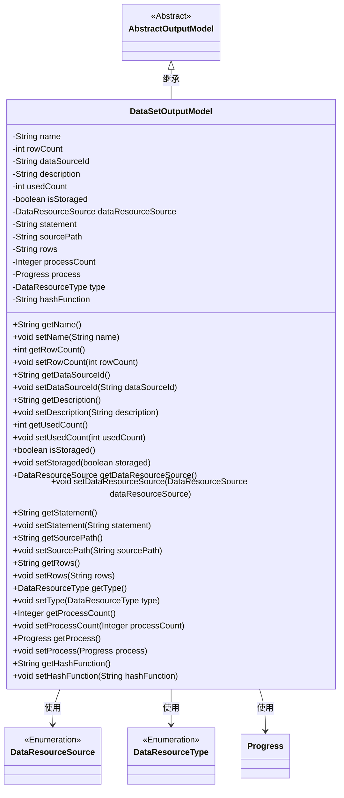

# 基础信息

|      |      |
|------|------|
| 名称 | DataSetOutputModel |
| 编码语言 | .java |
| 代码路径 | WeFe/fusion/fusion-service/src/main/java/com/welab/wefe/data/fusion/service/dto/entity/dataset/DataSetOutputModel.java |
| 包名 | com.welab.wefe.data.fusion.service.dto.entity.dataset |
| 依赖项 | ['com.welab.wefe.data.fusion.service.dto.entity.AbstractOutputModel', 'com.welab.wefe.data.fusion.service.enums.DataResourceSource', 'com.welab.wefe.data.fusion.service.enums.DataResourceType', 'com.welab.wefe.data.fusion.service.enums.Progress', 'javax.persistence.EnumType', 'javax.persistence.Enumerated'] |
| 概述说明 | DataSetOutputModel类继承AbstractOutputModel，包含数据集名称、行数、数据源ID、描述、使用次数、存储状态、数据来源、SQL语句、源文件路径、列选择、进度计数、进度状态、资源类型和哈希函数等属性及其getter/setter方法。 |

# 说明

DataSetOutputModel类继承AbstractOutputModel，包含数据集名称、行数、数据源ID、描述、使用次数、存储状态等属性。枚举类型dataResourceSource表示数据来源，statement存储SQL语句，sourcePath记录文件路径，rows保存列信息。processCount和process分别表示进度数值与状态，type默认为DataSet。提供各属性的getter和setter方法，hashFunction用于哈希计算。

# 类列表 Class Summary

| 名称   | 类型  | 说明 |
|-------|------|-------------|
| DataSetOutputModel | class | DataSetOutputModel类继承AbstractOutputModel，包含名称、行数、数据源ID、描述、使用次数、存储状态、数据来源、SQL语句、源路径、行选择、进度计数、进度状态、资源类型和哈希函数等属性及其getter/setter方法。 |

## 类 DataSetOutputModel

|      |      |
|------|------|
| 访问范围 | public |
| 类型 | class |
| 名称 | DataSetOutputModel |
| 说明 | DataSetOutputModel类继承AbstractOutputModel，包含名称、行数、数据源ID、描述、使用次数、存储状态、数据来源、SQL语句、源路径、行选择、进度计数、进度状态、资源类型和哈希函数等属性及其getter/setter方法。 |

### UML类图

该代码定义了一个数据集输出模型类DataSetOutputModel，继承自抽象类AbstractOutputModel。该类包含多个私有字段，如名称、行数、数据源ID、描述、使用计数等，以及对应的getter和setter方法。其中DataResourceSource和DataResourceType是枚举类型，Progress是一个类。该类主要用于管理数据集输出的各种属性和状态，包括数据来源、存储状态、处理进度等信息，提供了对这些属性的访问和修改方法。

### 内部方法调用关系图

这段代码定义了一个DataSetOutputModel类，继承自AbstractOutputModel，包含多个属性和对应的getter/setter方法。该类主要用于管理数据集输出模型，包括名称、行数、数据源ID、描述、使用计数、存储状态、数据资源来源、SQL语句、源文件路径、行选择、进度计数、进度状态、资源类型和哈希函数等信息。每个属性都有对应的访问方法，便于外部操作和获取数据。

### 字段列表 Field List

| 名称  | 类型  | 说明 |
|-------|-------|------|
| statement | String | 私有字符串变量statement。 |
| dataSourceId | String | 私有字符串变量，存储数据源ID。 |
| dataResourceSource | DataResourceSource | 使用@Enumerated注解将枚举类型DataResourceSource按字符串形式存储。 |
| rowCount | int | 私有整型变量，记录行数。 |
| isStoraged = false | boolean | 变量isStoraged为布尔类型，初始值为false，表示未存储状态。 |
| usedCount | int | 私有整型变量，记录使用次数。 |
| type = DataResourceType.DataSet | DataResourceType | 定义数据类型变量type，赋值为DataSet。 |
| description | String | 私有字符串类型变量description。 |
| hashFunction | String | 字符串哈希函数变量声明。 |
| processCount | Integer | 私有整型变量，用于记录进程数量。 |
| process | Progress | 私有进度处理对象。 |
| rows | String | 声明一个私有字符串变量rows。 |
| sourcePath | String | 声明一个私有字符串变量sourcePath。 |
| name | String | 声明一个私有字符串变量name。 |

### 方法列表

| 名称  | 类型  | 说明 |
|-------|-------|------|
| getType | DataResourceType | 方法返回DataResourceType类型的对象type。 |
| setUsedCount | void | 设置已使用次数的函数，参数为usedCount，赋值给类成员变量usedCount。 |
| setRows | void | 这是一个Java方法，用于设置类的rows属性值。方法接受一个字符串参数rows，并将其赋值给类的同名成员变量。 |
| getName | String | 获取名称的方法，返回字符串类型的name变量值。 |
| setRowCount | void | 设置行数为指定值。 |
| getSourcePath | String | 获取源路径的方法，返回字符串类型的sourcePath变量值。 |
| getDataSourceId | String | 获取数据源ID的方法，返回字符串类型变量dataSourceId。 |
| setType | void | 设置数据资源类型的方法，将传入参数赋值给对象属性type。 |
| getProcessCount | Integer | 获取进程数量的方法，返回整型值processCount。 |
| setProcessCount | void | 设置进程数量的方法，参数为整数类型。 |
| getProcess | Progress | 获取当前进度对象的方法。 |
| setProcess | void | 这是一个Java方法，用于设置Progress类型的成员变量process。方法名为setProcess，接受一个Progress参数。 |
| getHashFunction | String | 获取哈希函数名称的方法，返回字符串类型。 |
| setHashFunction | void | 这是一个Java方法，用于设置对象的hashFunction属性。方法接受一个字符串参数并将其赋值给成员变量。 |
| setDataSourceId | void | 设置数据源ID的方法，将输入参数赋值给类的成员变量dataSourceId。 |
| setStatement | void | 设置语句内容的方法。 |
| setStoraged | void | 设置存储状态的方法，将isStoraged赋值为传入的storaged参数。 |
| getStatement | String | 获取statement字符串的方法。 |
| getRows | String | 获取rows字符串的方法。 |
| isStoraged | boolean | 检查存储状态的布尔方法，返回isStoraged值。 |
| setDescription | void | 这是一个Java方法，用于设置对象的描述信息。方法接收一个字符串参数description，并将其赋值给对象的description属性。 |
| getDataResourceSource | DataResourceSource | 这是一个Java方法，返回名为dataResourceSource的数据资源源对象。 |
| getDescription | String | 获取描述信息的方法，返回字符串类型的description值。 |
| setSourcePath | void | 设置源路径的方法，将输入参数赋值给类的sourcePath成员变量。 |
| setName | void | 设置对象名称的方法，将参数name赋值给对象的name属性。 |
| getRowCount | int | 获取行数的方法，返回变量rowCount的值。 |
| getUsedCount | int | 方法返回已使用次数的整数值。 |
| setDataResourceSource | void | 设置数据资源源的方法，将传入的dataResourceSource赋值给当前对象的同名属性。 |

