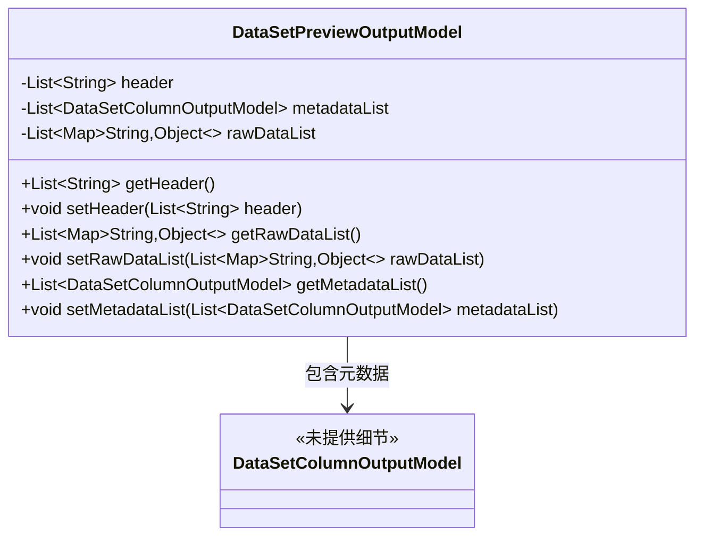
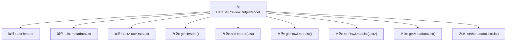

# 基础信息

|      |      |
|------|------|
| 名称 | DataSetPreviewOutputModel |
| 编码语言 | .java |
| 代码路径 | WeFe/fusion/fusion-service/src/main/java/com/welab/wefe/data/fusion/service/dto/entity/dataset/DataSetPreviewOutputModel.java |
| 包名 | com.welab.wefe.data.fusion.service.dto.entity.dataset |
| 依赖项 | ['com.welab.wefe.common.fieldvalidate.annotation.Check', 'com.welab.wefe.data.fusion.service.database.entity.DataSetColumnOutputModel', 'java.util.ArrayList', 'java.util.List', 'java.util.Map'] |
| 概述说明 | 数据集预览输出模型，包含字段列表、元数据信息和原始数据列表，提供对应的getter和setter方法。 |

# 说明

DataSetPreviewOutputModel类用于表示数据集预览输出，包含三个主要字段：header存储字段列表，metadataList存储元数据信息，rawDataList存储原始数据列表。每个字段都有对应的getter和setter方法，便于访问和修改数据。header是字符串列表，metadataList是DataSetColumnOutputModel对象列表，rawDataList是键值对映射列表。类结构清晰，功能明确，适合处理数据集预览相关操作。

# 类列表 Class Summary

| 名称   | 类型  | 说明 |
|-------|------|-------------|
| DataSetPreviewOutputModel | class | 数据集预览输出模型，包含字段列表、元数据信息和原始数据列表，提供对应的getter和setter方法。 |

## 类 DataSetPreviewOutputModel

|      |      |
|------|------|
| 访问范围 | public |
| 类型 | class |
| 名称 | DataSetPreviewOutputModel |
| 说明 | 数据集预览输出模型，包含字段列表、元数据信息和原始数据列表，提供对应的getter和setter方法。 |

### UML类图

该类图展示了DataSetPreviewOutputModel的数据结构，它是一个包含数据集预览信息的模型类。具有三个核心字段：header存储字段列表，metadataList存储列元数据信息，rawDataList存储原始数据记录。所有字段都通过@Check注解进行校验，并通过标准的getter/setter方法暴露访问接口。其中metadataList字段与DataSetColumnOutputModel类存在关联关系，表示元数据的具体结构由该模型定义。整个设计采用了典型的JavaBean模式，适合作为DTO进行数据传输。

### 内部方法调用关系图

这段代码定义了一个名为DataSetPreviewOutputModel的类，用于封装数据集预览的输出模型。该类包含三个主要属性：header（字段列表）、metadataList（元数据信息）和rawDataList（原始数据列表），每个属性都带有@Check注解进行校验。类中提供了对应的getter和setter方法，用于访问和修改这些属性。该模型主要用于结构化存储和传递数据集预览的相关信息，便于在数据处理流程中进行操作和校验。

### 字段列表 Field List

| 名称  | 类型  | 说明 |
|-------|-------|------|
| rawDataList = new ArrayList<>() | List<Map<String, Object>> | 定义私有变量rawDataList，类型为List<Map<String, Object>>，初始化为空ArrayList，并添加Check注解标注为"原始数据列表"。 |
| metadataList = new ArrayList<>() | List<DataSetColumnOutputModel> | Java代码中定义了一个名为metadataList的私有列表变量，用于存储元数据信息，初始化为空ArrayList。 |
| header = new ArrayList<>() | List<String> | 定义私有字段header，类型为字符串列表，初始化为空列表，使用@Check注解标记字段名称为"字段列表"。 |

### 方法列表

| 名称  | 类型  | 说明 |
|-------|-------|------|
| getRawDataList | List<Map<String, Object>> | 方法返回原始数据列表，列表元素为键值对映射。 |
| getHeader | List<String> | 方法getHeader返回字符串列表header。 |
| setMetadataList | void | 设置元数据列表的方法，将输入参数赋值给类的成员变量metadataList。 |
| getMetadataList | List<DataSetColumnOutputModel> | 该方法返回一个包含DataSetColumnOutputModel对象的列表metadataList。 |
| setHeader | void | 设置方法：将输入的字符串列表赋值给类的header属性。 |
| setRawDataList | void | 方法setRawDataList接收一个元素为Map的List参数，并将其赋值给类的rawDataList成员变量。 |

