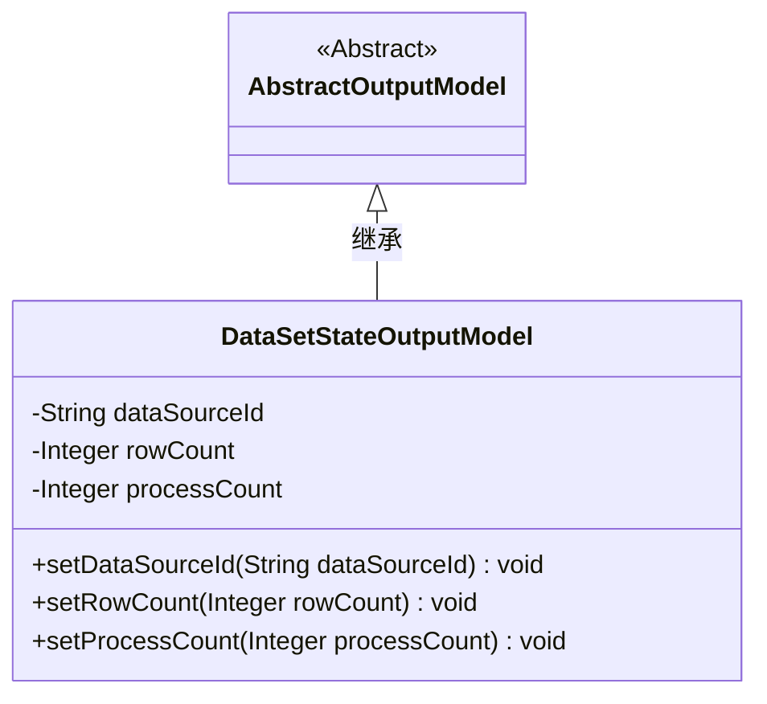
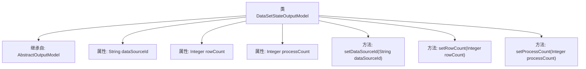

# 基础信息

|      |      |
|------|------|
| 名称 | DataSetStateOutputModel |
| 编码语言 | .java |
| 代码路径 | WeFe/fusion/fusion-service/src/main/java/com/welab/wefe/data/fusion/service/dto/entity/dataset/DataSetStateOutputModel.java |
| 包名 | com.welab.wefe.data.fusion.service.dto.entity.dataset |
| 依赖项 | ['com.welab.wefe.data.fusion.service.dto.entity.AbstractOutputModel'] |
| 概述说明 | 数据集状态输出模型类，包含数据源ID、行数和处理数三个属性及对应的setter方法。 |

# 说明

DataSetStateOutputModel是一个继承自AbstractOutputModel的Java类，用于表示数据集状态输出模型。该类包含三个私有属性：dataSourceId用于存储数据源标识符，rowCount记录行数，processCount表示处理计数。提供了三个公共setter方法分别用于设置这些属性的值。

# 类列表 Class Summary

| 名称   | 类型  | 说明 |
|-------|------|-------------|
| DataSetStateOutputModel | class | 数据集状态输出模型类，包含数据源ID、行数和处理数三个属性及对应的设置方法。 |

## 类 DataSetStateOutputModel

|      |      |
|------|------|
| 访问范围 | public |
| 类型 | class |
| 名称 | DataSetStateOutputModel |
| 说明 | 数据集状态输出模型类，包含数据源ID、行数和处理数三个属性及对应的设置方法。 |

### UML类图

这段类图展示了DataSetStateOutputModel继承自抽象类AbstractOutputModel的结构。DataSetStateOutputModel包含三个私有属性：dataSourceId（字符串类型）、rowCount和processCount（均为整型包装类），以及对应的三个公有设置方法。该类用于封装数据集状态输出信息，通过继承机制复用父类功能，典型应用于数据处理流程中记录数据源标识、总行数和已处理行数等元信息。

### 内部方法调用关系图

这段代码展示了一个名为DataSetStateOutputModel的类，它继承自AbstractOutputModel。该类包含三个私有属性：dataSourceId（字符串类型）、rowCount和processCount（均为整数类型）。同时提供了三个公共的setter方法，分别用于设置这三个属性的值。流程图清晰地展示了类的继承关系、属性定义以及方法结构，反映了该类的核心功能和数据封装特性。

### 字段列表 Field List

| 名称  | 类型  | 说明 |
|-------|-------|------|
| dataSourceId | String | 私有字符串变量dataSourceId。 |
| rowCount | Integer | 整型变量rowCount，用于记录行数。 |
| processCount | Integer | 私有整型变量，用于记录进程数量。 |

### 方法列表

| 名称  | 类型  | 说明 |
|-------|-------|------|
| setRowCount | void | 方法setRowCount用于设置行数，参数为Integer类型的rowCount，将其赋值给类的成员变量this.rowCount。 |
| setDataSourceId | void | 设置数据源ID的方法，将输入参数赋值给类成员变量dataSourceId。 |
| setProcessCount | void | 设置进程数量的方法，参数为整数类型。 |

