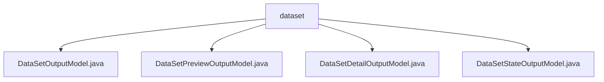

# 基础信息

|      |      |
|------|------|
| 名称 | dataset |
| 编码语言 | .java |
| 代码路径 | WeFe/fusion/fusion-service/src/main/java/com/welab/wefe/data/fusion/service/dto/entity/dataset |
| 包名 | docs.fusion.fusion-service.src.main.java.com.welab.wefe.data.fusion.service.dto.entity.dataset |
| 概述说明 | DataSetOutputModel类继承AbstractOutputModel，包含数据集名称、行数等属性，提供getter/setter方法。DataSetPreviewOutputModel类用于数据集预览，包含字段列表、元数据和原始数据。DataSetDetailOutputModel继承AbstractOutputModel，包含数据集详细信息及预览数据。DataSetStateOutputModel类表示数据集状态，包含数据源ID、行数和处理计数。 |

# 说明

## 概述  
该模块核心职责是管理数据集的全生命周期状态，包括基础信息存储、预览展示和详细状态跟踪。接口规范统一采用Getter/Setter模式，通过继承AbstractOutputModel实现标准化输出。关键数据结构包含DataSetOutputModel（基础属性）、DataSetPreviewOutputModel（预览结构）、DataSetDetailOutputModel（扩展详情）和DataSetStateOutputModel（处理状态）。外部依赖仅为Java基础库。例如DataSetPreviewOutputModel使用Map存储原始数据，类似NoSQL文档结构。

## 主要业务场景  
模块支持数据集元数据管理（例如记录行数/来源）、动态预览（如字段列表与原始数据分离展示）和异步处理监控（如processCount进度跟踪）。典型交互模式为链式操作：先通过DataSetOutputModel获取概要，再按需加载Preview或Detail模型。完整功能覆盖从SQL查询结果到文件路径数据的统一封装，例如DataSetDetailOutputModel同时整合SQL语句和本地文件路径。API类型均为POJO实体类，适用于RESTful接口序列化。

### 包内部结构视图

该流程图展示了`dataset`目录下的四个Java文件之间的层级关系。`dataset`作为父节点，包含四个子节点文件：DataSetOutputModel.java、DataSetPreviewOutputModel.java、DataSetDetailOutputModel.java和DataSetStateOutputModel.java。这些文件都属于数据融合服务的DTO实体类，用于处理数据集的不同输出模型。

# 文件列表

| 名称   | 类型  | 说明 |
|-------|------|-------------|
| [DataSetOutputModel.java](DataSetOutputModel.md) | file | DataSetOutputModel类继承AbstractOutputModel，包含数据集名称、行数、数据源ID、描述、使用次数、存储状态、数据来源、SQL语句、源文件路径、列选择、进度计数、进度状态、资源类型和哈希函数等属性及其getter/setter方法。 |
| [DataSetPreviewOutputModel.java](DataSetPreviewOutputModel.md) | file | 数据集预览输出模型，包含字段列表、元数据信息和原始数据列表，提供对应的getter和setter方法。 |
| [DataSetDetailOutputModel.java](DataSetDetailOutputModel.md) | file | 数据集详情输出模型，包含名称、行数、数据源ID、描述、使用次数、存储状态、数据来源、SQL语句、源文件路径、列选择、进度计数、进度状态、类型及预览数据。 |
| [DataSetStateOutputModel.java](DataSetStateOutputModel.md) | file | 数据集状态输出模型类，包含数据源ID、行数和处理数三个属性及对应的setter方法。 |

