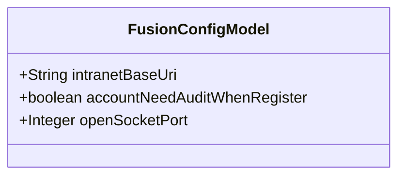
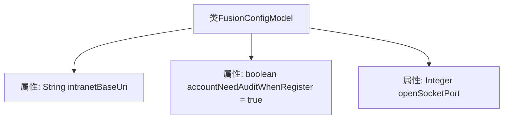

# 基础信息

|      |      |
|------|------|
| 名称 | FusionConfigModel |
| 编码语言 | .java |
| 代码路径 | WeFe/fusion/fusion-service/src/main/java/com/welab/wefe/data/fusion/service/dto/entity/globalconfig/FusionConfigModel.java |
| 包名 | com.welab.wefe.data.fusion.service.dto.entity.globalconfig |
| 依赖项 | [] |
| 概述说明 | FusionConfigModel类包含内网基础URL、新账号需审核标志和开放Socket端口配置。 |

# 说明

FusionConfigModel类包含三个配置参数：intranetBaseUri表示fusion服务的内部网络基础URL；accountNeedAuditWhenRegister默认为true，控制新注册账号是否需要管理员审核；openSocketPort用于设置开放的socket端口号。

# 类列表 Class Summary

| 名称   | 类型  | 说明 |
|-------|------|-------------|
| FusionConfigModel | class | FusionConfigModel类包含内网基础URL、新账号注册需审核标志及开放Socket端口配置。 |

## 类 FusionConfigModel

|      |      |
|------|------|
| 访问范围 | public |
| 类型 | class |
| 名称 | FusionConfigModel |
| 说明 | FusionConfigModel类包含内网基础URL、新账号注册需审核标志及开放Socket端口配置。 |

### UML类图

该类图展示了一个配置模型类FusionConfigModel，包含三个公有字段：intranetBaseUri表示内网基础URL地址，accountNeedAuditWhenRegister控制新账号注册时是否需要管理员审核（默认值为true），openSocketPort用于存储开放的Socket端口号。这是一个简单的数据传输对象，用于集中管理融合服务的配置参数，所有字段均为公开可访问且无封装方法，适合作为配置信息的载体类。

### 内部方法调用关系图

这段流程图展示了FusionConfigModel类的结构，包含三个主要属性：intranetBaseUri用于存储内网基础URL地址，accountNeedAuditWhenRegister控制新账号注册时的审核开关（默认开启），openSocketPort记录开放的Socket端口号。类中没有定义方法，仅通过公开字段直接暴露配置参数，这种设计通常用于简单的配置数据封装场景。每个属性都配有JavaDoc注释说明其用途，体现了配置类的基本特征。

### 字段列表 Field List

| 名称  | 类型  | 说明 |
|-------|-------|------|
| accountNeedAuditWhenRegister = true | boolean | 注册时账户需审核 |
| intranetBaseUri | String | 声明一个公共字符串变量intranetBaseUri，用于存储内网基础URI。 |
| openSocketPort | Integer | 定义了一个公开的整型变量openSocketPort，用于表示打开的套接字端口号。 |

### 方法列表

| 名称  | 类型  | 说明 |
|-------|-------|------|

