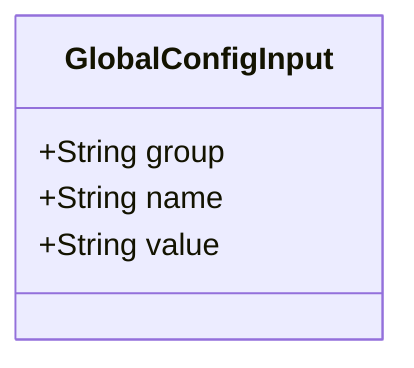
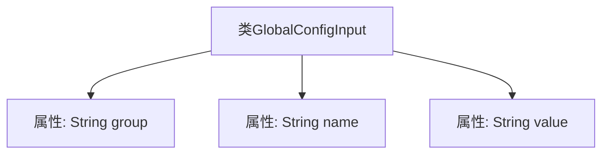

# 基础信息

|      |      |
|------|------|
| 名称 | GlobalConfigInput |
| 编码语言 | .java |
| 代码路径 | WeFe/fusion/fusion-service/src/main/java/com/welab/wefe/data/fusion/service/dto/entity/globalconfig/GlobalConfigInput.java |
| 包名 | com.welab.wefe.data.fusion.service.dto.entity.globalconfig |
| 依赖项 | [] |
| 概述说明 | GlobalConfigInput类包含三个字符串属性：group、name和value，用于配置项的分组、名称和值。 |

# 说明

GlobalConfigInput是一个公共类，用于表示全局配置的输入信息。该类包含三个公共字符串类型属性：group表示配置所属的分组，name表示配置的名称，value表示配置的值。这个类结构简单明了，适用于存储和传递全局配置相关的数据。

# 类列表 Class Summary

| 名称   | 类型  | 说明 |
|-------|------|-------------|
| GlobalConfigInput | class | GlobalConfigInput类包含三个字符串属性：group、name和value。 |

## 类 GlobalConfigInput

|      |      |
|------|------|
| 访问范围 | public |
| 类型 | class |
| 名称 | GlobalConfigInput |
| 说明 | GlobalConfigInput类包含三个字符串属性：group、name和value。 |

### UML类图

这段类图描述了一个简单的全局配置输入类GlobalConfigInput，包含三个公有字符串字段：group表示配置分组，name表示配置项名称，value存储配置值。该类作为数据传输对象(DTO)使用，没有封装逻辑，仅用于结构化存储配置数据。所有字段均为公开可访问，适用于需要快速读写配置信息的场景，常见于系统初始化或动态配置加载等流程中。

### 内部方法调用关系图

该流程图展示了GlobalConfigInput类的结构，它是一个简单的数据载体类，包含三个公开的字符串类型属性：group、name和value。类中没有定义任何方法，仅通过属性存储配置项的组名、名称和值。这种设计通常用于DTO(数据传输对象)或配置参数封装场景，属性公开便于直接访问但缺乏封装保护。

### 字段列表 Field List

| 名称  | 类型  | 说明 |
|-------|-------|------|
| name | String | 公共字符串变量name |
| group | String | 定义了一个公共字符串变量group。 |
| value | String | 声明一个公开的字符串变量value。 |

### 方法列表

| 名称  | 类型  | 说明 |
|-------|-------|------|

