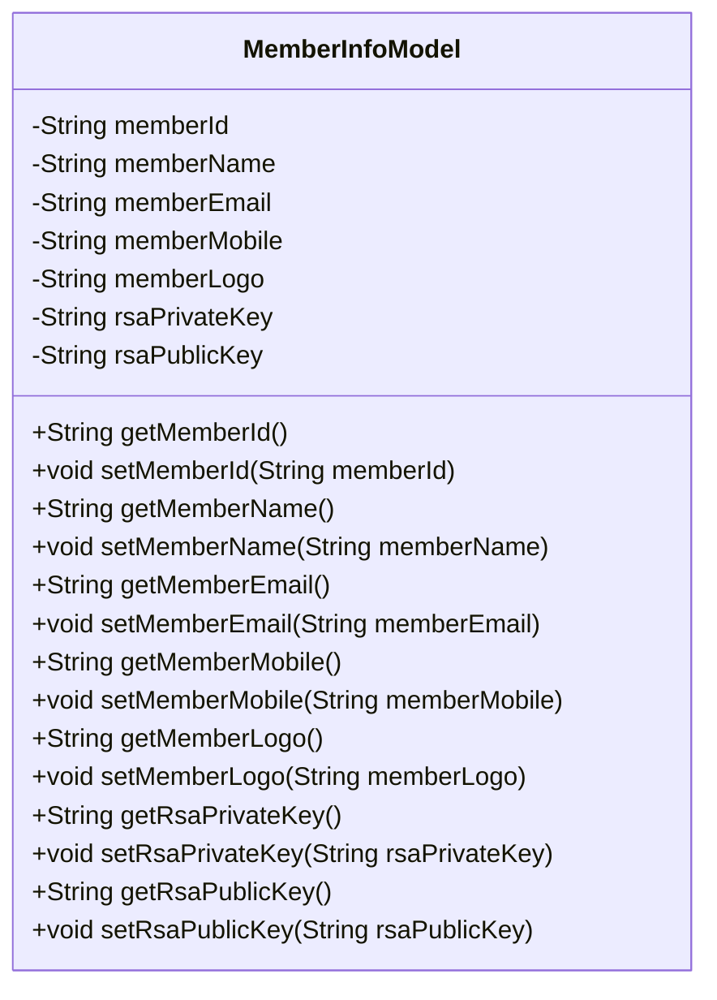

# 基础信息

|      |      |
|------|------|
| 名称 | MemberInfoModel |
| 编码语言 | .java |
| 代码路径 | WeFe/fusion/fusion-service/src/main/java/com/welab/wefe/data/fusion/service/dto/entity/globalconfig/MemberInfoModel.java |
| 包名 | com.welab.wefe.data.fusion.service.dto.entity.globalconfig |
| 依赖项 | ['com.welab.wefe.common.fieldvalidate.annotation.Check'] |
| 概述说明 | MemberInfoModel类包含成员ID、名称、邮箱、电话、头像及RSA公私钥字段，均提供getter/setter方法。 |

# 说明

MemberInfoModel类定义了联邦成员信息的数据结构，包含成员ID（全局唯一，默认为uuid）、名称、邮箱、电话、头像等基础信息，以及RSA公私钥字段。每个字段均通过@Check注解标注了中文名称和描述。类中为所有字段提供了标准的getter和setter方法，支持对这些属性的读取和修改操作。该模型用于封装和管理联邦成员的相关数据。

# 类列表 Class Summary

| 名称   | 类型  | 说明 |
|-------|------|-------------|
| MemberInfoModel | class | MemberInfoModel类包含成员ID、名称、邮箱、电话、头像及RSA公私钥字段，提供getter/setter方法。 |

## 类 MemberInfoModel

|      |      |
|------|------|
| 访问范围 | public |
| 类型 | class |
| 名称 | MemberInfoModel |
| 说明 | MemberInfoModel类包含成员ID、名称、邮箱、电话、头像及RSA公私钥字段，提供getter/setter方法。 |

### UML类图

这段代码定义了一个名为`MemberInfoModel`的类，用于表示联邦成员的信息模型。该类包含多个私有字段，如成员ID、名称、电子邮件、电话、头像以及RSA公私钥等，每个字段都配有相应的getter和setter方法。通过注解`@Check`对字段进行了描述性标注，表明其用途和约束条件。整体设计符合JavaBean规范，便于数据封装和访问控制。

### 内部方法调用关系图

```mermaid
graph TD
    A["类MemberInfoModel"]
    B["属性: String memberId"]
    C["属性: String memberName"]
    D["属性: String memberEmail"]
    E["属性: String memberMobile"]
    F["属性: String memberLogo"]
    G["属性: String rsaPrivateKey"]
    H["属性: String rsaPublicKey"]
    I["方法: getMemberId()"]
    J["方法: setMemberId(String)"]
    K["方法: getMemberName()"]
    L["方法: setMemberName(String)"]
    M["方法: getMemberEmail()"]
    N["方法: setMemberEmail(String)"]
    O["方法: getMemberMobile()"]
    P["方法: setMemberMobile(String)"]
    Q["方法: getMemberLogo()"]
    R["方法: setMemberLogo(String)"]
    S["方法: getRsaPrivateKey()"]
    T["方法: setRsaPrivateKey(String)"]
    U["方法: getRsaPublicKey()"]
    V["方法: setRsaPublicKey(String)"]

    A --> B
    A --> C
    A --> D
    A --> E
    A --> F
    A --> G
    A --> H
    A --> I
    A --> J
    A --> K
    A --> L
    A --> M
    A --> N
    A --> O
    A --> P
    A --> Q
    A --> R
    A --> S
    A --> T
    A --> U
    A --> V
```

该流程图展示了MemberInfoModel类的完整结构，包含7个私有属性和对应的14个getter/setter方法。所有属性均使用@Check注解进行校验标注，涉及成员基本信息（如ID、名称、联系方式）和安全凭证（RSA密钥对）。每个属性通过成对的访问方法实现封装，形成标准的数据模型类结构，适用于联邦成员信息的存储和校验场景。

### 字段列表 Field List

| 名称  | 类型  | 说明 |
|-------|-------|------|
| memberId | String | 联邦成员Id，全局唯一，默认值为uuid。 |
| memberEmail | String | 代码定义了一个私有字符串变量memberEmail，并通过@Check注解标注其名称为"联邦成员名称"。 |
| memberName | String | 定义私有字符串变量memberName，使用@Check注解校验联邦成员名称。 |
| rsaPublicKey | String | 类成员变量rsaPublicKey，使用@Check注解标记为"公钥"，类型为String。 |
| memberLogo | String | 成员头像字段，使用@Check注解标记。 |
| memberMobile | String | 类成员变量memberMobile，使用@Check注解校验联邦成员电话。 |
| rsaPrivateKey | String | 私有字符串变量rsaPrivateKey，标注为私钥检查项。 |

### 方法列表

| 名称  | 类型  | 说明 |
|-------|-------|------|
| setRsaPrivateKey | void | 设置RSA私钥的方法，将输入字符串赋值给类的私有变量rsaPrivateKey。 |
| getRsaPrivateKey | String | 获取RSA私钥的方法，返回字符串类型的私钥值。 |
| getMemberLogo | String | 获取成员Logo的字符串值方法。 |
| setMemberMobile | void | 这是一个Java方法，用于设置成员手机号，将传入的memberMobile赋值给类的同名成员变量。 |
| setRsaPublicKey | void | 设置RSA公钥的方法，将输入字符串赋值给类成员变量rsaPublicKey。 |
| setMemberId | void | 设置成员ID的方法，将输入参数赋值给类的成员变量memberId。 |
| getMemberEmail | String | 获取成员邮箱的方法，返回成员邮箱字符串。 |
| setMemberEmail | void | 这是一个Java方法，用于设置成员邮箱属性。方法接收一个字符串参数memberEmail，并将其赋值给类的成员变量memberEmail。 |
| getRsaPublicKey | String | 获取RSA公钥的方法。 |
| getMemberId | String | 获取成员ID的方法，返回字符串类型的memberId。 |
| getMemberMobile | String | 获取成员手机号的方法，返回字符串类型的成员手机号。 |
| setMemberLogo | void | 设置成员logo的方法，将输入字符串赋值给成员变量memberLogo。 |
| getMemberName | String | 方法返回成员变量memberName的值。 |
| setMemberName | void | 设置成员名称的方法，将输入参数赋值给成员变量。 |

