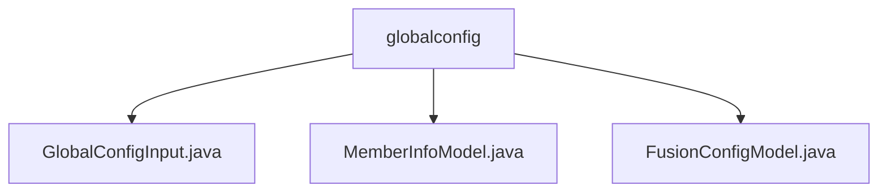

# 基础信息

|      |      |
|------|------|
| 名称 | globalconfig |
| 编码语言 | .java |
| 代码路径 | WeFe/fusion/fusion-service/src/main/java/com/welab/wefe/data/fusion/service/dto/entity/globalconfig |
| 包名 | docs.fusion.fusion-service.src.main.java.com.welab.wefe.data.fusion.service.dto.entity.globalconfig |
| 概述说明 | GlobalConfigInput类含group、name、value三个字符串属性，用于全局配置输入。MemberInfoModel类定义联邦成员信息，含ID、名称、邮箱等字段及RSA密钥。FusionConfigModel类包含内网URL、注册审核开关、socket端口号三个配置参数。 |

# 说明

## 概述  
该模块核心职责是管理联邦学习系统的全局配置和成员信息，类似配置中心的角色。接口规范统一采用Java类封装，包含GlobalConfigInput（配置项输入）、MemberInfoModel（成员信息）和FusionConfigModel（服务配置）三个主要数据结构。关键字段包括group/name/value（配置三元组）、成员ID/密钥（身份认证）及intranetBaseUri（网络地址）等。外部依赖仅涉及基础Java环境。例如GlobalConfigInput通过字符串存储配置，MemberInfoModel使用注解校验字段。

## 主要业务场景  
模块支持联邦成员管理（如注册审核）和服务配置维护两类核心流程，交互模式均为DTO对象传递。典型应用包括：新成员注册时校验账号审核开关（accountNeedAuditWhenRegister），服务间通信依赖intranetBaseUri配置。API类型涵盖配置CRUD和成员信息管理，例如通过openSocketPort参数控制Socket服务端口。整体形成类似微服务配置中心的解决方案。

### 包内部结构视图

该流程图展示了`globalconfig`目录下的三个Java文件：`GlobalConfigInput.java`、`MemberInfoModel.java`和`FusionConfigModel.java`。所有文件都直接隶属于`globalconfig`目录，没有更深层级的嵌套关系，结构清晰简单。

# 文件列表

| 名称   | 类型  | 说明 |
|-------|------|-------------|
| [GlobalConfigInput.java](GlobalConfigInput.md) | file | GlobalConfigInput类包含三个字符串属性：group、name和value，用于配置项的分组、名称和值。 |
| [MemberInfoModel.java](MemberInfoModel.md) | file | MemberInfoModel类包含成员ID、名称、邮箱、电话、头像及RSA公私钥字段，均提供getter/setter方法。 |
| [FusionConfigModel.java](FusionConfigModel.md) | file | FusionConfigModel类包含内网基础URL、新账号需审核标志和开放Socket端口配置。 |

