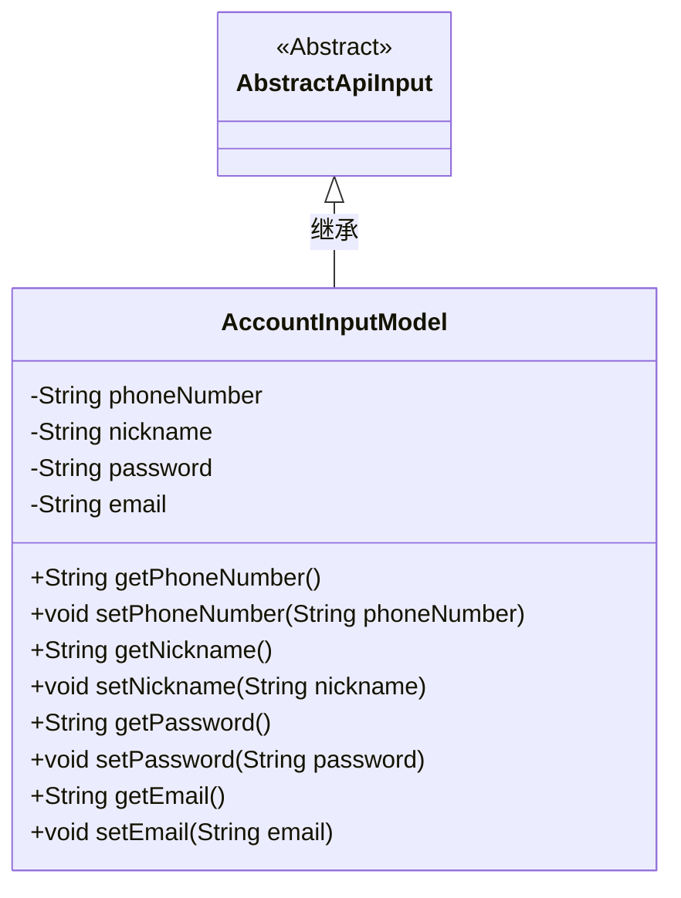
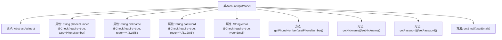

# 基础信息

|      |      |
|------|------|
| 名称 | AccountInputModel |
| 编码语言 | .java |
| 代码路径 | WeFe/fusion/fusion-service/src/main/java/com/welab/wefe/data/fusion/service/dto/vo/AccountInputModel.java |
| 包名 | com.welab.wefe.data.fusion.service.dto.vo |
| 依赖项 | ['com.welab.wefe.common.fieldvalidate.StandardFieldType', 'com.welab.wefe.common.fieldvalidate.annotation.Check', 'com.welab.wefe.common.web.dto.AbstractApiInput'] |
| 概述说明 | AccountInputModel类继承AbstractApiInput，包含必填字段：手机号、2-15位昵称、6-128位密码和邮箱，均有校验规则和getter/setter方法。 |

# 说明

这是一个名为AccountInputModel的Java类，继承自AbstractApiInput，用于封装账户输入数据。类中包含四个私有字段：phoneNumber（电话号码，必填且需符合标准电话号码格式）、nickname（昵称，必填且长度在2到15个字符之间）、password（密码，必填且长度在6到128个字符之间）、email（邮箱，必填且需符合标准邮箱格式）。每个字段都有对应的getter和setter方法用于访问和修改其值。

# 类列表 Class Summary

| 名称   | 类型  | 说明 |
|-------|------|-------------|
| AccountInputModel | class | AccountInputModel类继承AbstractApiInput，包含手机号、昵称、密码和邮箱字段，均有非空校验及格式限制，并提供getter/setter方法。 |

## 类 AccountInputModel

|      |      |
|------|------|
| 访问范围 | public |
| 类型 | class |
| 名称 | AccountInputModel |
| 说明 | AccountInputModel类继承AbstractApiInput，包含手机号、昵称、密码和邮箱字段，均有非空校验及格式限制，并提供getter/setter方法。 |

### UML类图

这段代码展示了一个账户输入模型类`AccountInputModel`，它继承自抽象类`AbstractApiInput`。该类包含四个私有字段：`phoneNumber`、`nickname`、`password`和`email`，每个字段都有对应的getter和setter方法。特别值得注意的是，这些字段都使用了`@Check`注解进行验证，包括电话号码格式、昵称长度、密码复杂度以及电子邮件格式等约束条件。这个类主要用于封装用户账户相关的输入数据，并通过继承`AbstractApiInput`来获得基础的API输入处理能力。

### 内部方法调用关系图

这段代码定义了一个AccountInputModel类，继承自AbstractApiInput基类。该类包含四个核心属性：phoneNumber（带电话号码校验）、nickname（2-15字符长度校验）、password（6-128字符长度校验）和email（带邮箱格式校验），每个属性都通过@Check注解进行强制的格式验证。类中为每个属性提供了标准的getter和setter方法，构成完整的数据封装结构。该模型典型用于API请求参数的接收和初步验证场景。

### 字段列表 Field List

| 名称  | 类型  | 说明 |
|-------|-------|------|
| password | String | 密码字段校验：必填，长度6-128字符。 |
| phoneNumber | String | 代码定义了一个私有字符串变量phoneNumber，使用@Check注解标记为必填且类型为电话号码。 |
| nickname | String | Java字段校验：昵称必填，长度2-15字符。 |
| email | String | 该代码定义了一个私有字符串变量email，使用@Check注解标记为必填字段，并指定其类型为标准邮箱格式。 |

### 方法列表

| 名称  | 类型  | 说明 |
|-------|-------|------|
| setPhoneNumber | void | 设置电话号码的方法，将输入参数赋值给类的phoneNumber成员变量。 |
| getNickname | String | 获取昵称的方法，返回字符串类型的nickname。 |
| getPassword | String | 这是一个Java方法，返回字符串类型的password变量值。 |
| getPhoneNumber | String | 这是一个Java方法，返回字符串类型的phoneNumber变量值。 |
| setNickname | void | 设置用户昵称的方法，将输入参数赋值给成员变量nickname。 |
| setPassword | void | 这是一个Java方法，用于设置类中的密码字段。方法接受一个字符串参数password，并将其赋值给类的成员变量password。 |
| setEmail | void | 设置email属性的方法，参数为email字符串。 |
| getEmail | String | 获取email的字符串方法。 |

