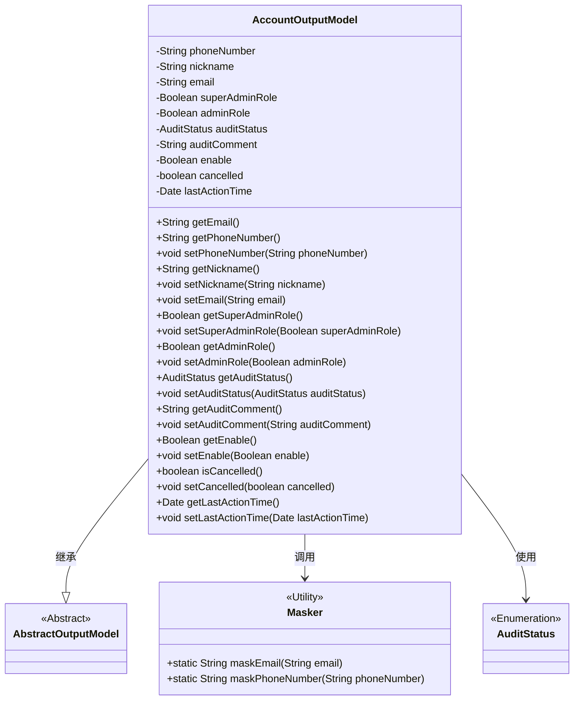

# 基础信息

|      |      |
|------|------|
| 名称 | AccountOutputModel |
| 编码语言 | .java |
| 代码路径 | WeFe/fusion/fusion-service/src/main/java/com/welab/wefe/data/fusion/service/dto/vo/AccountOutputModel.java |
| 包名 | com.welab.wefe.data.fusion.service.dto.vo |
| 依赖项 | ['com.welab.wefe.common.fieldvalidate.annotation.Check', 'com.welab.wefe.common.util.Masker', 'com.welab.wefe.common.wefe.enums.AuditStatus', 'com.welab.wefe.data.fusion.service.dto.entity.AbstractOutputModel', 'java.util.Date'] |
| 概述说明 | AccountOutputModel类包含用户账号信息，如手机号、昵称、邮箱、管理员角色、审核状态和是否可用等字段，并提供getter/setter方法。部分敏感信息通过掩码处理。 |

# 说明

AccountOutputModel类继承自AbstractOutputModel，包含账户相关属性：手机号、昵称、邮箱、超级管理员标识、管理员标识、审核状态、审核意见、可用状态、注销状态和最后活动时间。手机号和邮箱通过Masker进行脱敏处理。提供所有属性的getter和setter方法，用于数据访问和修改。超级管理员标识和管理员标识分别用于区分不同权限级别。审核状态和意见用于记录账户审核信息。可用状态控制账户是否有效，注销状态标识账户是否已注销，最后活动时间记录用户最近操作时间。

# 类列表 Class Summary

| 名称   | 类型  | 说明 |
|-------|------|-------------|
| AccountOutputModel | class | AccountOutputModel类包含用户账号信息，如手机号、昵称、邮箱、管理员角色、审核状态及最后活动时间等字段，并提供getter/setter方法。部分敏感信息通过掩码处理。 |

## 类 AccountOutputModel

|      |      |
|------|------|
| 访问范围 | public |
| 类型 | class |
| 名称 | AccountOutputModel |
| 说明 | AccountOutputModel类包含用户账号信息，如手机号、昵称、邮箱、管理员角色、审核状态及最后活动时间等字段，并提供getter/setter方法。部分敏感信息通过掩码处理。 |

### UML类图

该图展示了AccountOutputModel继承自AbstractOutputModel，包含多个私有属性和对应的getter/setter方法。其中phoneNumber和email通过Masker工具类进行脱敏处理，auditStatus使用枚举类型AuditStatus。类图清晰地反映了数据模型的结构和关联关系，体现了账户输出模型的核心属性和行为特征。

### 内部方法调用关系图

```mermaid
graph TD
    A["类AccountOutputModel"]
    B["继承自: AbstractOutputModel"]
    C["属性: @Check String phoneNumber"]
    D["属性: @Check String nickname"]
    E["属性: @Check String email"]
    F["属性: @Check Boolean superAdminRole"]
    G["属性: @Check Boolean adminRole"]
    H["属性: @Check AuditStatus auditStatus"]
    I["属性: @Check String auditComment"]
    J["属性: @Check Boolean enable"]
    K["属性: boolean cancelled"]
    L["属性: Date lastActionTime"]
    M["方法: getEmail()调用Masker.maskEmail"]
    N["方法: getPhoneNumber()调用Masker.maskPhoneNumber"]
    O["方法: 14个标准getter/setter"]

    A --> B
    A --> C
    A --> D
    A --> E
    A --> F
    A --> G
    A --> H
    A --> I
    A --> J
    A --> K
    A --> L
    A --> M
    A --> N
    A --> O
```

该流程图展示了AccountOutputModel类的完整结构，包含继承关系、11个属性（其中8个带@Check注解）和16个方法。关键特性包括：1) 继承AbstractOutputModel的扩展模型；2) 使用Masker工具类对敏感信息(email/phone)进行脱敏处理；3) 包含管理员角色、审核状态等业务字段；4) 提供完整的getter/setter方法链。类设计注重数据安全（脱敏）和可扩展性（继承+注解驱动）。

### 字段列表 Field List

| 名称  | 类型  | 说明 |
|-------|-------|------|
| auditComment | String | 定义私有字符串auditComment，用于存储审核意见，标注为@Check。 |
| email | String | 代码定义了一个私有字符串变量email，并添加了邮箱校验注解。 |
| lastActionTime | Date | 私有变量，记录最后一次操作的时间。 |
| auditStatus | AuditStatus | 类私有字段auditStatus，标注为审核状态，类型为AuditStatus。 |
| adminRole | Boolean | 检查是否为管理员，管理员拥有更多权限如设置成员可见性。 |
| enable | Boolean | 定义私有布尔变量enable，使用@Check注解标记为"是否可用"检查项。 |
| nickname | String | Java字段注解：检查昵称的字符串类型私有变量。 |
| phoneNumber | String | 字段phoneNumber使用@Check注解校验手机号格式。 |
| cancelled | boolean | 私有布尔变量，表示取消状态。 |
| superAdminRole | Boolean | 检查是否为超级管理员，即系统初始创建者。 |

### 方法列表

| 名称  | 类型  | 说明 |
|-------|-------|------|
| setLastActionTime | void | 设置最后操作时间的方法，将传入的日期参数赋值给对象的lastActionTime属性。 |
| getSuperAdminRole | Boolean | 这是一个Java方法，返回布尔类型的superAdminRole值，表示是否为超级管理员角色。 |
| setAuditComment | void | 设置审核评语的方法，将输入参数auditComment赋值给类的auditComment成员变量。 |
| setPhoneNumber | void | 设置电话号码的方法，将输入参数赋值给类的成员变量phoneNumber。 |
| setNickname | void | 设置用户昵称的方法，将输入参数赋值给对象的nickname属性。 |
| getAuditComment | String | 获取审计评语的方法，返回auditComment字符串。 |
| setSuperAdminRole | void | 设置超级管理员角色的方法，参数为布尔值，用于更新成员变量superAdminRole。 |
| setEnable | void | 设置布尔型启用状态的方法。 |
| getAuditStatus | AuditStatus | 方法返回审计状态auditStatus。 |
| getEmail | String | 该方法返回经过掩码处理的电子邮件地址，隐藏部分信息以保护隐私。 |
| isCancelled | boolean | 该方法返回布尔值，表示是否已取消。 |
| setAuditStatus | void | 设置审计状态的方法，将传入的auditStatus赋值给当前对象的auditStatus字段。 |
| getPhoneNumber | String | 获取手机号并返回脱敏处理后的结果。 |
| getEnable | Boolean | 获取enable布尔值的公共方法。 |
| setAdminRole | void | 这是一个Java方法，用于设置对象的adminRole属性，接受布尔值参数。 |
| getNickname | String | 获取昵称的方法，返回字符串类型的nickname。 |
| getAdminRole | Boolean | 获取管理员角色状态的方法，返回布尔值表示是否为管理员。 |
| setEmail | void | 设置对象邮箱属性的方法，参数为字符串类型email。 |
| setCancelled | void | 设置取消状态的公共方法，参数为布尔值cancelled，用于更新内部状态。 |
| getLastActionTime | Date | 方法返回最后操作时间。 |

