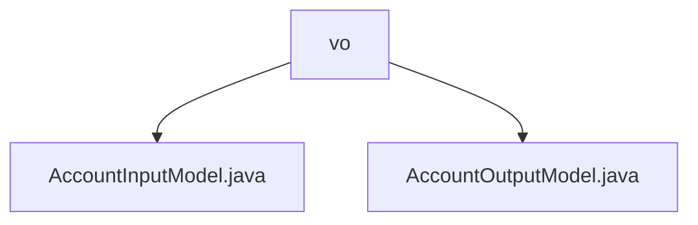

# 基础信息

|      |      |
|------|------|
| 名称 | vo |
| 编码语言 | .java |
| 代码路径 | WeFe/fusion/fusion-service/src/main/java/com/welab/wefe/data/fusion/service/dto/vo |
| 包名 | docs.fusion.fusion-service.src.main.java.com.welab.wefe.data.fusion.service.dto.vo |
| 概述说明 | AccountInputModel类继承AbstractApiInput，包含必填的电话、昵称、密码和邮箱字段，有格式和长度限制。AccountOutputModel类继承AbstractOutputModel，包含账户属性如手机号、邮箱（脱敏）、权限标识、状态信息及活动时间，提供getter/setter方法。 |

# 说明

## 概述  
该模块核心职责是处理账户数据的输入输出封装，通过Input/Output模型实现数据格式校验与脱敏保护。接口规范包含AccountInputModel的必填字段校验（如电话号码/邮箱格式）和AccountOutputModel的敏感信息脱敏（类似数据掩码模式）。关键数据结构包括Input的phoneNumber/nickname等字段和Output的权限标识/状态标记。外部依赖仅为基础的AbstractApiInput/OutputModel父类。例如InputModel强制校验密码长度，OutputModel使用Masker处理手机号。

## 主要业务场景  
典型流程为用户注册时提交InputModel数据，系统校验后返回脱敏的OutputModel信息。交互模式采用标准Getter/Setter进行数据存取，权限控制通过超级管理员标识分级。功能完整性体现在覆盖账户全生命周期（注册-审核-注销），例如OutputModel包含审核状态与注销状态。集成案例包括账户信息查询接口返回脱敏数据，注册接口验证Input格式。

### 包内部结构视图

该流程图展示了WeFe项目中fusion-service模块下dto/vo目录的结构关系。vo作为父节点，包含两个子节点：AccountInputModel.java和AccountOutputModel.java，这两个文件都是数据传输对象的值对象类，用于处理账户相关的输入输出模型。整个结构简洁明了，体现了典型的Java项目分层设计。

# 文件列表

| 名称   | 类型  | 说明 |
|-------|------|-------------|
| [AccountInputModel.java](AccountInputModel.md) | file | AccountInputModel类继承AbstractApiInput，包含必填字段：手机号、2-15位昵称、6-128位密码和邮箱，均有校验规则和getter/setter方法。 |
| [AccountOutputModel.java](AccountOutputModel.md) | file | AccountOutputModel类包含用户账号信息，如手机号、昵称、邮箱、管理员角色、审核状态和是否可用等字段，并提供getter/setter方法。部分敏感信息通过掩码处理。 |

