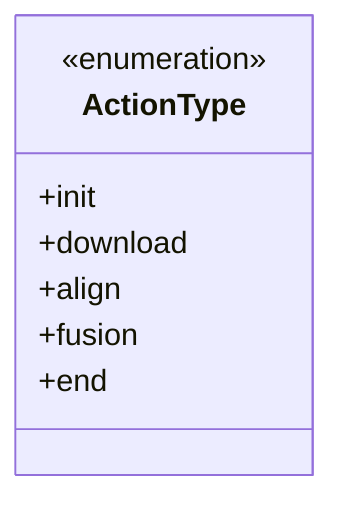
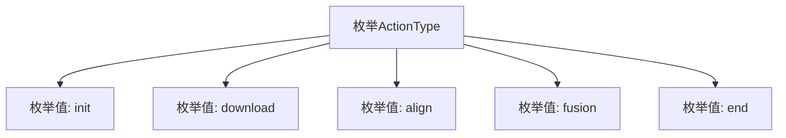

# 基础信息

|      |      |
|------|------|
| 名称 | ActionType |
| 编码语言 | .java |
| 代码路径 | WeFe/fusion/fusion-service/src/main/java/com/welab/wefe/data/fusion/service/enums/ActionType.java |
| 包名 | com.welab.wefe.data.fusion.service.enums |
| 依赖项 | [] |
| 概述说明 | ActionType枚举定义了五个动作类型：初始化、下载、对齐、融合和结束。 |

# 说明

该内容定义了一个名为ActionType的枚举类型，包含五个枚举值：init表示初始化操作，download表示下载操作，align表示对齐操作，fusion表示融合操作，end表示结束操作。这些枚举值可能用于表示程序执行流程中的不同阶段或操作类型。

# 类列表 Class Summary

| 名称   | 类型  | 说明 |
|-------|------|-------------|
| ActionType | enum | 这是一个枚举类型，定义了五种动作类型：初始化、下载、对齐、融合和结束。 |

## 类 ActionType

|      |      |
|------|------|
| 访问范围 | public |
| 类型 | enum |
| 名称 | ActionType |
| 说明 | 这是一个枚举类型，定义了五种动作类型：初始化、下载、对齐、融合和结束。 |

### UML类图

这段代码定义了一个名为ActionType的枚举类型，包含五个枚举常量：init、download、align、fusion和end。枚举类型用于表示一组固定的常量值，通常用于状态机、选项配置等场景。该枚举可能用于描述某种流程或操作的不同阶段，例如文件处理流程的初始化、下载、对齐、融合和结束等步骤。每个枚举常量都是ActionType类型的实例，可以直接通过ActionType.init等方式引用。

### 内部方法调用关系图

这段流程图展示了ActionType枚举的结构，包含五个顺序定义的枚举值：init、download、align、fusion和end。每个枚举值作为独立节点与父枚举类型ActionType相连，表示它们是该枚举的可能取值。这种结构常用于表示有限的状态集合或操作类型，适合在状态机或工作流场景中使用。

### 字段列表 Field List

| 名称  | 类型  | 说明 |
|-------|-------|------|

### 方法列表

| 名称  | 类型  | 说明 |
|-------|-------|------|

