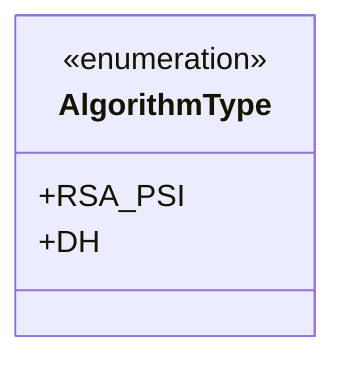
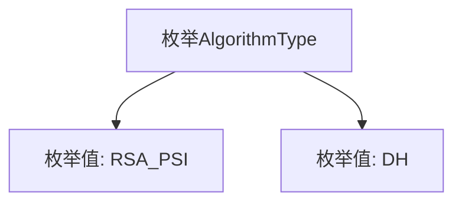

# 基础信息

|      |      |
|------|------|
| 名称 | AlgorithmType |
| 编码语言 | .java |
| 代码路径 | WeFe/fusion/fusion-service/src/main/java/com/welab/wefe/data/fusion/service/enums/AlgorithmType.java |
| 包名 | com.welab.wefe.data.fusion.service.enums |
| 依赖项 | [] |
| 概述说明 | 算法类型枚举包含RSA_PSI和DH两种选项。 |

# 说明

该内容定义了一个名为AlgorithmType的公共枚举类型，包含两个枚举常量：RSA_PSI和DH。RSA_PSI可能表示基于RSA算法的私有集合交集技术，DH可能指Diffie-Hellman密钥交换协议。这个枚举类型可用于在系统中标识或选择特定的加密算法类型。

# 类列表 Class Summary

| 名称   | 类型  | 说明 |
|-------|------|-------------|
| AlgorithmType | enum | 算法类型枚举包含两种：RSA_PSI和DH。 |

## 类 AlgorithmType

|      |      |
|------|------|
| 访问范围 | public |
| 类型 | enum |
| 名称 | AlgorithmType |
| 说明 | 算法类型枚举包含两种：RSA_PSI和DH。 |

### UML类图

这段代码定义了一个名为AlgorithmType的枚举类型，包含两个枚举常量RSA_PSI和DH，用于表示不同的算法类型。枚举类型在类图中用<<enumeration>>标记，其成员作为公有静态常量列出。该设计适用于需要明确限定算法选择的场景，如密码学协议实现，通过枚举可避免无效参数并增强代码可读性。

### 内部方法调用关系图

这段代码定义了一个名为AlgorithmType的枚举类型，包含两个枚举值RSA_PSI和DH。流程图展示了枚举类型与其包含的枚举值之间的层级关系，AlgorithmType作为父节点，RSA_PSI和DH作为其直接子节点。这种结构常用于表示一组固定的常量，例如不同的算法类型选择。

### 字段列表 Field List

| 名称  | 类型  | 说明 |
|-------|-------|------|

### 方法列表

| 名称  | 类型  | 说明 |
|-------|-------|------|

