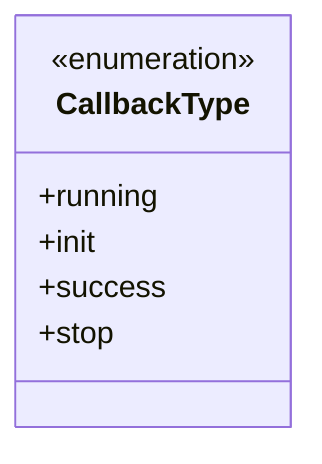
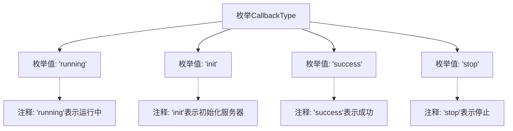

# 基础信息

|      |      |
|------|------|
| 名称 | CallbackType |
| 编码语言 | .java |
| 代码路径 | WeFe/fusion/fusion-service/src/main/java/com/welab/wefe/data/fusion/service/enums/CallbackType.java |
| 包名 | com.welab.wefe.data.fusion.service.enums |
| 依赖项 | [] |
| 概述说明 | CallbackType枚举定义四种状态：运行中、初始化服务器、成功、停止。 |

# 说明

该内容定义了一个名为CallbackType的枚举类型，包含四个枚举值：running表示运行中，init表示服务器初始化，success表示成功，stop表示停止。每个枚举值都有对应的注释说明其含义。

# 类列表 Class Summary

| 名称   | 类型  | 说明 |
|-------|------|-------------|
| CallbackType | enum | 枚举CallbackType定义回调类型：运行中、初始化服务器、成功、停止。 |

## 类 CallbackType

|      |      |
|------|------|
| 访问范围 | public |
| 类型 | enum |
| 名称 | CallbackType |
| 说明 | 枚举CallbackType定义回调类型：运行中、初始化服务器、成功、停止。 |

### UML类图

该代码定义了一个名为CallbackType的枚举类型，包含四个枚举常量：running表示运行中状态，init表示服务器初始化状态，success表示成功状态，stop表示停止状态。枚举类型通过classDiagram中的<<enumeration>>标记表示，所有枚举常量均为公有成员。这种设计常用于表示有限且固定的状态集合，适合在状态机或回调机制中使用，能有效避免魔法字符串并提高代码可读性。

### 内部方法调用关系图

该流程图展示了CallbackType枚举的结构，包含四个枚举值：running（运行中）、init（初始化服务器）、success（成功）和stop（停止）。每个枚举值都有对应的注释说明其用途，通过箭头连接显示枚举类与值之间的从属关系，以及注释与枚举值的关联关系。

### 字段列表 Field List

| 名称  | 类型  | 说明 |
|-------|-------|------|

### 方法列表

| 名称  | 类型  | 说明 |
|-------|-------|------|

