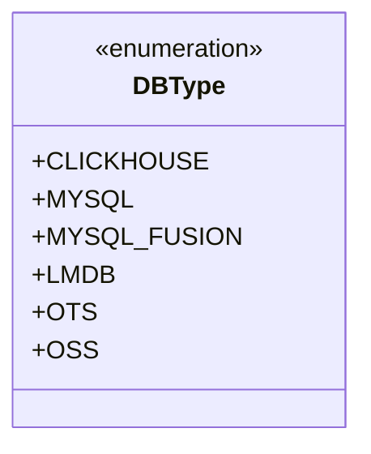
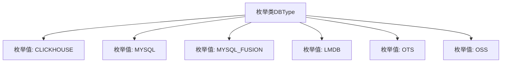

# 基础信息

|      |      |
|------|------|
| 名称 | DBType |
| 编码语言 | .java |
| 代码路径 | WeFe/fusion/fusion-service/src/main/java/com/welab/wefe/data/fusion/service/enums/DBType.java |
| 包名 | com.welab.wefe.data.fusion.service.enums |
| 依赖项 | [] |
| 概述说明 | 定义数据库类型枚举，包含CLICKHOUSE、MYSQL、MYSQL_FUSION、LMDB、OTS、OSS六种类型。 |

# 说明

该内容定义了一个名为DBType的公共枚举类型，包含六个枚举常量：CLICKHOUSE、MYSQL、MYSQL_FUSION、LMDB、OTS和OSS。这些常量代表不同类型的数据库系统，涵盖了关系型数据库、键值存储和对象存储等多种数据存储技术。

# 类列表 Class Summary

| 名称   | 类型  | 说明 |
|-------|------|-------------|
| DBType | enum | DBType枚举定义了六种数据库类型：CLICKHOUSE、MYSQL、MYSQL_FUSION、LMDB、OTS和OSS。 |

## 类 DBType

|      |      |
|------|------|
| 访问范围 | public |
| 类型 | enum |
| 名称 | DBType |
| 说明 | DBType枚举定义了六种数据库类型：CLICKHOUSE、MYSQL、MYSQL_FUSION、LMDB、OTS和OSS。 |

### UML类图

这段类图展示了一个名为DBType的枚举类型，它定义了六种数据库类型的常量值：CLICKHOUSE、MYSQL、MYSQL_FUSION、LMDB、OTS和OSS。枚举类型在Java中是一种特殊的类，用于表示一组固定的常量，这里用来标识不同类型的数据库系统。每个枚举值都是该枚举类型的实例，可以直接通过DBType.CLICKHOUSE等方式引用。这种设计常用于系统配置或数据库连接管理等场景，以确保类型安全并避免使用魔法字符串。

### 内部方法调用关系图

该流程图展示了DBType枚举类的结构，包含6个预定义的数据库类型枚举值：CLICKHOUSE、MYSQL、MYSQL_FUSION、LMDB、OTS和OSS。每个枚举值都作为独立节点与枚举类直接关联，表示它们是DBType类的静态常量成员。这种设计常用于定义系统中支持的数据库类型集合，便于类型安全的配置管理和开关控制。

### 字段列表 Field List

| 名称  | 类型  | 说明 |
|-------|-------|------|

### 方法列表

| 名称  | 类型  | 说明 |
|-------|-------|------|

