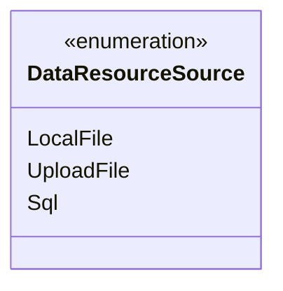
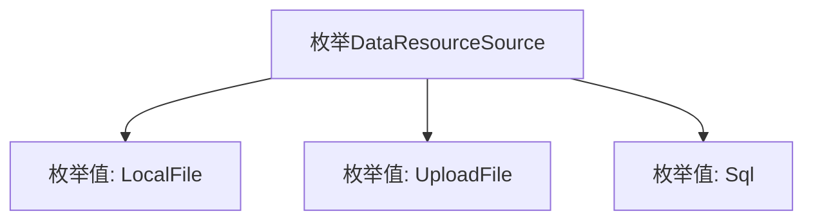

# 基础信息

|      |      |
|------|------|
| 名称 | DataResourceSource |
| 编码语言 | .java |
| 代码路径 | WeFe/fusion/fusion-service/src/main/java/com/welab/wefe/data/fusion/service/enums/DataResourceSource.java |
| 包名 | com.welab.wefe.data.fusion.service.enums |
| 依赖项 | [] |
| 概述说明 | DataResourceSource枚举定义三种数据来源：本地文件、上传文件和SQL数据库。 |

# 说明

该内容定义了一个名为DataResourceSource的公共枚举类型，包含三个枚举值：LocalFile表示本地文件来源，UploadFile表示上传文件来源，Sql表示数据库来源。枚举用于标识数据资源的不同来源类型。

# 类列表 Class Summary

| 名称   | 类型  | 说明 |
|-------|------|-------------|
| DataResourceSource | enum | 枚举DataResourceSource定义三种数据源类型：本地文件、上传文件和SQL数据库。 |

## 类 DataResourceSource

|      |      |
|------|------|
| 访问范围 | public |
| 类型 | enum |
| 名称 | DataResourceSource |
| 说明 | 枚举DataResourceSource定义三种数据源类型：本地文件、上传文件和SQL数据库。 |

### UML类图

这段代码定义了一个名为DataResourceSource的枚举类型，包含三个枚举常量：LocalFile、UploadFile和Sql。枚举类型用于表示一组固定的常量值，这里可能用于标识数据来源的不同类型，如本地文件、上传文件或SQL数据库。枚举类型在类图中用<<enumeration>>标记，其常量值直接列在类框内，无需标注访问修饰符或方法，因为枚举常量本质上是该类型的公共静态实例。

### 内部方法调用关系图

这段流程图展示了DataResourceSource枚举的结构，包含三个枚举值：LocalFile表示本地文件数据源，UploadFile表示上传文件数据源，Sql表示数据库数据源。枚举类型通过简洁的常量定义方式，为程序提供了类型安全的资源来源标识，适用于需要明确区分不同数据来源的场景。每个枚举值都是该类型的唯一实例，可直接通过枚举类名访问。

### 字段列表 Field List

| 名称  | 类型  | 说明 |
|-------|-------|------|

### 方法列表

| 名称  | 类型  | 说明 |
|-------|-------|------|

