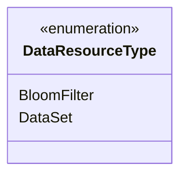
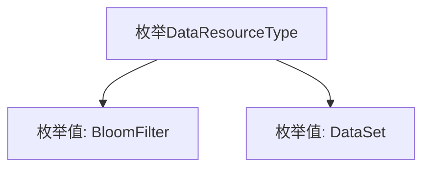

# 基础信息

|      |      |
|------|------|
| 名称 | DataResourceType |
| 编码语言 | .java |
| 代码路径 | WeFe/fusion/fusion-service/src/main/java/com/welab/wefe/data/fusion/service/enums/DataResourceType.java |
| 包名 | com.welab.wefe.data.fusion.service.enums |
| 依赖项 | [] |
| 概述说明 | 数据资源类型枚举：BloomFilter（布隆过滤器）和DataSet（数据集）。 |

# 说明

该内容定义了一个名为DataResourceType的公共枚举类型，包含两个枚举值：BloomFilter和DataSet。BloomFilter表示布隆过滤器资源类型，DataSet表示数据集资源类型。枚举用于表示不同的数据资源类别，结构简洁明确。

# 类列表 Class Summary

| 名称   | 类型  | 说明 |
|-------|------|-------------|
| DataResourceType | enum | DataResourceType枚举定义两种数据类型：BloomFilter和DataSet。 |

## 类 DataResourceType

|      |      |
|------|------|
| 访问范围 | public |
| 类型 | enum |
| 名称 | DataResourceType |
| 说明 | DataResourceType枚举定义两种数据类型：BloomFilter和DataSet。 |

### UML类图

这段代码定义了一个名为DataResourceType的枚举类型，包含两个枚举常量：BloomFilter和DataSet。枚举类型用于表示一组固定的常量值，在这里可能用于标识不同类型的数据资源。由于是枚举类型，在类图中使用<<enumeration>>标记，并直接列出其所有枚举值。该枚举结构简单，没有定义额外的方法或属性，主要用于类型安全的常量标识。

### 内部方法调用关系图

这段代码定义了一个名为DataResourceType的枚举类型，包含两个枚举值：BloomFilter和DataSet。枚举类型用于表示一组固定的常量，这里可能用于标识不同类型的数据资源。BloomFilter可能代表布隆过滤器这种概率型数据结构，DataSet则可能表示常规数据集。该枚举为系统提供了类型安全的资源类型标识方式，避免了使用字符串或整数常量带来的潜在错误。

### 字段列表 Field List

| 名称  | 类型  | 说明 |
|-------|-------|------|

### 方法列表

| 名称  | 类型  | 说明 |
|-------|-------|------|

