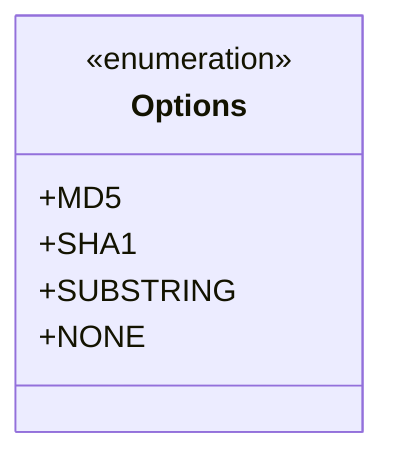
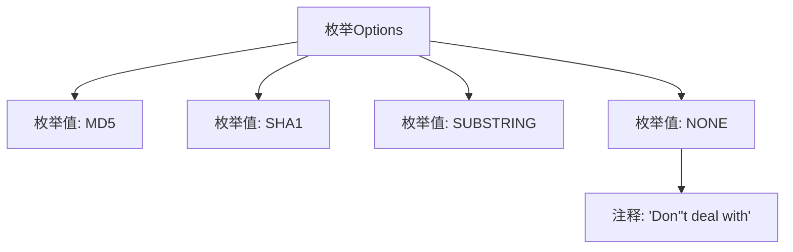

# 基础信息

|      |      |
|------|------|
| 名称 | Options |
| 编码语言 | .java |
| 代码路径 | WeFe/fusion/fusion-service/src/main/java/com/welab/wefe/data/fusion/service/enums/Options.java |
| 包名 | com.welab.wefe.data.fusion.service.enums |
| 依赖项 | [] |
| 概述说明 | 枚举Options定义四种选项：MD5、SHA1、SUBSTRING和NONE（不处理）。 |

# 说明

这是一个名为Options的枚举类型，定义了四种选项常量：MD5、SHA1、SUBSTRING和NONE。其中MD5和SHA1表示两种不同的哈希算法，SUBSTRING表示子字符串操作，NONE表示不进行任何处理。NONE选项还附带了一个注释说明其含义为"不处理"。该枚举可能用于指定数据处理方式的选择。

# 类列表 Class Summary

| 名称   | 类型  | 说明 |
|-------|------|-------------|
| Options | enum | 枚举Options定义了四种选项：MD5、SHA1、SUBSTRING和NONE，NONE表示不处理。 |

## 类 Options

|      |      |
|------|------|
| 访问范围 | public |
| 类型 | enum |
| 名称 | Options |
| 说明 | 枚举Options定义了四种选项：MD5、SHA1、SUBSTRING和NONE，NONE表示不处理。 |

### UML类图

该枚举类定义了四种选项常量：MD5、SHA1、SUBSTRING和NONE，其中NONE带有注释说明表示不进行处理。枚举类型在类图中用<<enumeration>>标记，所有枚举值均为公有静态常量。这个简单的枚举结构可用于算法选择或功能开关等场景，通过清晰的命名和注释提供了可读性强的配置选项。

### 内部方法调用关系图

这段流程图展示了Options枚举的结构，包含四个枚举值（MD5、SHA1、SUBSTRING和NONE），其中NONE带有特殊注释说明"Don't deal with"。图形清晰地呈现了枚举定义的基本组成元素和注释的从属关系，每个节点通过箭头连接显示层级结构，便于理解该枚举类型的整体设计意图。

### 字段列表 Field List

| 名称  | 类型  | 说明 |
|-------|-------|------|

### 方法列表

| 名称  | 类型  | 说明 |
|-------|-------|------|

