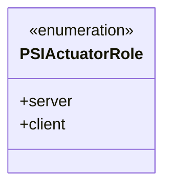
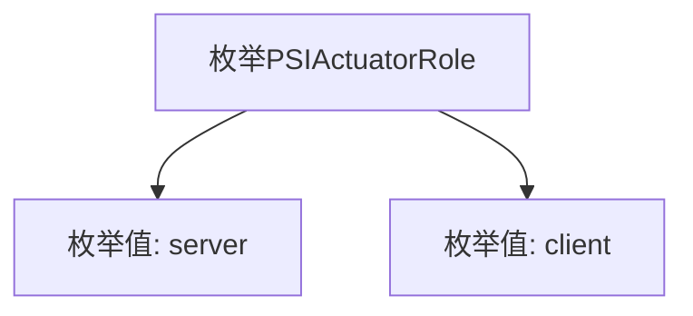

# 基础信息

|      |      |
|------|------|
| 名称 | PSIActuatorRole |
| 编码语言 | .java |
| 代码路径 | WeFe/fusion/fusion-service/src/main/java/com/welab/wefe/data/fusion/service/enums/PSIActuatorRole.java |
| 包名 | com.welab.wefe.data.fusion.service.enums |
| 依赖项 | [] |
| 概述说明 | PSIActuatorRole枚举定义两种角色：server和client。 |

# 说明

该内容定义了一个名为PSIActuatorRole的公共枚举类型，包含两个枚举值：server和client。枚举用于表示PSI执行器的两种角色，即服务器端和客户端。该定义简洁明确，不包含其他属性或方法，仅用于区分角色类型。

# 类列表 Class Summary

| 名称   | 类型  | 说明 |
|-------|------|-------------|
| PSIActuatorRole | enum | PSIActuatorRole枚举定义了两个角色：server和client。 |

## 类 PSIActuatorRole

|      |      |
|------|------|
| 访问范围 | public |
| 类型 | enum |
| 名称 | PSIActuatorRole |
| 说明 | PSIActuatorRole枚举定义了两个角色：server和client。 |

### UML类图

这段代码定义了一个名为PSIActuatorRole的枚举类型，包含两个枚举常量：server和client。枚举类型用于表示一组固定的常量值，这里可能用于标识执行器在PSI（Private Set Intersection）协议中的角色是服务端还是客户端。类图展示了该枚举的结构，标注了其枚举特性并列出所有可能取值。

### 内部方法调用关系图

这段代码定义了一个名为PSIActuatorRole的枚举类型，包含两个枚举值：server和client。流程图清晰地展示了枚举类型与其值的层级关系，PSIActuatorRole作为父节点，server和client作为其直接子节点。这种结构常用于表示固定的角色或状态集合，例如在网络通信中区分服务端和客户端角色。

### 字段列表 Field List

| 名称  | 类型  | 说明 |
|-------|-------|------|

### 方法列表

| 名称  | 类型  | 说明 |
|-------|-------|------|

