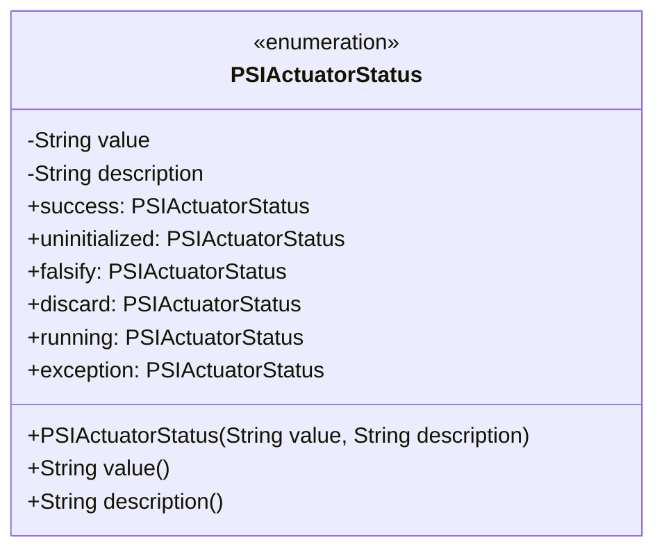
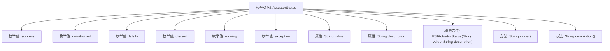

# 基础信息

|      |      |
|------|------|
| 名称 | PSIActuatorStatus |
| 编码语言 | .java |
| 代码路径 | WeFe/fusion/fusion-service/src/main/java/com/welab/wefe/data/fusion/service/enums/PSIActuatorStatus.java |
| 包名 | com.welab.wefe.data.fusion.service.enums |
| 依赖项 | [] |
| 概述说明 | 枚举PSIActuatorStatus定义了执行器状态：成功、未初始化、验证失败、任务丢弃、运行中、异常。每个状态包含值和描述。 |

# 说明

这是一个名为PSIActuatorStatus的枚举类型，定义了六种状态及其描述。状态包括：success表示成功，uninitialized表示数据未初始化或初始化失败，falsify表示数据验证不通过，discard表示任务被丢弃，running表示运行中，exception表示预料之外的情况。每个枚举值都有对应的value和description属性，并通过构造函数初始化。提供了value和description方法分别获取这两个属性的值。

# 类列表 Class Summary

| 名称   | 类型  | 说明 |
|-------|------|-------------|
| PSIActuatorStatus | enum | 枚举PSIActuatorStatus定义了执行器状态，包含成功、未初始化、验证失败、丢弃、运行和异常六种状态，每种状态有值和描述。 |

## 类 PSIActuatorStatus

|      |      |
|------|------|
| 访问范围 | public |
| 类型 | enum |
| 名称 | PSIActuatorStatus |
| 说明 | 枚举PSIActuatorStatus定义了执行器状态，包含成功、未初始化、验证失败、丢弃、运行和异常六种状态，每种状态有值和描述。 |

### UML类图

该代码定义了一个枚举类`PSIActuatorStatus`，用于表示执行器状态，包含6种预定义状态（success、uninitialized等）。每个枚举实例包含value和description两个私有属性，通过构造函数初始化，并提供对应的公有访问方法。类图清晰展示了枚举结构、私有字段、构造方法及实例列表，符合枚举类型的UML表示规范。

### 内部方法调用关系图

该流程图展示了PSIActuatorStatus枚举类的完整结构，包含6个预定义状态枚举值（success/uninitialized/falsify/discard/running/exception）、两个字符串属性（value和description）、一个带参数的构造方法以及两个获取属性值的方法。枚举类通过value和description字段为每个状态提供机器可读值和人类可读描述，适用于需要明确状态标识和状态说明的业务场景。

### 字段列表 Field List

| 名称  | 类型  | 说明 |
|-------|-------|------|

### 方法列表

| 名称  | 类型  | 说明 |
|-------|-------|------|

