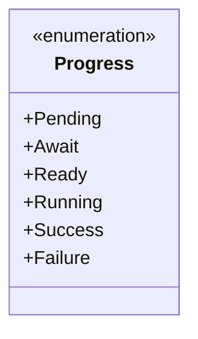
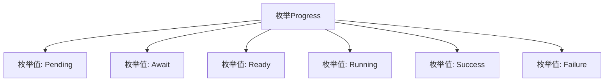

# 基础信息

|      |      |
|------|------|
| 名称 | Progress |
| 编码语言 | .java |
| 代码路径 | WeFe/fusion/fusion-service/src/main/java/com/welab/wefe/data/fusion/service/enums/Progress.java |
| 包名 | com.welab.wefe.data.fusion.service.enums |
| 依赖项 | [] |
| 概述说明 | Progress枚举定义了任务状态：Pending待处理、Await等待、Ready就绪、Running运行中、Success成功、Failure失败。 |

# 说明

这是一个名为Progress的枚举类型，定义了六个不同的状态值，分别表示任务或流程的不同阶段。Pending表示待处理状态，Await表示等待状态，Ready表示准备就绪状态，Running表示运行中状态，Success表示成功完成状态，Failure表示失败状态。这些枚举值可用于跟踪和表示某个过程的当前进展或结果状态。

# 类列表 Class Summary

| 名称   | 类型  | 说明 |
|-------|------|-------------|
| Progress | enum | 进度状态枚举：待处理、等待、就绪、运行中、成功、失败。 |

## 类 Progress

|      |      |
|------|------|
| 访问范围 | public |
| 类型 | enum |
| 名称 | Progress |
| 说明 | 进度状态枚举：待处理、等待、就绪、运行中、成功、失败。 |

### UML类图

这段代码定义了一个名为`Progress`的枚举类型，包含六个枚举常量：`Pending`、`Await`、`Ready`、`Running`、`Success`和`Failure`。枚举通常用于表示一组固定的状态或选项，这里可能用于表示某个任务或流程的不同阶段状态。每个枚举常量都是`Progress`类型的实例，可以直接通过`Progress.常量名`访问。枚举类型在类图中用`<<enumeration>>`标记，并列举所有枚举值作为公有属性。

### 内部方法调用关系图

这段流程图展示了Progress枚举的结构，它定义了6个状态值：Pending（待处理）、Await（等待中）、Ready（准备就绪）、Running（运行中）、Success（成功）和Failure（失败）。每个枚举值通过独立节点表示，并与父节点Progress形成层级关系，清晰地描述了该枚举类型的完整状态集合，适用于需要多状态管理的场景（如任务进度跟踪）。

### 字段列表 Field List

| 名称  | 类型  | 说明 |
|-------|-------|------|

### 方法列表

| 名称  | 类型  | 说明 |
|-------|-------|------|

