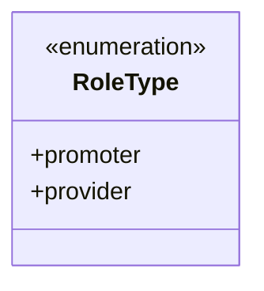
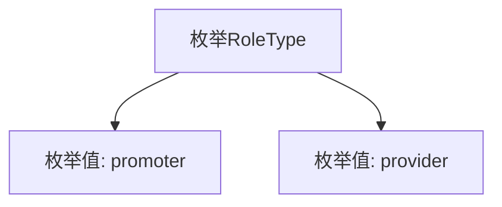

# 基础信息

|      |      |
|------|------|
| 名称 | RoleType |
| 编码语言 | .java |
| 代码路径 | WeFe/fusion/fusion-service/src/main/java/com/welab/wefe/data/fusion/service/enums/RoleType.java |
| 包名 | com.welab.wefe.data.fusion.service.enums |
| 依赖项 | [] |
| 概述说明 | 定义了一个枚举类RoleType，包含两个角色类型：promoter和provider。 |

# 说明

该内容定义了一个名为RoleType的公共枚举类型，包含两个枚举常量：promoter和provider。枚举用于表示一组固定的常量值，此处可能用于标识角色类型。promoter和provider分别代表两种不同的角色，具体含义需结合上下文确定。整个定义简洁明了，未包含其他修饰或方法。

# 类列表 Class Summary

| 名称   | 类型  | 说明 |
|-------|------|-------------|
| RoleType | enum | 枚举RoleType定义两种角色类型：promoter（推广者）和provider（提供者）。 |

## 类 RoleType

|      |      |
|------|------|
| 访问范围 | public |
| 类型 | enum |
| 名称 | RoleType |
| 说明 | 枚举RoleType定义两种角色类型：promoter（推广者）和provider（提供者）。 |

### UML类图

这段类图描述了一个简单的枚举类型RoleType，它包含两个枚举常量：promoter和provider。作为枚举类型，它被标记为<<enumeration>>，表示这是一个固定的值集合。该枚举没有定义任何方法或额外属性，仅用于表示两种角色类型。这种设计常用于需要类型安全常量的场景，比如系统权限管理或状态标识。

### 内部方法调用关系图

这段mermaid流程图描述了RoleType枚举的结构，包含两个枚举值promoter和provider。枚举类型在Java中是一种特殊的类，用于定义一组固定的常量。图中清晰地展示了RoleType作为父节点，与两个枚举值之间的层级关系。这种表示方式有助于理解枚举的组成，特别是在需要明确限定取值范围或状态时，枚举类型能提供更好的类型安全性和代码可读性。

### 字段列表 Field List

| 名称  | 类型  | 说明 |
|-------|-------|------|

### 方法列表

| 名称  | 类型  | 说明 |
|-------|-------|------|

