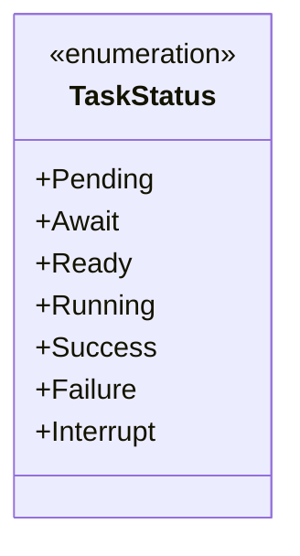
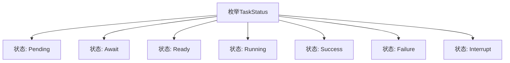

# 基础信息

|      |      |
|------|------|
| 名称 | TaskStatus |
| 编码语言 | .java |
| 代码路径 | WeFe/fusion/fusion-service/src/main/java/com/welab/wefe/data/fusion/service/enums/TaskStatus.java |
| 包名 | com.welab.wefe.data.fusion.service.enums |
| 依赖项 | [] |
| 概述说明 | 任务状态枚举：待处理、等待、就绪、运行中、成功、失败、中断。 |

# 说明

该枚举类型定义了任务状态的七种可能值，涵盖任务执行全生命周期。初始状态包括Pending（待处理）和Await（等待中），准备阶段为Ready（就绪），执行阶段为Running（进行中）。最终状态分为三种：Success（成功）、Failure（失败）和Interrupt（中断）。注释说明各状态对应任务对齐流程的不同阶段，但实际枚举值名称与注释描述存在部分差异。

# 类列表 Class Summary

| 名称   | 类型  | 说明 |
|-------|------|-------------|
| TaskStatus | enum | 任务状态枚举定义，包含待处理、等待、就绪、运行中、成功、失败和中断七种状态。 |

## 类 TaskStatus

|      |      |
|------|------|
| 访问范围 | public |
| 类型 | enum |
| 名称 | TaskStatus |
| 说明 | 任务状态枚举定义，包含待处理、等待、就绪、运行中、成功、失败和中断七种状态。 |

### UML类图

该枚举类定义了任务执行的7种状态：Pending（待处理）、Await（等待中）、Ready（准备就绪）、Running（运行中）、Success（成功）、Failure（失败）、Interrupt（中断）。每个枚举值代表任务生命周期的不同阶段，从初始等待状态到最终完成状态（成功/失败/中断），完整覆盖了任务执行过程可能出现的所有状态情况。枚举类型通过固定值集合确保了状态的一致性和类型安全。

### 内部方法调用关系图

该流程图展示了TaskStatus枚举的完整状态定义结构。枚举包含7个状态常量，分别表示任务生命周期的不同阶段：Pending(待处理)、Await(等待)、Ready(准备就绪)、Running(运行中)三个中间状态，以及Success(成功)、Failure(失败)、Interrupt(中断)三个最终状态。每个状态通过独立节点与枚举主体连接，清晰呈现了状态机的完整定义。

### 字段列表 Field List

| 名称  | 类型  | 说明 |
|-------|-------|------|

### 方法列表

| 名称  | 类型  | 说明 |
|-------|-------|------|

