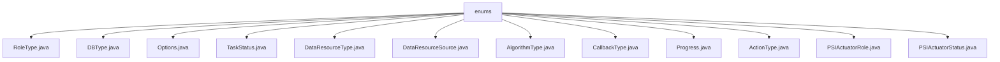

# 基础信息

|      |      |
|------|------|
| 名称 | enums |
| 编码语言 | .java |
| 代码路径 | WeFe/fusion/fusion-service/src/main/java/com/welab/wefe/data/fusion/service/enums |
| 包名 | docs.fusion.fusion-service.src.main.java.com.welab.wefe.data.fusion.service.enums |
| 概述说明 | 定义了多个枚举类型：RoleType（promoter/provider）、DBType（6种数据库）、Options（4种处理方式）、TaskStatus（7种任务状态）、DataResourceType（2种资源类型）、DataResourceSource（3种来源）、AlgorithmType（2种算法）、CallbackType（4种回调状态）、Progress（6种进度）、ActionType（5种操作）、PSIActuatorRole（2种角色）、PSIActuatorStatus（6种状态）。 |

# 说明

## 概述  
该模块通过枚举类型定义系统核心元数据，主要职责是规范数据融合服务中的状态、角色、算法和资源类型等基础枚举值。接口规范统一采用Java枚举类型定义，包含value/description属性和获取方法。关键数据结构包括TaskStatus（7种任务状态）、DBType（6种数据库类型）和PSIActuatorStatus（带描述的状态对象）。外部依赖仅涉及标准Java枚举支持。例如AlgorithmType定义了RSA_PSI和DH加密算法，类似策略模式的选择器。

## 主要业务场景  
模块支撑数据融合全流程管理，包括任务状态机（Pending→Success）、PSI角色分配（server/client）和数据处理选项（如MD5哈希）。典型交互模式为枚举驱动流程跳转，例如ActionType从init到end的线性操作链。完整覆盖数据源（LocalFile/Sql）、资源类型（BloomFilter）和回调事件（running/stop）等场景。API类型均为枚举值，集成案例包括数据库选择（CLICKHOUSE/OSS）和算法切换（RSA_PSI/DH）。

### 包内部结构视图

该流程图展示了WeFe数据融合服务中枚举类的层级结构，根节点为enums目录，包含12个具体的枚举类型文件，涵盖角色类型、数据库类型、任务状态、算法类型等多种业务枚举定义。所有子节点均直接隶属于enums目录，呈现扁平化结构。

# 文件列表

| 名称   | 类型  | 说明 |
|-------|------|-------------|
| [RoleType.java](RoleType.md) | file | 定义了一个枚举类RoleType，包含两个角色类型：promoter和provider。 |
| [DBType.java](DBType.md) | file | 定义数据库类型枚举，包含CLICKHOUSE、MYSQL、MYSQL_FUSION、LMDB、OTS、OSS六种类型。 |
| [Options.java](Options.md) | file | 枚举Options定义四种选项：MD5、SHA1、SUBSTRING和NONE（不处理）。 |
| [TaskStatus.java](TaskStatus.md) | file | 任务状态枚举：待处理、等待、就绪、运行中、成功、失败、中断。 |
| [DataResourceType.java](DataResourceType.md) | file | 数据资源类型枚举：BloomFilter（布隆过滤器）和DataSet（数据集）。 |
| [DataResourceSource.java](DataResourceSource.md) | file | DataResourceSource枚举定义三种数据来源：本地文件、上传文件和SQL数据库。 |
| [AlgorithmType.java](AlgorithmType.md) | file | 算法类型枚举包含RSA_PSI和DH两种选项。 |
| [CallbackType.java](CallbackType.md) | file | CallbackType枚举定义四种状态：运行中、初始化服务器、成功、停止。 |
| [Progress.java](Progress.md) | file | Progress枚举定义了任务状态：Pending待处理、Await等待、Ready就绪、Running运行中、Success成功、Failure失败。 |
| [ActionType.java](ActionType.md) | file | ActionType枚举定义了五个动作类型：初始化、下载、对齐、融合和结束。 |
| [PSIActuatorRole.java](PSIActuatorRole.md) | file | PSIActuatorRole枚举定义两种角色：server和client。 |
| [PSIActuatorStatus.java](PSIActuatorStatus.md) | file | 枚举PSIActuatorStatus定义了执行器状态：成功、未初始化、验证失败、任务丢弃、运行中、异常。每个状态包含值和描述。 |

