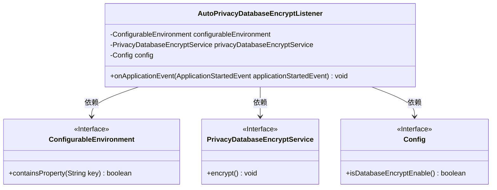
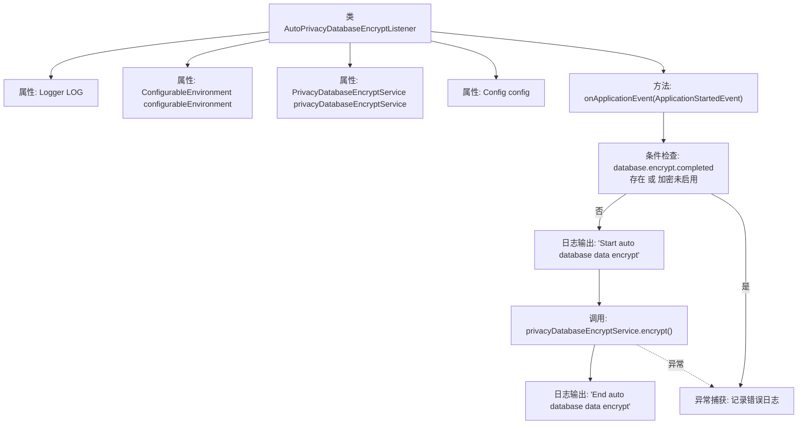

# 基础信息

|      |      |
|------|------|
| 名称 | AutoPrivacyDatabaseEncryptListener |
| 编码语言 | .java |
| 代码路径 | WeFe/fusion/fusion-service/src/main/java/com/welab/wefe/data/fusion/service/listener/AutoPrivacyDatabaseEncryptListener.java |
| 包名 | com.welab.wefe.data.fusion.service.listener |
| 依赖项 | ['com.welab.wefe.data.fusion.service.config.Config', 'com.welab.wefe.data.fusion.service.service.PrivacyDatabaseEncryptService', 'org.slf4j.Logger', 'org.slf4j.LoggerFactory', 'org.springframework.beans.factory.annotation.Autowired', 'org.springframework.boot.context.event.ApplicationStartedEvent', 'org.springframework.context.ApplicationListener', 'org.springframework.core.env.ConfigurableEnvironment', 'org.springframework.stereotype.Component'] |
| 概述说明 | 自动数据库加密监听器，在应用启动时检查配置并执行加密服务，记录操作日志和异常。 |

# 说明

这是一个名为AutoPrivacyDatabaseEncryptListener的Spring组件类，实现了ApplicationListener接口监听ApplicationStartedEvent事件。类中注入了ConfigurableEnvironment、PrivacyDatabaseEncryptService和Config三个依赖。主要逻辑是在应用启动时检查配置，若未完成加密且加密功能启用，则调用隐私数据库加密服务执行加密操作，并记录开始、结束及异常日志。整个过程包含条件判断、加密执行和异常处理机制。

# 类列表 Class Summary

| 名称   | 类型  | 说明 |
|-------|------|-------------|
| AutoPrivacyDatabaseEncryptListener | class | AutoPrivacyDatabaseEncryptListener监听应用启动事件，检查配置后调用加密服务处理数据库数据，记录操作日志和异常。 |

## 类 AutoPrivacyDatabaseEncryptListener

|      |      |
|------|------|
| 访问范围 | @Component;public |
| 类型 | class |
| 名称 | AutoPrivacyDatabaseEncryptListener |
| 说明 | AutoPrivacyDatabaseEncryptListener监听应用启动事件，检查配置后调用加密服务处理数据库数据，记录操作日志和异常。 |

### UML类图

类图描述：该图展示了AutoPrivacyDatabaseEncryptListener类与三个接口的依赖关系。监听器通过Spring环境变量ConfigurableEnvironment检查加密状态，依赖PrivacyDatabaseEncryptService执行加密操作，并通过Config接口获取加密配置。核心逻辑在onApplicationEvent方法中实现条件判断和异常处理，完成数据库自动加密流程。

### 内部方法调用关系图

这段代码是一个Spring事件监听器，用于在应用启动时自动执行数据库加密。流程图展示了从类结构到事件处理的全过程：首先检查加密条件，若满足则执行加密服务并记录日志，异常时捕获错误。核心逻辑集中在onApplicationEvent方法内，通过环境变量和配置控制加密流程的执行。

### 字段列表 Field List

| 名称  | 类型  | 说明 |
|-------|-------|------|
| privacyDatabaseEncryptService | PrivacyDatabaseEncryptService | 使用@Autowired自动注入隐私数据库加密服务实例。 |
| LOG = LoggerFactory.getLogger(AutoPrivacyDatabaseEncryptListener.class) | Logger | 类AutoPrivacyDatabaseEncryptListener中定义了一个静态不可变的日志记录器实例LOG。 |
| config | Config | 自动注入Config配置对象实例。 |
| configurableEnvironment | ConfigurableEnvironment | 代码片段声明了一个私有成员变量configurableEnvironment，并使用@Autowired注解实现自动依赖注入。 |

### 方法列表

| 名称  | 类型  | 说明 |
|-------|-------|------|
| onApplicationEvent | void | 应用启动时检查数据库加密配置，若未完成且启用加密，则执行数据加密操作，记录开始和结束日志，异常时记录错误信息。 |

