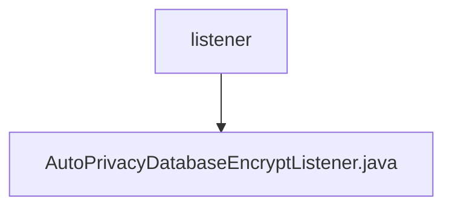

# 基础信息

|      |      |
|------|------|
| 名称 | listener |
| 编码语言 | .java |
| 代码路径 | WeFe/fusion/fusion-service/src/main/java/com/welab/wefe/data/fusion/service/listener |
| 包名 | docs.fusion.fusion-service.src.main.java.com.welab.wefe.data.fusion.service.listener |
| 概述说明 | 自动数据库加密监听器，在应用启动时检查配置并执行加密服务，记录操作日志和异常。 |

# 说明

这是一个名为AutoPrivacyDatabaseEncryptListener的Spring组件类，实现了ApplicationListener接口监听ApplicationStartedEvent事件。类中注入了ConfigurableEnvironment、PrivacyDatabaseEncryptService和Config三个依赖。主要逻辑是在应用启动时检查配置，若未完成加密且加密功能启用，则调用隐私数据库加密服务执行加密操作，并记录开始、结束及异常日志。整个过程包含条件判断、加密执行和异常处理机制。

### 包内部结构视图

该流程图展示了WeFe项目中fusion-service模块下的监听器目录结构。根节点为listener文件夹，其下包含一个具体的监听器实现文件AutoPrivacyDatabaseEncryptListener.java。这种结构符合典型的Java服务监听器设计模式，其中监听器类被集中存放在专门的listener包中，便于统一管理和维护事件监听逻辑。

# 文件列表

| 名称   | 类型  | 说明 |
|-------|------|-------------|
| [AutoPrivacyDatabaseEncryptListener.java](AutoPrivacyDatabaseEncryptListener.md) | file | 自动数据库加密监听器，在应用启动时检查配置并执行加密服务，记录操作日志和异常。 |

