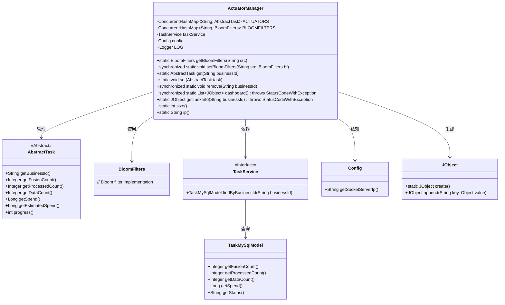
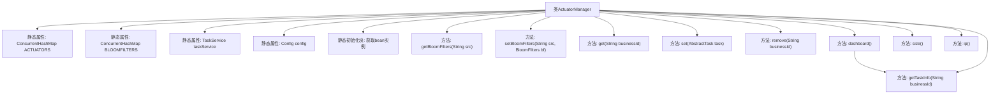
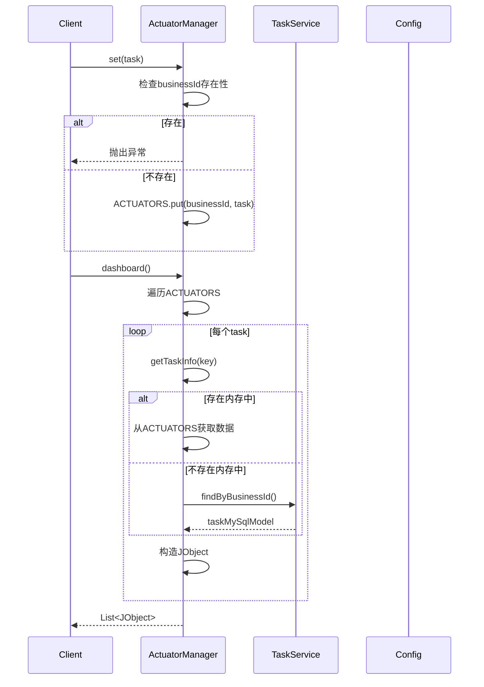

# 基础信息

|      |      |
|------|------|
| 名称 | ActuatorManager |
| 编码语言 | .java |
| 代码路径 | WeFe/fusion/fusion-service/src/main/java/com/welab/wefe/data/fusion/service/manager/ActuatorManager.java |
| 包名 | com.welab.wefe.data.fusion.service.manager |
| 依赖项 | ['java.net.InetAddress', 'java.net.UnknownHostException', 'java.util.ArrayList', 'java.util.List', 'java.util.concurrent.ConcurrentHashMap', 'org.apache.commons.lang3.StringUtils', 'org.slf4j.Logger', 'org.slf4j.LoggerFactory', 'com.welab.wefe.common.exception.StatusCodeWithException', 'com.welab.wefe.common.util.JObject', 'com.welab.wefe.common.web.Launcher', 'com.welab.wefe.data.fusion.service.config.Config', 'com.welab.wefe.data.fusion.service.database.entity.TaskMySqlModel', 'com.welab.wefe.data.fusion.service.enums.TaskStatus', 'com.welab.wefe.data.fusion.service.service.TaskService', 'com.welab.wefe.data.fusion.service.task.AbstractTask', 'com.welab.wefe.data.fusion.service.utils.bf.BloomFilters'] |
| 概述说明 | ActuatorManager类管理任务和布隆过滤器，提供增删查改功能，支持任务状态查询和仪表板展示，包含并发控制和IP获取方法。 |

# 说明

ActuatorManager是一个管理任务执行器的工具类，包含两个静态ConcurrentHashMap分别存储任务ID与任务对象、任务ID与布隆过滤器的映射。类初始化时通过Launcher获取TaskService和Config的实例。提供对布隆过滤器的获取和设置方法，支持添加、移除和查询任务，并确保任务ID唯一。dashboard方法返回所有任务的信息列表，getTaskInfo方法获取单个任务的详细信息，包括业务ID、处理数量、数据量、耗时、进度和状态等。size方法返回当前任务数量，ip方法获取服务器IP地址，优先使用配置中的IP，未配置则获取本地IP。所有操作均线程安全。

# 类列表 Class Summary

| 名称   | 类型  | 说明 |
|-------|------|-------------|
| ActuatorManager | class | ActuatorManager类管理任务和布隆过滤器，提供增删查改功能，支持任务信息展示和IP获取。使用ConcurrentHashMap存储任务和过滤器，确保线程安全。包含静态初始化、任务状态查询和仪表板数据生成方法。 |

## 类 ActuatorManager

|      |      |
|------|------|
| 访问范围 | public |
| 类型 | class |
| 名称 | ActuatorManager |
| 说明 | ActuatorManager类管理任务和布隆过滤器，提供增删查改功能，支持任务信息展示和IP获取。使用ConcurrentHashMap存储任务和过滤器，确保线程安全。包含静态初始化、任务状态查询和仪表板数据生成方法。 |

### UML类图

类图描述：ActuatorManager 是一个核心管理类，通过两个 ConcurrentHashMap 分别管理 AbstractTask 和 BloomFilters 实例。它依赖 TaskService 和 Config 获取任务信息和配置，使用 JObject 构建响应数据。AbstractTask 是抽象基类，定义了任务的核心属性和方法。该设计实现了线程安全的任务管理和状态监控功能。

### 内部方法调用关系图

该流程图展示了ActuatorManager类的核心结构和数据流向。类通过两个ConcurrentHashMap分别管理任务和布隆过滤器，提供任务CRUD操作和仪表板数据聚合功能。时序图重点描述了任务设置和仪表板数据获取两个关键流程，涉及内存数据检查、数据库回查以及异常处理逻辑。静态初始化块通过Spring上下文获取依赖服务实例，体现了与控制反转容器的集成。

### 字段列表 Field List

| 名称  | 类型  | 说明 |
|-------|-------|------|
| config | Config | 私有静态不可变配置对象。 |
| taskService | TaskService | 私有静态常量任务服务实例。 |
| ACTUATORS = new ConcurrentHashMap<>() | ConcurrentHashMap<String, AbstractTask> | 定义一个私有静态不可变的并发哈希映射，键为字符串，值为抽象任务对象，用于存储执行器。 |
| LOG = LoggerFactory.getLogger(ActuatorManager.class) | Logger | 定义ActuatorManager类的静态日志常量LOG，使用LoggerFactory创建。 |
| BLOOMFILTERS = new ConcurrentHashMap<>() | ConcurrentHashMap<String, BloomFilters> | 定义一个线程安全的全局静态Map，键为String，值为BloomFilters对象。 |

### 方法列表

| 名称  | 类型  | 说明 |
|-------|-------|------|
| dashboard | List<JObject> | 同步静态方法dashboard返回JObject列表，遍历ACTUATORS键集获取任务信息，非空则加入列表。可能抛出StatusCodeWithException异常。 |
| remove | void | 同步静态方法，移除指定businessId对应的执行器。 |
| getTaskInfo | JObject | 获取任务信息方法：根据businessId查询任务数据，返回包含业务ID、融合数、处理数、总数、耗时、进度和状态的JSON对象。若任务不存在则从数据库获取，运行中则从执行器获取。 |
| set | void | 静态方法set接收AbstractTask参数，检查businessId是否已存在，存在则抛异常，否则存入ACTUATORS映射。 |
| getBloomFilters | BloomFilters | 静态方法getBloomFilters根据输入字符串src返回对应的BloomFilters对象，从BLOOMFILTERS中获取。 |
| size | int | 该方法返回静态集合ACTUATORS的元素数量。 |
| ip | String | 获取IP地址方法：优先从配置读取，失败则获取本机IP，异常时记录错误日志。 |
| setBloomFilters | void | 同步静态方法`setBloomFilters`：清空`BLOOMFILTERS`后，将`src`和`bf`存入。 |
| get | AbstractTask | 静态方法get通过businessId从ACTUATORS获取对应AbstractTask实例。 |

