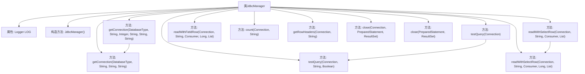

# 基础信息

|      |      |
|------|------|
| 名称 | JdbcManager |
| 编码语言 | .java |
| 代码路径 | WeFe/fusion/fusion-service/src/main/java/com/welab/wefe/data/fusion/service/manager/JdbcManager.java |
| 包名 | com.welab.wefe.data.fusion.service.manager |
| 依赖项 | ['com.welab.wefe.common.CommonThreadPool', 'com.welab.wefe.common.StatusCode', 'com.welab.wefe.common.exception.StatusCodeWithException', 'com.welab.wefe.common.jdbc.base.DatabaseType', 'org.slf4j.Logger', 'org.slf4j.LoggerFactory', 'java.sql', 'java.util.ArrayList', 'java.util.LinkedHashMap', 'java.util.List', 'java.util.Map', 'java.util.function.Consumer'] |
| 概述说明 | 废弃的JdbcManager类，提供数据库连接、查询测试、数据遍历读取、列名获取等功能，支持Hive、MySQL、Impala，包含异常处理和资源关闭。 |

# 说明

JdbcManager是一个已弃用的JDBC连接管理工具类，提供多种数据库连接和查询功能。支持Hive、MySQL和Impala数据库的连接，通过不同方法获取Connection对象。包含测试查询、遍历读取数据、获取查询结果列名和记录数等功能。使用流式读取优化大数据量处理，提供资源关闭方法确保连接安全释放。所有操作均记录日志并处理异常，抛出StatusCodeWithException自定义异常。

# 类列表 Class Summary

| 名称   | 类型  | 说明 |
|-------|------|-------------|
| JdbcManager | class | 废弃的JdbcManager类提供JDBC连接管理，支持Hive、MySQL、Impala数据库连接，包含连接获取、测试查询、数据遍历读取、记录数统计及列名获取功能，最后关闭资源。 |


## 类 JdbcManager

|      |      |
|------|------|
| 访问范围 | @Deprecated;public |
| 类型 | class |
| 名称 | JdbcManager |
| 说明 | 废弃的JdbcManager类提供JDBC连接管理，支持Hive、MySQL、Impala数据库连接，包含连接获取、测试查询、数据遍历读取、记录数统计及列名获取功能，最后关闭资源。 |


### UML类图

```mermaid
classDiagram
    class JdbcManager {
        <<Deprecated>>
        -Logger LOG
        +JdbcManager()
        +getConnection(DatabaseType, String, Integer, String, String, String) Connection
        +getConnection(DatabaseType, String, String, String) Connection
        +testQuery(Connection) boolean
        +testQuery(Connection, String, boolean) boolean
        +readWithSelectRow(Connection, String, Consumer~Map~String,Object~~, List~String~)
        +readWithSelectRow(Connection, String, Consumer~Map~String,Object~~, long, List~String~)
        +readWithFieldRow(Connection, String, Consumer~Map~String,Object~~, long, List~String~)
        +count(Connection, String) long
        +getRowHeaders(Connection, String) List~String~
        +close(Connection, PreparedStatement, ResultSet)
        +close(PreparedStatement, ResultSet)
    }

    class DatabaseType {
        <<enumeration>>
        Hive
        MySql
        Impala
    }

    class StatusCodeWithException {
        <<Exception>>
    }

    class StatusCode {
        <<enumeration>>
        UNEXPECTED_ENUM_CASE
        DATABASE_LOST
        ILLEGAL_REQUEST
        SQL_SYNTAX_ERROR
    }

    JdbcManager --> DatabaseType : 使用
    JdbcManager --> StatusCodeWithException : 抛出
    StatusCodeWithException --> StatusCode : 关联
    JdbcManager --> Consumer~Map~String,Object~~ : 回调
    JdbcManager --> Connection : 返回/操作
    JdbcManager --> PreparedStatement : 操作
    JdbcManager --> ResultSet : 操作
```

该代码展示了一个已弃用的JDBC连接管理类JdbcManager，它提供了多种数据库连接和查询操作方法。类图显示了JdbcManager与DatabaseType枚举、StatusCodeWithException异常类以及JDBC核心类(Connection/PreparedStatement/ResultSet)的关系。主要功能包括：建立不同数据库类型的连接、执行测试查询、流式读取数据、获取查询结果列名和统计记录数等。所有数据库操作都包含日志记录和资源清理机制，并通过自定义状态码处理异常情况。


### 内部方法调用关系图



这段代码展示了一个JDBC连接管理工具类，主要用于处理不同类型的数据库连接、查询测试、数据读取和资源关闭等操作。流程图清晰地展示了类结构及其方法间的调用关系，包括两个重载的getConnection方法用于建立数据库连接，testQuery方法用于测试查询，readWithSelectRow和readWithFieldRow方法用于读取数据，以及close方法用于释放资源。该类支持Hive、MySQL和Impala等多种数据库类型，并通过日志记录操作耗时，体现了完善的异常处理和资源管理机制。

### 字段列表 Field List

| 名称  | 类型  | 说明 |
|-------|-------|------|
| LOG = LoggerFactory.getLogger(JdbcManager.class) | Logger | 声明一个受保护的静态常量日志对象LOG，用于JdbcManager类的日志记录。 |

### 方法列表

| 名称  | 类型  | 说明 |
|-------|-------|------|
| readWithSelectRow | void | 静态方法readWithSelectRow通过JDBC流式读取数据，支持按行筛选和最大行数限制，处理结果集后通过Consumer回调每行数据，最后关闭资源并记录耗时。 |
| getConnection | Connection | 静态方法getConnection根据数据库类型加载驱动并建立连接，支持Hive、MySQL和Impala，失败时抛出异常。 |
| count | long | 静态方法count通过JDBC执行SQL查询并返回记录数，记录耗时，处理异常并确保资源释放。 |
| readWithFieldRow | void | 该方法从数据库读取指定字段数据，处理每行数据后通过回调返回。支持限制读取行数，自动添加默认限制并记录耗时。 |
| readWithSelectRow | void | 静态方法readWithSelectRow通过SQL查询读取数据，并调用Consumer处理每行结果，可指定查询行数。 |
| getConnection | Connection | 静态方法getConnection根据数据库类型生成连接URL，支持Hive、MySQL和Impala，通过用户名密码建立连接，失败抛出异常。 |
| testQuery | boolean | 方法testQuery测试SQL查询，检查结果集非空，可选验证列数大于1，记录耗时，返回成功或失败。 |
| testQuery | boolean | 这是一个静态方法，用于测试数据库连接，执行简单查询"select 1"，不抛出异常。 |
| getRowHeaders | List<String> | 该方法通过JDBC获取SQL查询结果的列名列表，自动添加limit 1限制并设置fetchSize和maxRows为1以提高性能，最后返回列名集合。 |
| close | void | 静态方法close用于安全关闭数据库连接、预处理语句和结果集，捕获并记录SQL异常。 |
| close | void | 静态方法close用于安全关闭PreparedStatement和ResultSet，捕获并记录SQLException。 |


