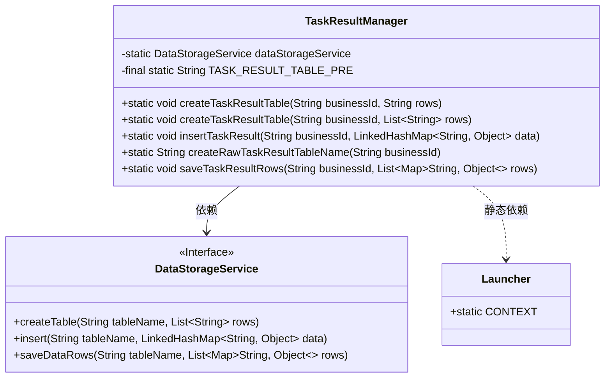
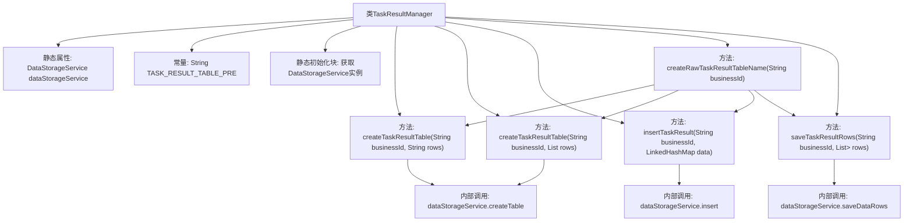

# 基础信息

|      |      |
|------|------|
| 名称 | TaskResultManager |
| 编码语言 | .java |
| 代码路径 | WeFe/fusion/fusion-service/src/main/java/com/welab/wefe/data/fusion/service/manager/TaskResultManager.java |
| 包名 | com.welab.wefe.data.fusion.service.manager |
| 依赖项 | ['com.welab.wefe.common.web.Launcher', 'com.welab.wefe.data.fusion.service.service.DataStorageService', 'java.util.Arrays', 'java.util.LinkedHashMap', 'java.util.List', 'java.util.Map'] |
| 概述说明 | TaskResultManager类用于管理任务结果表，提供创建表、插入数据和批量保存功能，表名格式为task_result_加业务ID。 |

# 说明

TaskResultManager是一个用于管理任务结果数据的工具类，包含静态成员dataStorageService和表名前缀常量。类初始化时从Launcher获取数据存储服务实例。提供创建任务结果表的方法，支持通过字符串或列表定义表结构。包含插入单条数据和批量保存数据的功能，均基于业务ID生成表名。表名格式为固定前缀加业务ID拼接而成。所有操作均委托给dataStorageService完成，包括建表、插入和批量保存。

# 类列表 Class Summary

| 名称   | 类型  | 说明 |
|-------|------|-------------|
| TaskResultManager | class | TaskResultManager类管理任务结果表，提供创建表、插入数据和批量保存功能，表名格式为task_result_加业务ID。 |

## 类 TaskResultManager

|      |      |
|------|------|
| 访问范围 | public |
| 类型 | class |
| 名称 | TaskResultManager |
| 说明 | TaskResultManager类管理任务结果表，提供创建表、插入数据和批量保存功能，表名格式为task_result_加业务ID。 |

### UML类图

这段代码展示了一个任务结果管理器（TaskResultManager），它通过静态方法提供对数据存储服务（DataStorageService）的封装操作。主要功能包括创建任务结果表、插入单条数据、批量保存数据行等。该类依赖于Spring上下文（Launcher.CONTEXT）获取数据存储服务实例，所有方法都围绕businessId生成动态表名进行操作。DataStorageService作为接口定义了核心数据操作契约，体现了依赖倒置原则。

### 内部方法调用关系图

这段代码流程图展示了TaskResultManager类的结构和主要方法调用关系。该类主要用于管理任务结果表，包含创建表、插入数据和批量保存数据等功能。核心是通过静态的DataStorageService实例进行数据操作，所有表名都通过createRawTaskResultTableName方法生成。流程图清晰地呈现了类属性初始化过程、各方法间的调用链，以及最终委托给dataStorageService执行具体存储操作的完整流程。

### 字段列表 Field List

| 名称  | 类型  | 说明 |
|-------|-------|------|
| TASK_RESULT_TABLE_PRE = "task_result_" | String | 定义静态常量TASK_RESULT_TABLE_PRE，值为"task_result_"，用于表名前缀。 |
| dataStorageService | DataStorageService | 私有静态数据存储服务实例变量。 |

### 方法列表

| 名称  | 类型  | 说明 |
|-------|-------|------|
| createRawTaskResultTableName | String | 该方法根据业务ID生成原始任务结果表名，格式为前缀加业务ID。 |
| createTaskResultTable | void | 方法`createTaskResultTable`根据业务ID生成表名，并调用存储服务创建包含指定行的表。 |
| createTaskResultTable | void | 方法createTaskResultTable根据businessId生成表名，并调用dataStorageService创建包含指定行的表。 |
| insertTaskResult | void | 静态方法insertTaskResult接收业务ID和数据映射，生成表名后调用存储服务插入数据。 |
| saveTaskResultRows | void | 保存任务结果数据行到指定业务ID对应的表中。 |

