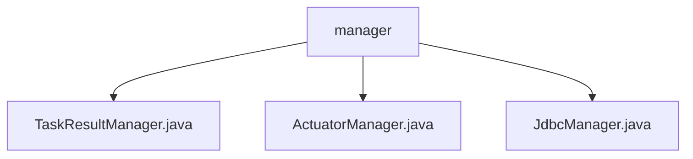

# 基础信息

|      |      |
|------|------|
| 名称 | manager |
| 编码语言 | .java |
| 代码路径 | WeFe/fusion/fusion-service/src/main/java/com/welab/wefe/data/fusion/service/manager |
| 包名 | docs.fusion.fusion-service.src.main.java.com.welab.wefe.data.fusion.service.manager |
| 概述说明 | TaskResultManager管理任务结果数据，支持建表、插入和批量保存。ActuatorManager管理任务执行器，提供线程安全的任务和布隆过滤器操作。JdbcManager是已弃用的JDBC工具类，支持多种数据库连接和查询。 |

# 说明

## 概述  
该模块核心职责是提供任务结果管理、执行器管理和数据库连接功能，支持数据存储、任务跟踪和多数据库操作。接口规范包括：TaskResultManager通过业务ID动态生成表名并委托存储服务操作数据；ActuatorManager使用线程安全容器管理任务状态；JdbcManager提供多种数据库连接能力。关键数据结构包含ConcurrentHashMap存储任务映射、布隆过滤器及表名前缀常量。外部依赖涉及Launcher服务、TaskService、Config及Hive/MySQL/Impala驱动。例如TaskResultManager通过"前缀+业务ID"动态建表。

## 主要业务场景  
模块支持任务全生命周期管理，类似工厂流水线模式：TaskResultManager处理结果存储，ActuatorManager监控执行状态，JdbcManager（已弃用）提供数据查询。典型流程包括：创建任务结果表、批量保存数据、通过布隆过滤器跟踪任务进度。交互模式以线程安全为基础，例如ActuatorManager使用ConcurrentHashMap保证任务操作原子性。功能覆盖数据存储（如Hive表操作）、任务监控（如进度查询）及跨库查询（如流式读取）。例如ActuatorManager的dashboard方法可汇总所有任务状态。

### 包内部结构视图

该流程图展示了manager目录下的三个Java文件：TaskResultManager.java、ActuatorManager.java和JdbcManager.java。这三个文件都直接隶属于manager目录，没有更深层次的嵌套关系，属于同一层级的管理类文件。

# 文件列表

| 名称   | 类型  | 说明 |
|-------|------|-------------|
| [TaskResultManager.java](TaskResultManager.md) | file | TaskResultManager类用于管理任务结果表，提供创建表、插入数据和批量保存功能，表名格式为task_result_加业务ID。 |
| [ActuatorManager.java](ActuatorManager.md) | file | ActuatorManager类管理任务和布隆过滤器，提供增删查改功能，支持任务状态查询和仪表板展示，包含并发控制和IP获取方法。 |
| [JdbcManager.java](JdbcManager.md) | file | 废弃的JdbcManager类，提供数据库连接、查询测试、数据遍历读取、列名获取等功能，支持Hive、MySQL、Impala，包含异常处理和资源关闭。 |

