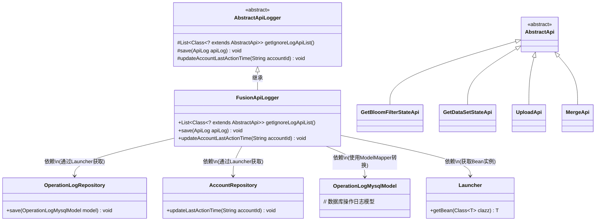
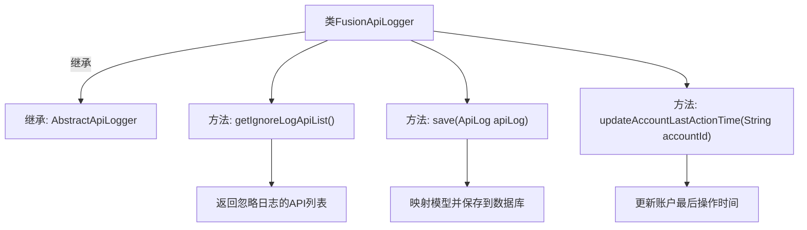

# 基础信息

|      |      |
|------|------|
| 名称 | FusionApiLogger |
| 编码语言 | .java |
| 代码路径 | WeFe/fusion/fusion-service/src/main/java/com/welab/wefe/data/fusion/service/operation/FusionApiLogger.java |
| 包名 | com.welab.wefe.data.fusion.service.operation |
| 依赖项 | ['com.welab.wefe.common.web.Launcher', 'com.welab.wefe.common.web.api.base.AbstractApi', 'com.welab.wefe.common.web.delegate.api_log.AbstractApiLogger', 'com.welab.wefe.common.web.delegate.api_log.ApiLog', 'com.welab.wefe.common.web.util.ModelMapper', 'com.welab.wefe.data.fusion.service.api.bloomfilter.GetBloomFilterStateApi', 'com.welab.wefe.data.fusion.service.api.dataset.GetDataSetStateApi', 'com.welab.wefe.data.fusion.service.api.file.MergeApi', 'com.welab.wefe.data.fusion.service.api.file.UploadApi', 'com.welab.wefe.data.fusion.service.database.entity.OperationLogMysqlModel', 'com.welab.wefe.data.fusion.service.database.repository.AccountRepository', 'com.welab.wefe.data.fusion.service.database.repository.OperationLogRepository', 'org.springframework.stereotype.Component', 'java.util.Arrays', 'java.util.List'] |
| 概述说明 | FusionApiLogger继承AbstractApiLogger，忽略特定API日志，保存日志到数据库并更新账户最后操作时间。 |

# 说明

FusionApiLogger是一个继承自AbstractApiLogger的组件类，主要用于记录API日志。它通过getIgnoreLogApiList方法定义了需要忽略日志记录的API列表，包括GetBloomFilterStateApi、GetDataSetStateApi、UploadApi和MergeApi。save方法负责将API日志映射为OperationLogMysqlModel并保存到数据库。updateAccountLastActionTime方法用于更新指定账户的最后操作时间。该类通过Launcher获取所需的Repository实例来完成数据操作。

# 类列表 Class Summary

| 名称   | 类型  | 说明 |
|-------|------|-------------|
| FusionApiLogger | class | FusionApiLogger继承AbstractApiLogger，忽略特定API日志，保存日志到数据库并更新账户最后操作时间。 |

## 类 FusionApiLogger

|      |      |
|------|------|
| 访问范围 | @Component;public |
| 类型 | class |
| 名称 | FusionApiLogger |
| 说明 | FusionApiLogger继承AbstractApiLogger，忽略特定API日志，保存日志到数据库并更新账户最后操作时间。 |

### UML类图

类图描述：该图展示了FusionApiLogger继承自抽象类AbstractApiLogger，实现了日志过滤、保存和账户更新时间三个核心功能。通过Launcher动态获取OperationLogRepository和AccountRepository的实例，使用ModelMapper进行模型转换。图中包含4个被忽略日志的API类（继承自AbstractApi），体现了日志系统的扩展性和依赖管理机制。

### 内部方法调用关系图

该流程图展示了FusionApiLogger类的结构和主要方法。该类继承自AbstractApiLogger，包含三个核心方法：getIgnoreLogApiList()返回需要忽略日志的API类列表，save()将API日志映射为数据库模型并存储，updateAccountLastActionTime()更新指定账户的最后操作时间。每个方法都清晰地展示了其功能和内部操作流程，体现了日志记录和账户管理的核心逻辑。

### 字段列表 Field List

| 名称  | 类型  | 说明 |
|-------|-------|------|

### 方法列表

| 名称  | 类型  | 说明 |
|-------|-------|------|
| save | void | 该方法重写save，将ApiLog映射为OperationLogMysqlModel并保存到数据库。 |
| getIgnoreLogApiList | List<Class<? extends AbstractApi>> | 方法返回忽略日志的API类列表，包括GetBloomFilterStateApi、GetDataSetStateApi、UploadApi和MergeApi。 |
| updateAccountLastActionTime | void | 重写方法，通过AccountRepository更新指定账户的最后操作时间。 |

