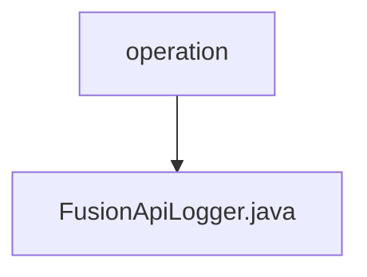

# 基础信息

|      |      |
|------|------|
| 名称 | operation |
| 编码语言 | .java |
| 代码路径 | WeFe/fusion/fusion-service/src/main/java/com/welab/wefe/data/fusion/service/operation |
| 包名 | docs.fusion.fusion-service.src.main.java.com.welab.wefe.data.fusion.service.operation |
| 概述说明 | FusionApiLogger继承AbstractApiLogger，忽略特定API日志，保存日志到数据库并更新账户最后操作时间。 |

# 说明

FusionApiLogger是一个继承自AbstractApiLogger的组件类，主要用于记录API日志。它通过getIgnoreLogApiList方法定义了需要忽略日志记录的API列表，包括GetBloomFilterStateApi、GetDataSetStateApi、UploadApi和MergeApi。save方法负责将API日志映射为OperationLogMysqlModel并保存到数据库。updateAccountLastActionTime方法用于更新指定账户的最后操作时间。该类通过Launcher获取所需的Repository实例来完成数据操作。

### 包内部结构视图

该流程图展示了WeFe项目中fusion-service模块的Java代码结构。operation作为父目录，包含一个子文件FusionApiLogger.java。这是一个典型的单文件目录结构，表示该操作目录下目前只包含一个日志相关的Java类文件。

# 文件列表

| 名称   | 类型  | 说明 |
|-------|------|-------------|
| [FusionApiLogger.java](FusionApiLogger.md) | file | FusionApiLogger继承AbstractApiLogger，忽略特定API日志，保存日志到数据库并更新账户最后操作时间。 |

