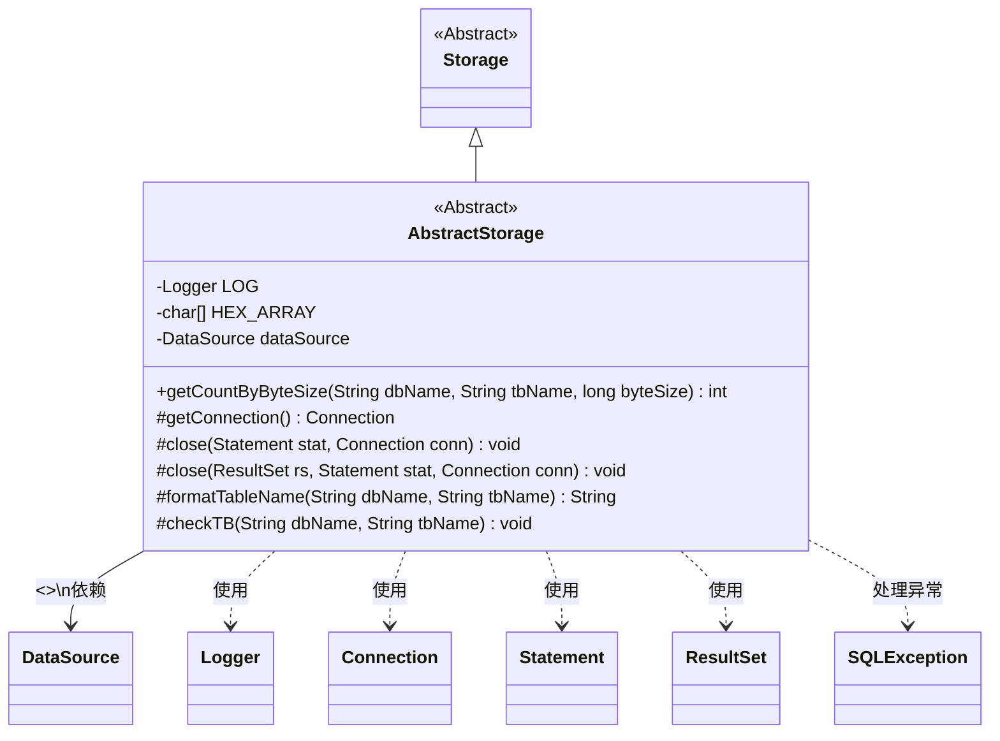
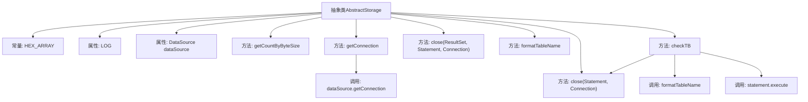

# 基础信息

|      |      |
|------|------|
| 名称 | AbstractStorage |
| 编码语言 | .java |
| 代码路径 | WeFe/fusion/fusion-service/src/main/java/com/welab/wefe/data/fusion/service/repo/AbstractStorage.java |
| 包名 | com.welab.wefe.data.fusion.service.repo |
| 依赖项 | ['org.slf4j.Logger', 'org.slf4j.LoggerFactory', 'org.springframework.beans.factory.annotation.Autowired', 'org.springframework.beans.factory.annotation.Qualifier', 'javax.sql.DataSource', 'java.sql'] |
| 概述说明 | 抽象类AbstractStorage继承Storage，包含日志、数据源配置，提供节点计算、连接管理、资源释放及表名格式化功能，支持表创建检查。 |

# 说明

这是一个名为AbstractStorage的抽象类，继承自Storage类。它包含日志记录器、十六进制字符数组和注入的DataSource对象。主要功能包括：根据字节大小计算节点数量（固定返回1000）、获取数据库连接、释放资源（关闭ResultSet、Statement和Connection）、格式化表名（添加反引号）、检查并创建表（使用MergeTree引擎，包含eventDate、k、v、id字段，按日期分区和id排序）。所有数据库操作都包含异常处理和资源释放逻辑。

# 类列表 Class Summary

| 名称   | 类型  | 说明 |
|-------|------|-------------|
| AbstractStorage | class | 抽象类AbstractStorage继承Storage，包含日志、数据源配置，提供节点计算、数据库连接管理、资源释放及表名格式化功能，支持表创建检查。 |

## 类 AbstractStorage

|      |      |
|------|------|
| 访问范围 | public abstract |
| 类型 | class |
| 名称 | AbstractStorage |
| 说明 | 抽象类AbstractStorage继承Storage，包含日志、数据源配置，提供节点计算、数据库连接管理、资源释放及表名格式化功能，支持表创建检查。 |

### UML类图

类图描述：AbstractStorage是Storage的抽象子类，主要提供数据库连接管理、资源释放和表操作的基础功能。包含受保护的DataSource依赖注入、连接获取方法getConnection()、两个重载的资源关闭方法close()、表名格式化方法formatTableName()以及表检查方法checkTB()。通过Logger记录日志，处理SQLException异常，并与JDBC核心接口(Connection/Statement/ResultSet)交互。

### 内部方法调用关系图

这段代码展示了一个抽象类AbstractStorage，继承自Storage类，主要用于数据库存储操作。它包含数据库连接管理、资源释放、表名格式化、表检查等功能。核心方法包括获取数据库连接(getConnection)、两种资源关闭方法(close)、表检查(checkTB)等。类通过@Autowired注入DataSource，使用常量HEX_ARRAY和日志记录器LOG，体现了数据库操作的基础封装和异常处理机制。

### 字段列表 Field List

| 名称  | 类型  | 说明 |
|-------|-------|------|
| HEX_ARRAY = "0123456789ABCDEF".toCharArray() | char[] | 定义静态字符数组HEX_ARRAY，包含十六进制字符0-9和A-F。 |
| LOG = LoggerFactory.getLogger(this.getClass()) | Logger | 类中定义了一个受保护的final日志对象LOG，使用当前类初始化日志记录器。 |
| dataSource | DataSource | 使用@Qualifier指定"fusion"数据源，并通过@Autowired自动注入DataSource对象。 |

### 方法列表

| 名称  | 类型  | 说明 |
|-------|-------|------|
| close | void | 关闭数据库连接和语句对象，处理可能出现的SQL异常。 |
| checkTB | void | 方法checkTB用于检查并创建表，表结构包含eventDate、k、v、id字段，使用MergeTree引擎，按eventDate分区和id排序，最后关闭连接。 |
| close | void | 关闭数据库资源方法，依次关闭ResultSet、Statement和Connection，捕获并打印SQLException异常。 |
| formatTableName | String | 该方法用于格式化数据库表名，返回格式为`数据库名`.`表名`的字符串。 |
| getConnection | Connection | 获取数据库连接的方法，尝试从数据源获取连接，捕获并打印SQL异常，最后返回连接对象。 |
| getCountByByteSize | int | 方法getCountByByteSize根据数据库名和表名及字节大小返回固定值1000，可能抛出异常。 |

