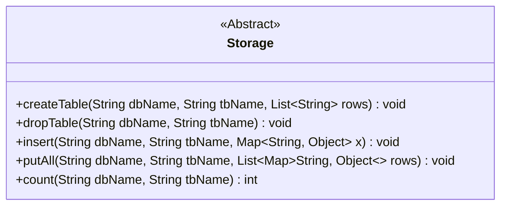
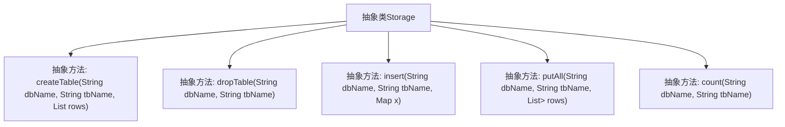

# 基础信息

|      |      |
|------|------|
| 名称 | Storage |
| 编码语言 | .java |
| 代码路径 | WeFe/fusion/fusion-service/src/main/java/com/welab/wefe/data/fusion/service/repo/Storage.java |
| 包名 | com.welab.wefe.data.fusion.service.repo |
| 依赖项 | ['java.util.List', 'java.util.Map'] |
| 概述说明 | 抽象类Storage定义数据库操作接口，包括创建表、删除表、插入数据、批量插入和数据统计功能。 |

# 说明

这是一个名为Storage的抽象类，定义了本地存储操作的抽象方法。包含创建表、删除表、插入单条数据、批量插入数据以及统计数据条数等功能。所有方法均需传入数据库名和表名参数，部分方法需要额外参数如列定义或数据内容。操作可能抛出异常，具体实现由子类完成。

# 类列表 Class Summary

| 名称   | 类型  | 说明 |
|-------|------|-------------|
| Storage | class | 抽象类Storage定义数据库操作接口，包括建表、删表、插入数据和统计数量等方法。 |

## 类 Storage

|      |      |
|------|------|
| 访问范围 | public abstract |
| 类型 | class |
| 名称 | Storage |
| 说明 | 抽象类Storage定义数据库操作接口，包括建表、删表、插入数据和统计数量等方法。 |

### UML类图

这段代码定义了一个名为Storage的抽象类，它提供了数据库表操作的基本抽象方法。该类包含五个核心方法：createTable用于创建表，dropTable用于删除表，insert用于插入单条数据，putAll用于批量插入数据，count用于统计数据条数。所有方法都接收dbName和tbName参数来指定数据库和表，并可能抛出异常。这个抽象类需要被子类实现，具体实现将决定底层存储类型（如关系型数据库、NoSQL或文件系统）。类图中使用<<Abstract>>标记表明其抽象性质，泛型参数清晰地展示了集合类型的结构。

### 内部方法调用关系图

该流程图展示了抽象类Storage的结构及其定义的五个核心抽象方法。Storage类作为数据存储的抽象基类，规定了创建表(createTable)、删除表(dropTable)、插入数据(insert)、批量插入(putAll)和统计数据量(count)等基本操作接口。每个方法都接收数据库名(dbName)和表名(tbName)作为参数，部分方法还涉及行数据(rows)或键值对数据(Map)。这些抽象方法需要由具体子类实现，为不同类型的存储系统提供统一的操作规范。

### 字段列表 Field List

| 名称  | 类型  | 说明 |
|-------|-------|------|

### 方法列表

| 名称  | 类型  | 说明 |
|-------|-------|------|
| putAll | void | 抽象方法：批量插入数据到指定数据库表，参数为库名、表名和数据行列表，可能抛出异常。 |
| count | int | 抽象方法count，输入数据库名和表名，返回整型结果，可能抛出异常。 |
| insert | void | 抽象方法insert，用于向指定数据库表插入数据，参数为库名、表名和数据映射，可能抛出异常。 |
| dropTable | void | 抽象方法dropTable，用于删除指定数据库的表，参数为dbName和tbName，可能抛出异常。 |
| createTable | void | 抽象方法createTable：在指定数据库dbName中创建表tbName，表结构由rows定义，可能抛出异常。 |

